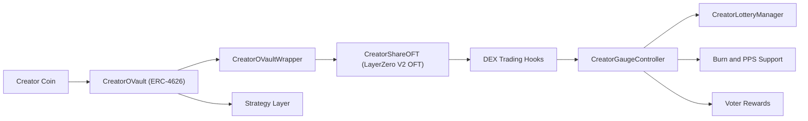
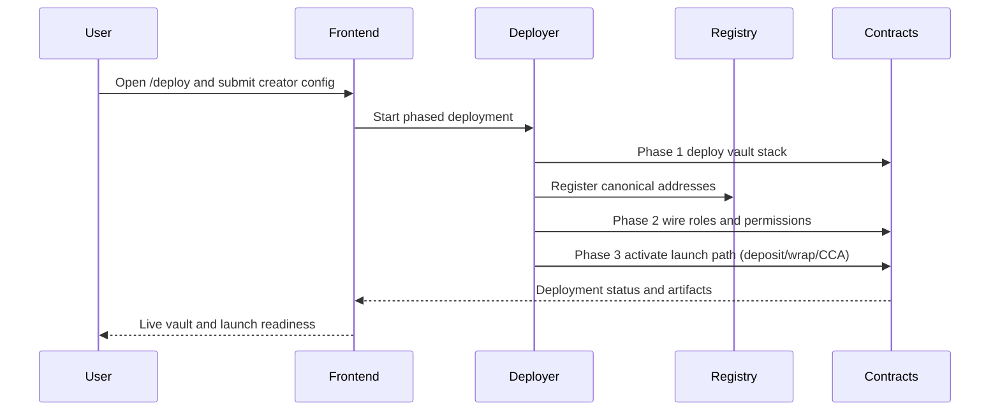
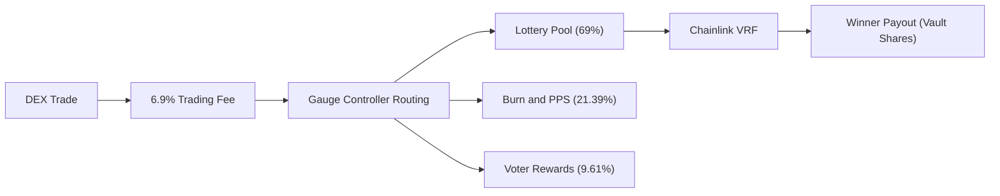
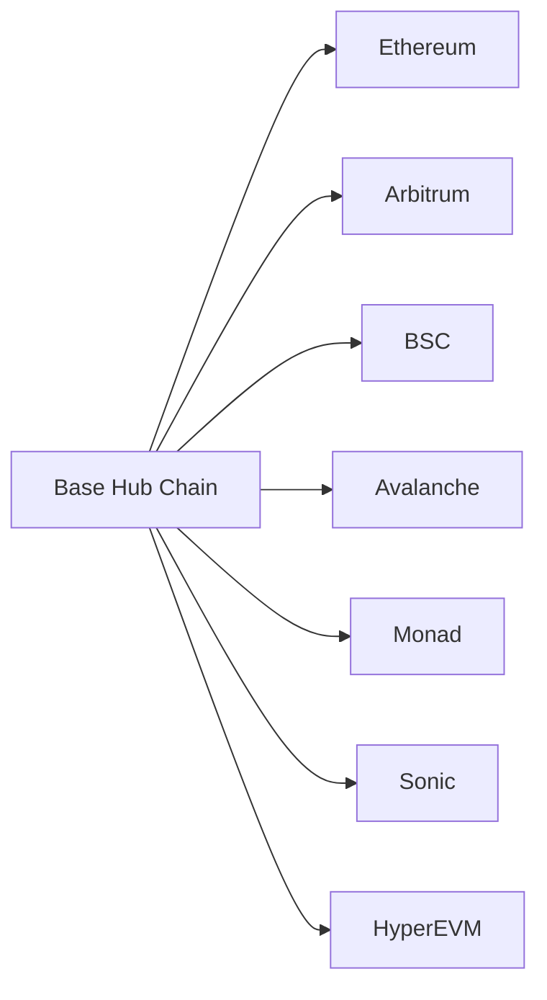

# CreatorVault

CreatorVault is a Base-native protocol and app stack for launching creator-centered vault economies.
It combines ERC-4626 vaults, account abstraction, cross-chain OFT shares, and an incentives layer designed for creator coins.

[](LICENSE)
[](https://docs.soliditylang.org/)
[](https://layerzero.network/)
[](https://github.com/wenakita/4626/actions/workflows/test.yml)

## Overview

CreatorVault focuses on three outcomes:

- Launch creator vault infrastructure from a single user flow (`/deploy`).
- Route creator coin activity into vault and incentive mechanics.
- Operate the system with automated keepers and API-driven workflows.

The repository includes:

- Smart contracts (vaults, gauges, lottery, wrappers, OFT, deployment infra).
- Frontend app (Vite + React) with local API handlers under `frontend/api`.
- CRE automation workflows (`cre/`) for keeper and settlement operations.
- Docusaurus docs site (`apps/docs-site/`).

## Key Capabilities

- **Vault stack:** ERC-4626 vault lifecycle with strategy integration.
- **Cross-chain shares:** LayerZero V2 OFT share token flows.
- **Launch flow:** Uniswap CCA-oriented deployment and activation path.
- **Incentives:** Trading-fee-funded reward mechanics and lottery workflows.
- **Automation:** CRE runners for tending/reporting, settlement, and queue processing.
- **AA support:** EIP-4337-compatible execution patterns for deploy/ops paths.

## High-Level Architecture



### Core Protocol Components

| Component | Role |
|-----------|------|
| `CreatorRegistry` | Canonical registry of creator coin -> vault stack mappings and chain config |
| `CreatorOVault` | ERC-4626 vault for creator coin deposits and strategy accounting |
| `CreatorOVaultWrapper` | Wraps vault shares into transportable OFT-compatible share form |
| `CreatorShareOFT` | LayerZero V2 OFT share token with DEX-aware fee hooks |
| `CreatorGaugeController` | Receives and routes trading-fee proceeds to downstream sinks |
| `CreatorLotteryManager` | Executes lottery odds/payout flow with VRF randomness |
| `CreatorOracle` | Price and accounting inputs for vault/share mechanics |
| `CreatorCCAStrategy` | CCA launch path and post-auction liquidity transition |

### Deployment Flow (User-Facing)

Creator deployment is exposed as a single `/deploy` flow, while the underlying execution follows phased setup:

1. Deploy per-creator stack (vault, wrapper, OFT, gauge, strategy, oracle).
2. Register and wire addresses/roles in registry and integrations.
3. Activate launch flow (deposit/wrap/start CCA) depending on wallet/batching capabilities.

For full operator details, see `docs/operations/deployment/index.md`.



## Tokenomics and Incentive Model

The documented fee model is centered on a **6.9% trading fee** for DEX trades (buys and sells), with deposits/withdrawals remaining untaxed.

### Fee Events

| Action | Fee | Notes |
|--------|-----|-------|
| DEX buy | 6.9% | Routed via gauge controller pipeline |
| DEX sell | 6.9% | Routed via gauge controller pipeline |
| Vault deposit | 0% | No trading fee |
| Vault withdrawal | 0% | No trading fee |
| Cross-chain OFT transfer | Messaging gas only | No protocol trading fee |

### Documented Distribution Split

- Lottery pool: **69%**
- Burn/PPS support: **21.39%**
- Voter rewards: **9.61%**

See canonical docs for current semantics and examples: `docs/tokenomics/index.md`.

### Lottery Mechanics (Current Docs)

- Odds scale with trade size (`$1 traded = 0.0004%` win chance).
- Randomness source uses Chainlink VRF.
- Payout flow and auditability are documented under tokenomics and game-loop docs.



## Supported Chains (Current Configuration)

CreatorVault is Base-hub-first with omnichain share transport through LayerZero V2.

| Network | Chain ID | LZ Endpoint ID | Status |
|---------|----------|----------------|--------|
| Base | 8453 | 30184 | Hub chain |
| Ethereum | 1 | 30101 | Configured |
| Arbitrum | 42161 | 30110 | Configured |
| BSC | 56 | 30102 | Configured |
| Avalanche | 43114 | 30106 | Configured |
| Monad | 10143 | 30390 | Configured |
| Sonic | 146 | 30332 | Configured |
| HyperEVM | 999 | 30275 | Configured |

Source: `docs/chains.md`.



For deeper design documentation, start with:

- `docs/index.md`
- `docs/overview/architecture.md`
- `docs/primitives/index.md`
- `docs/current-contract-inventory.md`

## Quick Start (Local Development)

### Prerequisites

- Node.js 20+ (recommended)
- `pnpm` (root/frontend/docs)
- `npm` (CRE package install and scripts)
- Foundry (`forge`) for Solidity build/test

### 1) Clone and install

```bash
git clone https://github.com/wenakita/4626.git
cd 4626

# Root dependencies
pnpm install

# Frontend dependencies
pnpm -C frontend install

# Docs site dependencies (optional for app-only development)
pnpm -C apps/docs-site install

# CRE dependencies
npm --prefix cre install
```

### 2) Configure environment files

```bash
# Root / contracts env
cp .env.example .env

# Frontend env
cp frontend/.env.example frontend/.env

# CRE env
cp cre/secrets.example.env cre/.env
```

Do not commit real secrets. Keep credentials in local env files or your deployment secret manager.

### 3) Run the main app

```bash
pnpm -C frontend dev
```

Default local URL: `http://localhost:5173`

### 4) Run CRE workflows (optional)

```bash
npm --prefix cre run start
```

### 5) Run docs site (optional)

```bash
pnpm -C apps/docs-site start
```

Default docs URL: `http://localhost:3000`

## Testing and Validation

### Frontend

```bash
pnpm -C frontend test
pnpm -C frontend typecheck
pnpm -C frontend lint
```

### CRE

```bash
npm --prefix cre test
npm --prefix cre run typecheck
```

### Contracts

```bash
forge build
forge test -vvv
```

## Build Commands

### Frontend build

```bash
pnpm -C frontend build
```

### Docs build

```bash
pnpm -C apps/docs-site build
```

## Frontend Routes and API Surface

### Primary frontend routes

| Route | Purpose |
|-------|---------|
| `/` | Landing and navigation entry |
| `/deploy` | Creator deployment and activation flow |
| `/waitlist` | Waitlist onboarding path |
| `/vault/:address` | Vault interaction surface |
| `/dashboard` | Legacy redirect path |
| `/launch` | Legacy redirect to deploy flow |

### API routing model

- Production entrypoint: `frontend/api/[...path].ts`
- Handler modules: `frontend/api/_handlers/*`
- Local dev route mapping: configured in `frontend/vite.config.ts`

Important bundling rule: register endpoints via static route mapping under `_routes.ts` patterns; avoid relying on ad hoc dynamic imports for production handler inclusion.

## Environment and Secrets

### Frontend/server variables (core examples)

| Variable | Scope | Purpose |
|----------|-------|---------|
| `VITE_CDP_PAYMASTER_URL` | client | Optional paymaster/bundler override |
| `CDP_PAYMASTER_URL` | server | Paymaster endpoint used by server handlers |
| `VITE_ZORA_PUBLIC_API_KEY` | client | Public Zora integration key |
| `ZORA_SERVER_API_KEY` | server | Server-side Zora API access |
| `BASE_RPC_URL` | server | Base RPC URL for handlers/workflows |
| `DATABASE_URL` | server | Local/prod DB connectivity |
| `AUTH_SESSION_SECRET` | server | Auth session signing secret |
| `PRIVY_APP_ID` / `PRIVY_APP_SECRET` | server | Privy integration keys |

### CRE variables (core examples)

| Variable | Purpose |
|----------|---------|
| `KEEPR_PRIVATE_KEY` | Keeper signer for workflow-triggered writes |
| `KEEPR_API_BASE_URL` | Target API base URL for keeper bridge |
| `KEEPR_API_KEY` | Auth between CRE workflows and API |

For complete and up-to-date variable docs, see `frontend/README.md` and `cre/README.md`.

## Cloud Agent Onboarding

This repo includes committed Cursor Cloud Agent config under `.cursor/`:

- `.cursor/environment.json`
- `.cursor/install.sh`
- `.cursor/start.sh`
- `.cursor/sandbox.json`

Use the onboarding runbook:

- `docs/operations/cursor-cloud-agent-onboarding.md`

That guide covers setup mode, idempotent install/start expectations, secrets handling, sandboxing, and snapshot workflow.

## Important Implementation Notes

- **Frontend API routing:** Vercel entrypoint is `frontend/api/[...path].ts`; handlers live in `frontend/api/_handlers/*`.
- **Local API behavior:** `frontend/vite.config.ts` maps local `/api` routes for dev.
- **Wallet invariants:** canonical ERC-4337 account behavior is documented in `.cursor/rules/ERC-4337-Wallet-Invariants.mdc`.
- **Operational automation:** CRE workflows and setup details are in `cre/README.md`.
- **Automation architecture:** CRE uses an HTTP bridge pattern for write execution through API endpoints.

## Repository Layout

| Path | Purpose |
|------|---------|
| `contracts/` | Protocol smart contracts and related components |
| `script/` | Foundry scripts for deploy/ops |
| `frontend/` | Vite React app + local/Vercel API handlers |
| `cre/` | CRE workflow runners, scripts, and tests |
| `apps/docs-site/` | Docusaurus documentation site |
| `docs/` | Product, architecture, operations, and reference docs |
| `deployments/` | Deployment artifacts and addresses |

## Documentation Shortcuts

- Docs root: `docs/index.md`
- Frontend guide: `frontend/README.md`
- CRE workflows: `cre/README.md`
- Operations hub: `docs/operations/index.md`
- Deploy checklist: `docs/operations/deployment/index.md`
- Security docs: `docs/security/index.md`
- Terms and privacy: `docs/terms.md`, `docs/privacy.md`

## Contributing

1. Create a branch from `main`.
2. Keep changes scoped (contracts, frontend, CRE, docs).
3. Run relevant tests before opening a PR.
4. Include migration or ops notes when behavior changes.

## License

MIT - AKITA, LLC
