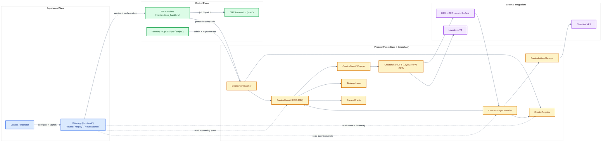
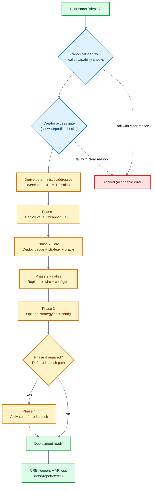
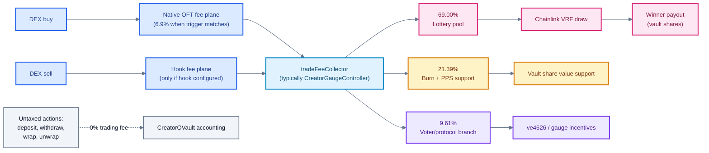
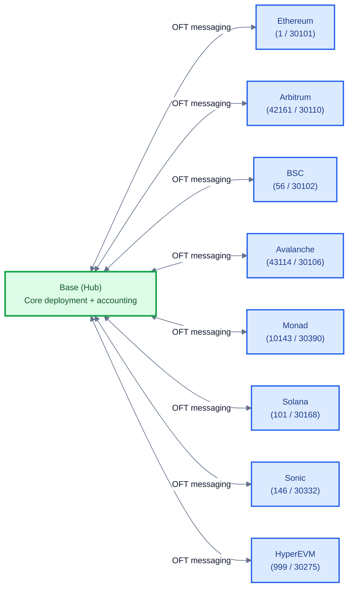

# 4626.fun

4626.fun is a Base-native protocol and app stack for launching creator vault economies. The repository combines Solidity smart contracts for ERC-4626 vaults, gauge/lottery incentives, and LayerZero OFT share tokens under contracts/, a Vite/React frontend plus Vercel API handlers under frontend/, Chainlink CRE automation in cre/, and a Solana transfer-hook program in programs/creator-share-hook. Users deploy vaults, trade share tokens, and interact with fee-driven incentives and lottery mechanics; keepers and workflows orchestrate strategy tending and settlement.

[](LICENSE)
[](https://docs.soliditylang.org/)
[](https://layerzero.network/)
[](https://github.com/wenakita/4626/actions/workflows/test.yml)
[](https://github.com/wenakita/4626/actions/workflows/security-scanning.yml)
[](https://github.com/wenakita/4626/actions/workflows/dependency-review.yml)

## Quick Navigation

- [What This Repository Contains](#what-this-repository-contains)
- [System Atlas](#system-atlas)
  - [Architecture (Experience -> Control -> Protocol)](#1-architecture-experience---control---protocol)
  - [Deployment Lifecycle](#2-deployment-lifecycle-phased-and-guarded)
  - [Fee + Incentive Routing](#3-fee--incentive-routing)
  - [Omnichain Topology](#4-omnichain-share-topology-base-hub)
- [Core Protocol Components](#core-protocol-components)
- [Supported Chains](#supported-chains-current-configuration)
- [Quick Start (Local Development)](#quick-start-local-development)
- [Testing and Build Commands](#testing-and-build-commands)
- [Agent Workflow](#agent-workflow)
- [XMTP Agent Runtime](#xmtp-agent-runtime)
- [Frontend Routes and API Surface](#frontend-routes-and-api-surface)
- [Environment and Secrets](#environment-and-secrets)
- [Security and Invariants](#security-and-invariants)
- [Documentation Map](#documentation-map)
- [Repository Layout](#repository-layout)

## What This Repository Contains

4626 focuses on three outcomes:

- Launch creator vault infrastructure from a single user flow (`/deploy`).
- Route creator coin activity into vault and incentive mechanics.
- Operate lifecycle + maintenance through automated keepers and API-driven workflows.

This monorepo includes:

- Smart contracts (`contracts/`) for vaults, gauges, lottery, wrappers, OFT, and deploy infra.
- Frontend app (`frontend/`) using Vite + React with local/Vercel API handlers.
- CRE automation workflows (`cre/`) for tending, reporting, settlement, and queue operations.
- Docusaurus docs site (`apps/docs-site/`) fed by `docs/` content and generated references.

## System Atlas

### 1) Architecture (Experience -> Control -> Protocol)



### 2) Deployment Lifecycle (Phased and Guarded)

Creator deployment is exposed as one user flow, but executed as guarded phases with deterministic addresses and prechecks.



### 3) Fee + Incentive Routing

Fee policy is two-plane and deployment-conditional:
- Native plane: `CreatorShareOFT` buy-side fee trigger (`SwapOnly -> non-SwapOnly`).
- Hook plane: sell-side (and any additional policy) via explicit tax-hook configuration.
- Both planes should route to the same `tradeFeeCollector` domain (typically `CreatorGaugeController`).



### 4) Omnichain Share Topology (Base Hub)

4626 is Base-hub-first with omnichain share transport via LayerZero V2 OFT.



## Core Protocol Components

| Component                | Role                                                                        |
| ------------------------ | --------------------------------------------------------------------------- |
| `CreatorRegistry`        | Canonical registry of creator coin -> vault stack mappings and chain config |
| `CreatorOVault`          | ERC-4626 vault for creator coin deposits and strategy accounting            |
| `CreatorOVaultWrapper`   | Wraps vault shares into transportable OFT-compatible share form             |
| `CreatorShareOFT`        | LayerZero V2 OFT share token with DEX-aware fee hooks                       |
| `CreatorGaugeController` | Receives and routes trading-fee proceeds to downstream sinks                |
| `CreatorLotteryManager`  | Executes lottery odds/payout flow with VRF randomness                       |
| `CreatorOracle`          | Price and accounting inputs for vault/share mechanics                       |
| `CreatorCCAStrategy`     | CCA launch path and post-auction liquidity transition                       |

## Supported Chains (Current Configuration)

Source of truth: `docs/reference/chains.md`.

| Network   | Registry Key / Chain ID | LayerZero Endpoint ID | Status                         |
| --------- | ----------------------- | --------------------- | ------------------------------ |
| Base      | 8453                    | 30184                 | Hub chain                      |
| Ethereum  | 1                       | 30101                 | Configured                     |
| Arbitrum  | 42161                   | 30110                 | Configured                     |
| BSC       | 56                      | 30102                 | Configured                     |
| Avalanche | 43114                   | 30106                 | Configured                     |
| Monad     | 10143                   | 30390                 | Configured                     |
| Solana    | 101                     | 30168                 | Configured (non-EVM registry key) |
| Sonic     | 146                     | 30332                 | Configured                     |
| HyperEVM  | 999                     | 30275                 | Configured                     |

## Quick Start (Local Development)

### Prerequisites

- Node.js 20+
- `pnpm` (root/frontend/docs)
- `npm` (CRE package install and scripts)
- Foundry (`forge`) for Solidity build/test

### 1) Clone and install

```bash
git clone https://github.com/wenakita/4626.git
cd 4626

# root
pnpm install

# frontend
pnpm -C frontend install

# docs (optional if app-only)
pnpm -C apps/docs-site install

# cre
npm --prefix cre install
```

### 2) Configure local env files

```bash
# root / contracts
cp .env.example .env

# frontend
cp frontend/.env.example frontend/.env

# cre
cp cre/secrets.example.env cre/.env
```

Keep real secrets in local env files or your deployment secret manager; do not commit secrets.

### 3) Run services

```bash
# app (default: http://localhost:5173)
pnpm -C frontend dev

# cre workflows (optional)
npm --prefix cre run start

# docs site (optional, default: http://localhost:3000)
pnpm -C apps/docs-site start
```

## Testing and Build Commands

### Common validation commands

| Surface        | Commands                                                                             |
| -------------- | ------------------------------------------------------------------------------------ |
| Agent workflow | `pnpm agent:verify-change -- <paths...>`                                             |
| Frontend       | `pnpm -C frontend test`<br/>`pnpm -C frontend typecheck`<br/>`pnpm -C frontend lint` |
| CRE            | `npm --prefix cre test`<br/>`npm --prefix cre run typecheck`                         |
| Contracts      | `forge build`<br/>`forge test -vvv`                                                  |
| Security sweep | `pnpm security:local` — Forge tests, CRE workflow checks, frontend lint/typecheck/test, optional Semgrep (Docker) + gitleaks + audit printouts ([`docs/audits/README.md`](docs/audits/README.md)) |
| Frontend build | `pnpm -C frontend build`                                                             |
| Docs build     | `pnpm -C apps/docs-site build`                                                       |

## Agent Workflow

This repo ships a small repo-native agent layer for Cursor/Codex-style use. It does not attempt to be a full orchestration platform.

- Authority order: `AGENTS.md` -> scoped `.cursor/rules/*.mdc` -> relevant repo skill -> verification selector.
- Bundled skills live under `script/agent-runtime/skills/`.
- Verification selector CLI: `pnpm agent:verify-change -- <paths...>`.
- Operator docs: [`docs/operators/index.md`](/operators), runtime skills: `script/agent-runtime/skills/`.

## XMTP Agent Runtime

The Keepr XMTP / Eliza runtime is not part of the normal local frontend dev loop.

Authoritative runtime entrypoint:

- `frontend/server/agent/eliza/index.ts`

Architecture at a glance:

- XMTP on Railway is the only live Eliza transport in the default repo posture.
- Telegram is a separate webhook + Mini App stack; it does not ingress through the XMTP runtime.
- Privy + Coinbase Smart Wallet provide identity/signing; ElizaOS provides memory, routing, action ranking, and conversational fallback.
- Shared agent logic now lives behind channel-specific processors:
  - `frontend/server/agent/core/processXmtpAgentInput.ts`
  - `frontend/server/agent/core/processTelegramAgentInput.ts`

Authoritative operating model:

- one Railway service
- one Railway replica
- one primary XMTP consumer
- no standby or failover deployment by default

Operational rules:

- Railway is the only intended production-primary runtime.
- Off-Railway production-primary boots are blocked by default.
- Local standby mode exists only for inspection and smoke checks.
- Railway misconfiguration is treated as fatal: standby mode or `AGENT_CONSUME_XMTP=false` will fail startup.
- Vercel is not a production XMTP worker target in the default repo posture.
- Do not schedule `/api/agent/process` on Vercel production or preview deployments.
- The persistent XMTP volume at `/data/.xmtp-data` must survive redeploys.
- On Railway primary with Postgres configured, the runtime lease lock is expected to be enabled.

Vercel split:

- Vercel serves the SPA and request/response API handlers under `frontend/api/*`.
- The long-lived XMTP consumer stays on Railway via `frontend/Dockerfile.agent`.
- Re-enabling a Vercel cron for `/api/agent/process` creates the wrong topology and can produce repeated `503` noise when XMTP primary-only env is absent there.

Safe Railway redeploy checklist:

1. Confirm Railway still has exactly one service and `numReplicas = 1` in `railway.toml`.
2. Confirm Railway env keeps `AGENT_RUNTIME_ROLE=primary` and `AGENT_CONSUME_XMTP=true`.
3. Confirm the runtime lock remains enabled for the primary (`AGENT_RUNTIME_LOCK_REQUIRED=true`, default-on when Postgres is present).
4. Confirm the Railway volume is still mounted at `/data/.xmtp-data`.
5. Confirm `XMTP_DB_ENCRYPTION_KEY` is unchanged.
6. Deploy and watch logs until `/readyz` becomes healthy with `status: "ok"`; `status: "standby"` is a misconfiguration.
7. Run one XMTP smoke command such as `/keepr status`.

Failure model:

- If a redeploy crashes the only Railway primary, the agent has downtime until Railway restarts it successfully or you roll back.
- There is no automatic standby failover in the default repo posture.
- Reusing the same Railway volume and `XMTP_DB_ENCRYPTION_KEY` lets the runtime reopen the same XMTP installation after restart instead of churning installations.

Transport split:

- XMTP + Eliza on Railway: long-lived agent runtime and memory-bearing conversational path.
- Telegram webhook runtime: bot menus, callbacks, inline mode, payments, and Mini App launch/auth.
- Telegram Mini App: verified Telegram context plus linking/onboarding into the same 4626 account model.

## Frontend Routes and API Surface

### Primary frontend routes

| Route             | Purpose                                |
| ----------------- | -------------------------------------- |
| `/`               | Landing and navigation entry           |
| `/deploy`         | Creator deployment and activation flow |
| `/waitlist`       | Waitlist onboarding path               |
| `/vault/:address` | Vault interaction surface              |
| `/dashboard`      | Legacy redirect path                   |
| `/launch`         | Legacy redirect to deploy flow         |

### API routing model

- Production entrypoint: `frontend/api/[...path].ts`
- Handler modules: `frontend/api/_handlers/*`
- Local dev API mapping: `frontend/vite.config.ts`

Important bundling rule: register endpoints through static route mapping in `frontend/api/_handlers/_routes.ts`; do not rely on ad hoc dynamic imports for production handler inclusion.

### `/swap` runtime notes

The swap surface has a few deliberate runtime constraints to keep the route stable and quiet:

- Session restoration is shared through `useSiweAuth()` and should not be reimplemented with ad hoc `/api/auth/me` polling.
- Admin session checks are route-scoped to `/admin`; normal app routes should not trigger `/api/auth/admin`.
- `AccountContextProvider` is mounted inside the app layout subtree, not at the outer app root.
- XMTP chat is lazy-activated; `ChatWidget` does not mount `XmtpChatProvider` until explicit chat intent or a chat deep link is present.
- `/swap` requotes on actual input changes and rebuilds stale quotes at review/submit time. It should not background-refresh idle quotes on a timer.
- Canonical smart-wallet lookup via `/api/waitlist/me` is deferred until a signer exists.

## Environment and Secrets

### Core frontend/server variables (examples)

| Variable                            | Scope  | Purpose                                |
| ----------------------------------- | ------ | -------------------------------------- |
| `VITE_CDP_PAYMASTER_URL`            | client | Optional paymaster/bundler override    |
| `CDP_PAYMASTER_URL`                 | server | Paymaster endpoint for server handlers |
| `VITE_ZORA_PUBLIC_API_KEY`          | client | Public Zora integration key            |
| `ZORA_SERVER_API_KEY`               | server | Server-side Zora API access            |
| `BASE_RPC_URL`                      | server | Base RPC URL for handlers/workflows    |
| `DATABASE_URL`                      | server | Database connectivity                  |
| `AUTH_SESSION_SECRET`               | server | Auth session signing secret            |
| `PRIVY_APP_ID` / `PRIVY_APP_SECRET` | server | Privy integration keys                 |

### Core CRE variables (examples)

| Variable             | Purpose                                     |
| -------------------- | ------------------------------------------- |
| `KEEPR_PRIVATE_KEY`  | Keeper signer for workflow-triggered writes |
| `KEEPR_API_BASE_URL` | Target API base URL for keeper bridge       |
| `KEEPR_API_KEY`      | Auth between CRE workflows and API          |

For complete env references, see `frontend/README.md` and `cre/README.md`.

## Security and Invariants

- Frontend API routing and auth boundaries are enforced in `frontend/api` + `frontend/server/auth`.
- Wallet/account invariants are documented in `.cursor/rules/ERC-4337-Wallet-Invariants.mdc`.
- Deploy/session ownership + creator access checks are enforced server-side before phased execution.
- CRE automation uses an HTTP bridge pattern; write execution happens through audited API surfaces.
- CI: `.github/workflows/security-scanning.yml` (secret scan, dependency reports, Semgrep on API/server lib, Slither report-only); `.github/workflows/dependency-review.yml` (PR dependency review, high+ in runtime **and** dev deps). Enable Dependency graph + optional branch protection: [`docs/audits/github-supply-chain-setup.md`](docs/audits/github-supply-chain-setup.md). Audit index: [`docs/audits/README.md`](docs/audits/README.md). Trust-boundary rules: [`AGENTS.md`](AGENTS.md).

## Documentation Map

- Root docs index: `docs/index.md`
- Narrative architecture model: `docs/compressions/index.md`
- Primitive model (account/market/game loop): `docs/primitives/index.md`
- Deployment operations: `docs/operations/deployment/index.md`
- Current contract inventory: `docs/reference/current-contract-inventory.md`
- Security docs: `docs/security/index.md`
- Payout router + ownership hardening memo: `docs/security/payout-router-ownership-hardening-2026-03.md`
- Internal audit / CI security index: `docs/audits/README.md`
- Operator lane: `/operators`
- Runtime skills source: `script/agent-runtime/skills/`
- Frontend guide: `frontend/README.md`
- Swap integration/runtime notes: `frontend/docs/uniswap-integration-notes.md`
- Account + onboarding architecture: `frontend/docs/account-auth-invariants.md`, `frontend/docs/waitlist-accounts-architecture.md`
- Telegram Mini App link/onboarding architecture: `frontend/docs/telegram-miniapp-link-architecture.md`
- CRE guide: `cre/README.md`

## Cloud Agent Onboarding

Cursor Cloud Agent config is committed under `.cursor/`:

- `.cursor/environment.json`
- `.cursor/install.sh`
- `.cursor/start.sh`
- `.cursor/sandbox.json`

Runbook:

- `docs/operations/cursor-cloud-agent-onboarding.md`

## Repository Layout

| Path              | Purpose                                               |
| ----------------- | ----------------------------------------------------- |
| `contracts/`      | Protocol smart contracts and related components       |
| `script/`         | Foundry scripts for deploy/ops                        |
| `frontend/`       | Vite React app + local/Vercel API handlers            |
| `cre/`            | CRE workflow runners, scripts, and tests              |
| `apps/docs-site/` | Docusaurus documentation site                         |
| `docs/`           | Product, architecture, operations, and reference docs |
| `deployments/`    | Deployment artifacts and addresses                    |

## Contributing

1. Branch from `main`.
2. Keep changes scoped (contracts, frontend, CRE, docs).
3. Run relevant tests before opening a PR.
4. Include migration or ops notes when behavior changes.

## License

MIT - AKITA, LLC
