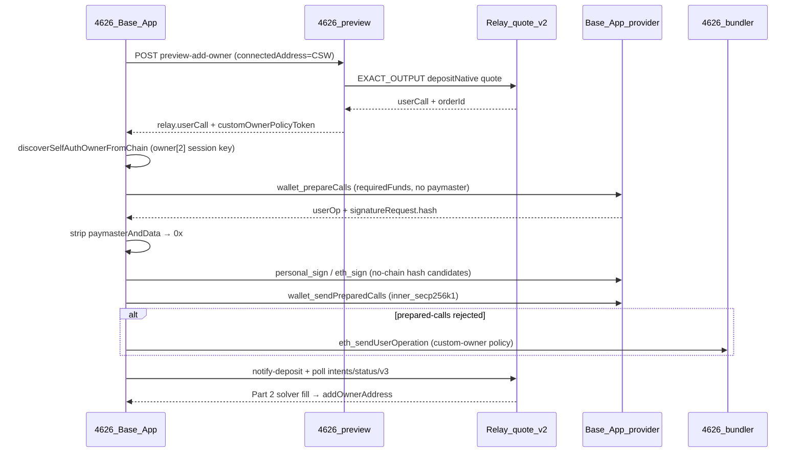

# Base App passkey-first owner mutation — Relay Part 1 recipe

Status: **Reference method B** ([owner-install reference methods](/operations/owner-install-reference-methods)) · Last updated: 2026-05-24

This is **not** the sole owner-install path. It documents the observed Base App lane where Part 1 is session-key-signed and Part 2 is passkey-validated. Waitlist success still requires **`isOwnerAddress(privyEmbeddedEoa)`** on the canonical CSW.

Related:

- [Owner-install reference methods](/operations/owner-install-reference-methods) — method index + golden txs
- [Relay Kit — Owner Mutation Guide](/operations/relay-owner-mutation-kit-guide)
- [Coinbase Smart Wallet Capabilities](/operations/coinbase-smart-wallet-capabilities)
- [Owner mutation decision (2026-05)](/owner-mutation-decision-2026-05)
- [Coinbase Wallet SDK](https://github.com/coinbase/coinbase-wallet-sdk) · [Base Account SDK](https://docs.base.org/base-account)

## Summary

For **passkey-first Base App CSWs** (owner[0] = WebAuthn, no user EOA owners), 4626 enables embedded-owner install via **Relay Settlement Part 1** using:

1. Server `/quote/v2` with `explicitDeposit: true` and Depository `depositNative` calldata
2. Base App **`wallet_prepareCalls`** with self-funded `requiredFunds` (no paymaster)
3. Passkey/session-key signature over stripped UserOp hash
4. **`wallet_sendPreparedCalls`** with `inner_secp256k1` payload when owner slot 2 is the session key
5. Bundler fallback via 4626 `/api/paymaster` custom-owner policy when prepared-calls submit rejects

**Never** use `wallet_sendCalls` for self-auth Part 1 — Base App re-injects USDC paymaster and Relay Part 2 stalls.

Implementation: `frontend/src/lib/relay/submitRelayPart1SelfFunded.ts`, `frontend/src/lib/wallet/cswSelfAuthOwnerDiscovery.ts` (preflight owner-slot read).

---

## Observed CSW owner layout (Base App)

| Slot | Bytes | Role |
| --- | --- | --- |
| `owner[0]` | 64 | WebAuthn passkey (user-facing approval; **Part 2** validation) |
| `owner[1]` | varies | Often empty or protocol slot |
| `owner[2]` | 32 (address-encoded) | **Session key** — signs **Part 1** UserOps inside Base App WebView |

Session-key signer observed on test CSW `0x4bEa…704EF`: `0xCf8D17Ce01B73637ef936fe7c47bA7100b820142` (read from chain via `ownerAtIndex(2)` when available).

4626 pre-reads this layout before Part 1 so the first sign attempt uses session-key hash modes and `inner_secp256k1` prepared-calls payload.

---

## Part 1 vs Part 2 signing split

| Phase | Signer slot | Hash domain | Notes |
| --- | --- | --- | --- |
| **Part 1** (4626 deposit UserOp) | Session key `owner[2]` | EntryPoint v0.6 variants after paymaster strip | `inner_secp256k1` prepared-calls payload |
| **Part 2** (Relay solver fill) | Passkey `owner[0]` | `getUserOpHashWithoutChainId` | Base App WebAuthn origin `org.toshi` |

Golden **Part 2** reference (historical session-key add, not embedded-EOA install): [0x801b9d4b…91503](https://basescan.org/tx/0x801b9d4b8f7470226c2f02d5252583f00d77da5cbb0b7dc8b73421ed8b491503) — see [Method B](/operations/owner-install-reference-methods#method-b--passkey-first-base-app-session-key-relay-reference).

Part 1 deposit shape matches Method A: [0xa6b54357…b4c3](https://basescan.org/tx/0xa6b5435718a8969905a08093a7208dadefdf702602c63e3fd322d84db5f4b4c3).

---

## Part 1 lane (self-auth CSW)



### Golden Part 1 shape (Base mainnet)

| Field | Value |
| --- | --- |
| Inner call | `RelayDepository.depositNative(depositor=CSW, orderId=…)` selector `0x49290c1c` |
| Wrapper | CSW `executeBatch` (Base App wraps plain `userCall` from preview) |
| Paymaster | **Must be 0** on landed UserOp |
| Reference tx | [0xa6b54357…b4c3](https://basescan.org/tx/0xa6b5435718a8969905a08093a7208dadefdf702602c63e3fd322d84db5f4b4c3) |

---

## `wallet_prepareCalls` capabilities (4626)

```typescript
{
  requiredFunds: [{
    address: '0x0000000000000000000000000000000000000000',
    value: `0x${(depositWei + gasReserveWei).toString(16)}`,
  }],
  // intentionally NO paymasterService
}
```

Gas reserve: `resolveRelayPart1UserOpGasReserveWei` (EntryPoint v0.6 prefund headroom).

---

## Session-key signature payload

When `ownerIndex === 2` or preflight marks `sessionKeyOwner`:

1. Sign hash candidates: stripped prepare hash, then `entrypoint_v06_no_chain` fallback
2. Sign methods: `personal_sign(hash, CSW)`, `eth_sign(CSW, hash)`, `personal_sign(CSW, hash)`
3. `wallet_sendPreparedCalls` signature mode order: `inner_secp256k1` → `full_wrapper_secp256k1` → `auto`
4. `signerAddress` in payload = on-chain `ownerAtIndex(2)` address (not the CSW)

---

## Known failure surfaces

| Symptom | Likely cause | 4626 handling |
| --- | --- | --- |
| `Failed to fetch RPC request` during **prepare** | Base App RPC to `keys.coinbase.com` failed pre-sign | Fail closed; user retries inside Base App (no external-browser escape for Base App track) |
| `Error generating transaction / not enough funds` | Coinbase Wallet in-app browser session-key mismatch | **Coinbase Wallet only** — open Chrome/Safari; Base App path differs |
| USDC paymaster on landed Part 1 | Used `wallet_sendCalls` or prepare left paymaster injected | Strip paymaster; reject if paymaster ≠ 0 after land |
| `Invalid UserOp signature` on prepared-calls | Wrong hash domain or payload mode for session key | Loop hash candidates + payload modes; bundler fallback |
| Relay Part 2 never fills | Wrong `orderId`, paymaster Part 1, or underfunded deposit | Poll with `orderId ?? requestId`; on-chain `isOwnerAddress(embeddedEoa)` verify |

---

## Open questions for Coinbase / Relay (vendor doc request)

We are asking for an **official, versioned recipe** for this path. Specific gaps:

### Coinbase Smart Wallet / Base App

1. **Session-key owner slot**: Is `ownerIndex = 2` stable for all Base App CSWs, or should dapps scan `ownerAtIndex(i)` for a marker?
2. **Prepared-calls signature payload**: When the signing key is the session key at slot 2, is `inner_secp256k1` always required for `wallet_sendPreparedCalls`? Document the `signature` field schema.
3. **UserOp hash domain**: For session-key CSWs, should dapps sign EntryPoint v0.6 hash with or without chain id after paymaster strip?
4. **Owner-mutating calldata**: Does Base App middleware block `wallet_prepareCalls` when inner calldata includes `addOwnerAddress` / `executeWithoutChainIdValidation`, or only legacy `wallet_sendCalls`?
5. **Passkey RP ID**: Confirm that passkey approval for prepare/sign must stay inside Base App (not `4626.fun` WebAuthn).

### Relay Settlement

1. **Same-chain call execution**: Confirm `EXACT_OUTPUT` + `explicitDeposit: true` + `depositNative` is the supported Part 1 for CSW self-auth (not router `multicall` `0xcd6e13f7`).
2. **Status polling id**: Authoritative id for `/intents/status/v3` when `orderId` and `requestId` differ.
3. **Part 2 timing**: Recommended notify path after Part 1 (`/transactions/index` + `/transactions/single`) and SLA expectations.

### Request channel

- Coinbase: [coinbase-wallet-sdk issues](https://github.com/coinbase/coinbase-wallet-sdk/issues) + Base Account developer support
- Relay: [relay-kit](https://github.com/relayprotocol/relay-kit), [radar.relay.link](https://radar.relay.link), and support@relayprotocol.com ([Relay has no official Discord](https://support.relay.link/en/articles/11045160-don-t-get-phished-how-to-spot-fake-relay-websites-ads-scams))

---

## Product routing (4626)

| Population | Route |
| --- | --- |
| Passkey-only CSW, desktop browser | Deep-link to `https://4626.fun/waitlist?setup=base-app` |
| Passkey-only CSW, Base App WebView | Inline Relay Part 1 (`preferFundingCswSelfAuth`) — **Method B** |
| CSW with known EOA owner | EOA `personal_sign` + prepared calls, or direct EOA lane |
| Zora CSW + EOA owner | Legacy `executeBatch` from EOA (March-9 lane) |

Sub-account + spend-permission track remains the long-term Arch B alternative per [owner-mutation-decision-2026-05](/owner-mutation-decision-2026-05).

---

## Verification checklist

- [ ] CSW has ETH ≥ Relay deposit + gas reserve
- [ ] Preview returns Depository `0x49290c1c` calldata bound to `orderId`
- [ ] Preview inner mutation targets **`addOwnerAddress(embeddedEoa)`**, not session-key address
- [ ] `wallet_prepareCalls` returns userOp; strip paymaster if injected
- [ ] Part 1 landed tx has `paymaster = 0x0`
- [ ] **Success:** `isOwnerAddress(embeddedEoa) === true` (not merely Part 2 landed)

Telemetry keys: `relay_part1:preflight_passkey_first_csw=1`, `relay_part1:preflight_session_key_owner=1`, `relay_part1:prepared_calls_signature_mode=inner_secp256k1`.
