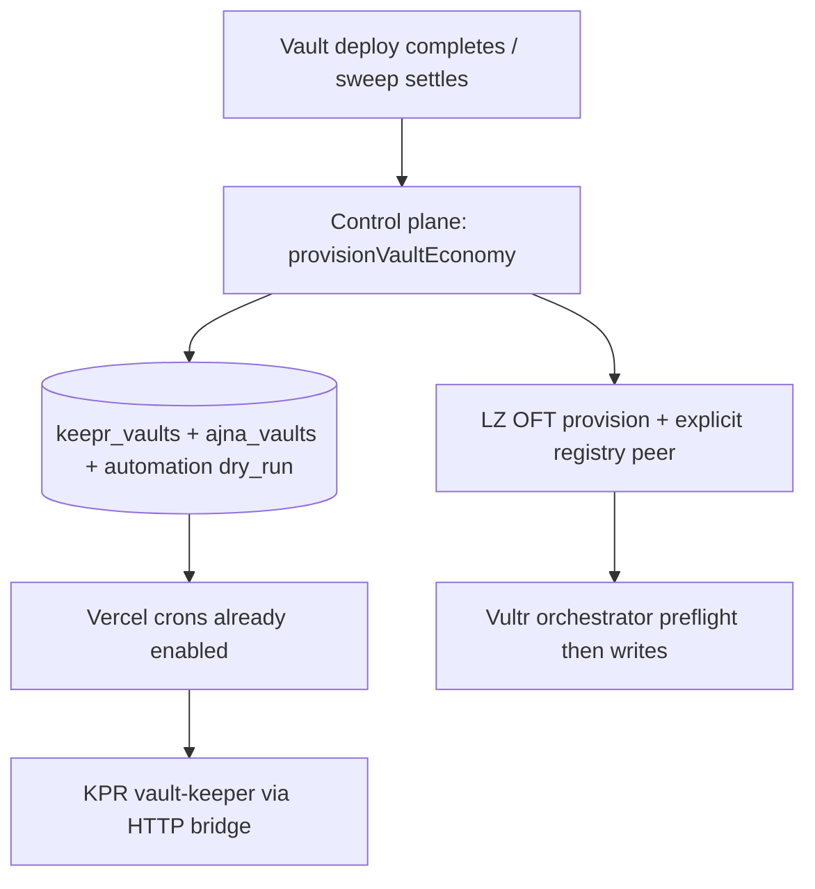

# AKITA keeper stack activation

Turn-on checklist for live vault `0x82C06EaAE27B1Ca31fA29F22341A162A670A4471` (creator `0x5b674196812451b7cec024fe9d22d2c0b172fa75`).

**Solana lottery policy:** lottery on Solana would be a **pool buy of share mesh**
only — not a historical creator SPL or compose deposit. The old entry-relay and
winner-relay workflows were removed with the Twin transport. See
[solana-share-mesh-lottery-policy.md](../operations/solana/solana-share-mesh-lottery-policy.md)
and [akita-solana-share-mesh-audit.md](../solana/akita-solana-share-mesh-audit.md).

## Layer map

| Layer | Host | What it runs |
|-------|------|----------------|
| Control plane | **Vercel** (`akita-llc/4626`) | Crons, `/api/keeper/*`, `/api/keepr/actions/*`, Ajna/Charm enqueue + queue processing |
| Base keeper writes | **Vercel** (`KPR_PRIVATE_KEY` / `PROTOCOL_AUTOMATION_SAFE`) | `tend` / `report` via HTTP bridge; Charm `rebalance()` via **hot automation Safe** `0x08f087…8eBE` |
| XMTP agent | **Railway** (`4626-keepr-agent`) | Eliza/XMTP primary only — **not** Charm automation |
| Solana execution | **Vultr** (`orchestrator.4626.fun`) | `/reconcile` maintenance actions such as fee settlement, price monitoring, graduation, and mapping sync |
| Local operator | **`kpr/.env`** | Dry-run + manual workflow runs against prod APIs |

## Phase 1 — Base keeper (Charm + Ajna bucket + vault tend/report)

### 1. Ship code (main production only)

Keeper stack fixes (HTTP bridge, Ajna cron, multi-adapter rebalance) must be on `main` before crons pick them up.

### 2. Vercel production env

Set in [Vercel → 4626 → Settings → Environment Variables](https://vercel.com/akita-llc/4626/settings/environment-variables):

| Variable | Value |
|----------|--------|
| `KPR_API_KEY` | Long random secret — **must be non-empty**; local `kpr/.env` must match |
| `KEEPER_AJNA_MANAGER_ENQUEUE_ENABLED` | `1` |
| `KEEPER_AJNA_MANAGER_CHAIN_ID` | `8453` |
| `KEEPER_AJNA_MANAGER_LIMIT` | `25` |
| `KEEPER_SOLANA_RECONCILE_ENABLED` | `1` (likely already set) |
| `KEEPER_SOLANA_RECONCILE_ACTIONS` | `settle_fees,price_monitor`; use only labels accepted by the current orchestrator. |
| `SOLANA_ORCHESTRATOR_URL` | `https://orchestrator.4626.fun` (no path suffix) |
| `SOLANA_ORCHESTRATOR_API_KEY` | Same secret as Vultr orchestrator env |
| `KEEPER_PROCESS_KPR_ACTIONS_ENABLED` | `1` — Vercel cron executes `keepr_actions` queue (Charm/Ajna writes) |
| `KEEPER_PROCESS_KPR_ACTIONS_LIMIT` | `1` until each strategy action has run cleanly |
| `KEEPER_STRATEGY_SIGNALS_ENABLED` | `1` (optional Pattern A) — cron-polled Charm/Ajna signal enqueue instead of websocket listener |
| `KPR_PRIVATE_KEY` | Canonical keeper/automation key — **must derive to** `0xed7eFE34D25a0B219de1b25AC99EB35E48CC1379` |
| `PROTOCOL_AJNA_KEEPER` | `0xed7eFE34D25a0B219de1b25AC99EB35E48CC1379` — Ajna `keeper` on deploy + paymaster checks |
| `PAYOUT_ROUTER_KEEPER` | `0xed7eFE34D25a0B219de1b25AC99EB35E48CC1379` — payout-router harvest signer pin |
| `4626_KEEPER_AUTOMATION_PUBLIC_KEY` | **Optional Vercel alias** — if set, must equal `PROTOCOL_AJNA_KEEPER` (do not use a second EOA) |
| `PROTOCOL_AUTOMATION_SAFE` | `0x08f0875E40781578F902998b2b831cc48d838eBE` — hot automation Safe (Charm manager + Ajna admin) |

Do **not** configure a separate automation private key. Retired: `0xed401e…a0Cd`.

Verify after env changes:

```bash
pnpm -C frontend exec tsx scripts/ops/verify-keeper-automation-alignment.ts
```

See `docs/_internal/operations/wallet/keeper-automation-setup.md`.

Redeploy production after changes (`[force-vercel]` commit or manual promote).

### 3. Local `kpr/.env`

| Variable | Value |
|----------|--------|
| `KPR_API_BASE_URL` | `https://app.4626.fun/api` |
| `KPR_API_KEY` | Same as Vercel |
| `AJNA_BUCKET_ORACLE_ADDRESS` | `0x8C044aeF10d05bcC53912869db89f6e1f37bC6fC` |
| `CHARM_REBALANCE_ORACLE_ADDRESS` | `0x8C044aeF10d05bcC53912869db89f6e1f37bC6fC` |
| `AJNA_BUCKET_VAULT_ADDRESS` | `0x82C06EaAE27B1Ca31fA29F22341A162A670A4471` |
| `CHARM_REBALANCE_VAULT_ADDRESS` | `0x82C06EaAE27B1Ca31fA29F22341A162A670A4471` |

### 4. Verify registry auth

```bash
./scripts/ops/test-akita-keeper-stack.sh
# Expect: GET /vaults/active -> HTTP 200
```

### 5. Run Base workflows

```bash
cd kpr
pnpm exec tsx runner.ts vault-keeper --dry-run
pnpm exec tsx runner.ts vault-keeper          # live tend/report via HTTP bridge
pnpm exec tsx runner.ts ajna-bucket-manager --dry-run
pnpm exec tsx runner.ts charm-rebalance-manager --dry-run
```

**Charm live path (Vercel control plane — not Railway):**

1. **Enqueue** — one of:
   - **Pattern A (Vercel-only):** `KEEPER_STRATEGY_SIGNALS_ENABLED=1` + cron `/api/keeper/jobs/enqueue-strategy-signals`, or `KEEPER_STRATEGY_CANARY_ENABLED=1` for canary vaults
   - **Pattern B (ops VPS):** long-lived `strategy-signal-listener` + `keepr-action-queue` via `kpr/runner.ts` (systemd on ops host) — still calls Vercel `/api/keepr/actions/enqueue`
   - **Operator:** `pnpm exec tsx runner.ts charm-rebalance-manager`
2. **Process** — `KEEPER_PROCESS_KPR_ACTIONS_ENABLED=1` on Vercel (`/api/keeper/jobs/process-keepr-actions`) or Pattern B `keepr-action-queue` worker
3. **Execute** — `/api/keepr/actions/execute`:
   - Charm → **protocol automation Safe** `rebalance()` when vault `manager` is the automation Safe
   - Ajna rebucket → **protocol automation Safe** `setMinBucketIndex()` when `AjnaVaultAuth.admin` is the automation Safe
   - Ajna liquidity moves → **automation EOA** `moveFromBuffer()` via `/api/keeper/ajna/rebalance`

### Two-Safe model (new deploys)

| Role | Address | Powers |
|------|---------|--------|
| **Protocol treasury** `0x7d429e…f2d3` | Cold Safe | Strategy **ownership**, USDC custody, Solana strategy **`keeper`** slot, governance |
| **Protocol automation** (`PROTOCOL_AUTOMATION_SAFE`) | Hot Safe | Charm vault **`manager`**; Ajna **`admin`** (`setMinBucketIndex`) |
| **Automation EOA** (`KPR_PRIVATE_KEY` / `PROTOCOL_AJNA_KEEPER`) | Hot signer | Safe owner (when configured); Ajna auth **`keeper`** (`moveFromBuffer` / buffer moves) |

Deploy a fresh **DeploymentBatcher** with `PROTOCOL_AUTOMATION` set before redeploying vaults. Creators do **not** operate Ajna on new vaults — protocol automation owns rebucket + buffer moves. Grandfathered vaults with CSW or treasury as Ajna admin keep existing exec paths until redeployed.

Railway deploys the XMTP Eliza agent only (`railway.toml`); it does not run Charm listeners or the action queue. See `docs/operations/automation/keeper-job-coordination.md` for env details.

### 6. Ajna Vault Manager P0

Per `docs/operations/ajna-vault-manager-p0-runbook.md`:

1. Confirm `ajna_vaults` row exists for AKITA strategy adapter.
2. Set `automation_status = dry_run` for canary.
3. After enqueue cron runs, promote to `live` via `POST /api/deploy/v2/ajna/automation/control`.

## Phase 2 — Solana share mesh

The active lane is the per-creator LayerZero ShareOFT mesh. Twin
`SolanaBridgeAdapter` registration, `registerSolanaBridgeToken`, and the
strict-parity creator SPL mint `9JWh…` are preserved historical grain; they do
not gate AKITA's active share-mesh route.

Before finalize:

1. Reuse or provision AKITA's LZ OFT store/mint with the canonical
   [creator provisioning runbook](../operations/solana/solana-share-mesh-creator-provisioning.md).
2. Seed
   `Registry4626.setRemoteOFTPeerBytes32(AKITA, 30168, 0xdf9a9ef76562adbfe0231e2c5cee77f24a1f9eac519d3fbb029fe5b454d9cd3f)`.
3. Verify the registry peer is non-zero and the v1.19.0 batcher
   `0x02D7abC547F8B1e7E2D7a919D8D1005918361750` has destination + OVault
   runtime enabled.
4. After supply arrives on Solana, create the Meteora pool against the LZ
   share-mesh mint through the canonical budget/runbook path.

### Vultr orchestrator env (`/etc/4626/solana-keeper-orchestrator.env`)

After LZ store/mint wiring + explicit registry-peer preflight is clean, configure
only the remaining LayerZero maintenance surfaces:

| Variable | Value |
|----------|--------|
| `SOLANA_ORCHESTRATOR_EXECUTE` | `1` |
| `SOLANA_CREATOR_MINTS` | Use the LZ share-mesh mint only where a remaining workflow requires a mint. |
| `SOLANA_SHARE_OFT_MAPPING` | After Phase B: `{"<share_mesh_mint>":"0x4df30fFfDA1D4A81bcf4DC778292Be8Ff9752a57"}` — not creator SPL → ShareOFT. |
| `KPR_PRIVATE_KEY` | Production keeper (`0xAb6d5…`) |

Restart: `sudo systemctl restart solana-keeper-orchestrator`

Optional B2 hook setup remains non-production. It does not restore the removed
Twin relay or rebalance actions.

## Historical Twin status (2026-05-25)

This table records the retired adapter grain as observed on 2026-05-25. It is
not the current launch checklist.

| Check | Status |
|-------|--------|
| Vultr orchestrator `/healthz` | ✅ 200 |
| AKITA on then-canonical Solana adapter | ❌ not registered (legacy; no active remediation required) |
| ShareOFT on adapter | ❌ neither current nor target share registered (legacy) |
| Local `KPR_API_KEY` vs Vercel | sync via `./scripts/ops/sync-kpr-env-from-vercel.sh` |
| Keeper code on `main` | ✅ shipped |
| `KEEPER_AJNA_MANAGER_*` on Vercel | ✅ enabled |

## Making this seamless (target architecture)

Today activation is manual because three things are decoupled:

1. **On-chain deploy** (vault exists)
2. **DB registry** (`keepr_vaults`, `ajna_vaults`) — empty for grandfathered vaults like AKITA
3. **Host env** (Vercel crons, Vultr orchestrator, local `kpr/.env`)

The seamless model is: **deploy completion is the only human trigger**. Everything else chains automatically.



### What to build (priority order)

| Priority | Change | Effect |
|----------|--------|--------|
| P0 | **Grandfathered vault backfill** — `scripts/ops/backfill-keepr-vault.ts` upserts AKITA into `keepr_vaults` + `ajna_vaults` from on-chain + `AKITA_DEFAULTS` | Registry stops returning 0 vaults |
| P0 | **`sync-kpr-env-from-vercel.sh`** | One command local env sync (no dashboard copy/paste) |
| P1 | **Post-settle hook** — `executeSettleVault` calls `ensureKeeperRegistryForVault` when `settlementStage=completed` | New deploys auto-seed registry if row missing |
| P1 | **Enable `KEEPER_ACTIVE_VAULT_ENQUEUE_ENABLED=1`** with `tend,report` | Crons fan out vault keeper without KPR polling registry |
| P2 | **Solana share mesh (Pipe A)** — per-creator LZ OFT + `Registry4626.setRemoteOFTPeerBytes32` before finalize | Legacy `solana_bridge_strategy`, adapter registration, global peer, and creator-SPL auto-pool retired |
| P2 | **Ajna default `dry_run`** on seed, promote to `live` via control-plane only | Safe-by-default automation |

### One-time AKITA backfill (grandfathered vault)

After Vercel deploy + env sync:

```bash
# Preview
pnpm -C frontend exec tsx scripts/ops/backfill-keepr-vault.ts --dry-run

# Write keepr_vaults + ajna_vaults
pnpm -C frontend exec tsx scripts/ops/backfill-keepr-vault.ts --execute

# Confirm registry
./scripts/ops/test-akita-keeper-stack.sh
```

Requires `DATABASE_URL` (same Supabase pooler URL as production API). Optional `--creator` if on-chain owner resolution differs from expected CSW.

### Operator UX today

```bash
# 1. Sync secrets (after Vercel deploy)
./scripts/ops/sync-kpr-env-from-vercel.sh

# 2. Smoke
./scripts/ops/test-akita-keeper-stack.sh

# 3. Dry-run keeper
cd kpr && pnpm exec tsx runner.ts vault-keeper --dry-run
```

New deploys that complete settlement via control plane auto-call `ensureKeeperRegistryForVault` (env `KEEPER_REGISTRY_AUTO_BOOTSTRAP_ENABLED=1`, default on).

