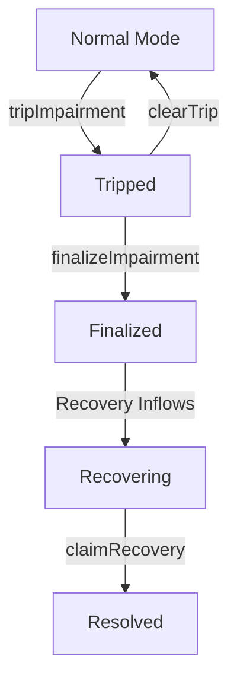

# Impairment Side-Pocket Implementation Plan

**Version:** 2.0  
**Date:** June 1, 2026  
**Status:** Draft for Implementation

---

## Objective

Implement impairment side-pocketing for CreatorOVault that:

- Preserves ERC-4626 share fungibility for the clean book.
- Blocks atomic NAV arbitrage during impairment transitions.
- Routes recovery value **only** to holders at the time of impairment.
- Uses **realized proceeds only** — never discretionary marks.

---

## Canonical Decisions

| Decision | Rationale |
|---------|---------|
| Main vault share remains single-class fungible | Represents the **clean book only** after impairment finalization |
| Two-layer model | `Vault Mode` (`Normal` / `Suspect`) + `Epoch Lifecycle` (`Tripped` → `Finalized` → `Resolved`) |
| v1 Claim Rights | Non-transferable epoch claims (upgrade path to optional transferability in v2) |
| v1 Snapshot | Merkle root captured at trip boundary with deterministic tooling and challenge window |
| Recovery Accounting | Realized inflows only → recovery pool/escrow. No manual impaired NAV marks ever |

---

## Source of Truth

- **ADR / Policy Document**: `state-machine-rights-separation.md`  
  Short, product-facing. Contains invariants, trust model, allowed triggers, and what governance **cannot** do.

- **Technical Spec**: `impairment-pricing-in-vaults.md`  
  Contains storage layout, function signatures, tests, and operational runbook.

---

## Architecture

**Vault Modes**: `Normal` → `Suspect` (during active trip)  
**Epoch States**: `Tripped` → `Finalized` → `Resolved`

---

## Implementation Phases

### Phase 0 — Documentation & Governance Alignment

- Normalize both research documents into clean Markdown.
- In the ADR, explicitly define:
  - Allowed impairment triggers (objective on-chain signals + guardian lane).
  - Emergency guardian powers and their limits.
  - What governance **cannot** do (no arbitrary NAV marking of impaired positions).
- Create integration attribution policy:
  - Direct holders → receive claims.
  - Wrappers / lending markets → claims accrue to the holding contract (v1 behavior).

### Phase 1 — Storage + State Machine (No Behavior Change)

- Extend `CreatorOVaultModuleStorage.sol` with appended fields:
  - `vaultMode` enum (`Normal`, `Suspect`)
  - Active epoch metadata (strategy, trip block, Merkle root, claim supply, recovered/claimed totals, status)
  - Per-account claim accounting (`minted`, `claimed`)
- Add comprehensive events and custom errors.
- Bump storage version.

### Phase 2 — Circuit Breaker + Flow Gating

In `CreatorOVaultCoreModule.sol`:

- `tripImpairment(strategy, reasonCode)`  
  Objective preconditions + emergency guardian lane.
- `clearImpairmentTrip(epochId)` for transient issues.
- While in `Suspect` mode:
  - `deposit` / `mint` blocked
  - `withdraw` / `redeem` → queue-only or disabled
- Update all `max*` ERC-4626 view functions to return safe bounds.

### Phase 3 — Finalization and Clean-Book Separation

- `finalizeImpairment(epochId, snapshotRoot, totalClaimSupply)`
  - Records epoch metadata
  - **Permanently excludes** impaired strategy from `totalAssets()` and active routing
  - Returns vault to `Normal` mode for clean-book operations
  - Epoch remains open for recovery

> **Important**: The excluded book value is derived on-chain at finalization. It is **never** passed in as a parameter.

### Phase 4 — Claim Rights + Recovery Pool

- Deploy `CreatorOImpairmentClaims` (ERC-1155, epoch as ID)
  - v1: **Non-transferable**
  - Mint via verified Merkle proof (once per account per epoch)
- Add recovery accounting (module or dedicated escrow):
  - `notifyRecovery(epochId, asset, amount)` — realized inflows only
  - `claimRecovery(epochId, receiver)` — pro-rata and idempotent
- **Critical rule**: Recovered assets **never** flow into clean-book `totalAssets()`.

**Snapshot & Challenge Window** (to be implemented in this phase):
- Merkle root is generated at `tripImpairment` time.
- A configurable challenge window follows during which the root can be disputed with on-chain evidence.
- After the window closes, the root is finalized and claims can be minted.

### Phase 5 — Strategy & Debt Integration

Wire into `CreatorOVaultStrategiesModule.sol`:

- Ejection/unwind proceeds route to the correct epoch recovery pool.
- `buyDebt()` proceeds related to an impaired epoch are treated as recovery inflows.
- Prevent double-counting between recovery distribution and clean vault assets.
- Impaired strategies require an explicit governance reinstate path before reactivation.

### Phase 6 — Tests, Invariants & Fork Validation

- Deterministic tests for:
  - Same-block anti-arbitrage at trip/finalize boundaries
  - Fairness (pre-trip holders receive claims; post-finalize depositors do not)
  - Merkle proof replay protection and malformed proof rejection
  - Partial + multiple recovery distributions
  - Conservation invariants (no double-crediting)
- Fork simulation runbook for a full forced impairment lifecycle before production enablement.

---

## Trust Model

| Actor | Powers | Constraints |
|-------|--------|-------------|
| **Emergency Guardian** | Can `tripImpairment` and `clearImpairmentTrip` | Limited to defined objective conditions + timelock where possible |
| **Governance** | Can reinstate strategies, adjust parameters | **Cannot** mark NAV, cannot arbitrarily assign recovery value |
| **Protocol** | Executes recovery distribution | Strictly pro-rata to snapshot claims only |

**Goal**: Minimize the trusted set, maximize objective on-chain triggers, and make all privileged actions visible and auditable.

---

## v1 vs v2 Scope

| Feature | v1 (Ship Target) | v2 (Future) |
|---------|------------------|-------------|
| Claim Transferability | Non-transferable | Optional transferability |
| Lending Market Support | Claims accrue to holding contract | Claim-aware adapters |
| Snapshot Mechanism | Merkle root + challenge window | Optional on-chain checkpoints |
| Composability | Main share remains clean | Enhanced integration support |

---

## Key Invariants (Release Gate)

1. No atomic ERC-4626 entry/exit can settle while the vault is in `Suspect` mode.
2. Finalized impaired strategies contribute **zero** to clean-book `totalAssets()`.
3. Recovery value cannot be counted in both clean NAV and epoch claims.
4. Claim eligibility is **fixed** at the trip boundary.
5. Post-trip depositors cannot obtain recovery rights from prior epochs.
6. The Merkle root used for claims must be finalized (post-challenge window) before any recovery can be notified.

---

## Delivery Checklist

- [ ] ADR and technical spec are synchronized and normalized
- [ ] Storage layout migration is safe and versioned
- [ ] All state transition events are indexed and documented
- [ ] Snapshot generation + verification tooling is reproducible
- [ ] Emergency guardian powers and limits are clearly documented
- [ ] User and integrator disclosures are prepared for launch
- [ ] Full impairment lifecycle tested on fork

---

## Open Items / Future Work

- Define exact parameters and duration for the Merkle challenge window.
- Decide on recovery pool architecture (module vs dedicated escrow contract).
- Evaluate user experience impact of non-transferable claims in v1.
- Design claim-aware adapter patterns for major lending markets (v2).

---

*This document reflects decisions made to balance fairness, atomicity protection, composability, and pragmatic delivery scope.*
