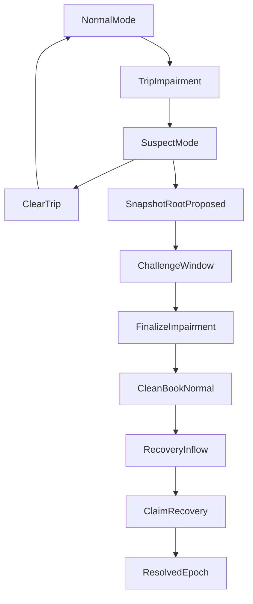

# Impairment Side-Pocket Canonical Spec (v1)

**Version:** 3.0  
**Date:** June 1, 2026  
**Status:** Canonical Implementation Spec (v1)

---

## Objective

Implement impairment handling for `CreatorOVault` that:

- Preserves ERC-4626 share fungibility for the clean book.
- Blocks atomic NAV arbitrage during impairment windows.
- Allocates recovery only to holders at the impairment boundary.
- Uses realized proceeds only (no discretionary impaired NAV marks).

---

## Core Model

### Two-layer state model

- **Vault mode**
  - `Normal`
  - `Suspect`

- **Impairment epoch lifecycle**
  - `Tripped`
  - `Finalized`
  - `Resolved`

### Clean-book and recovery rights split

- Main ERC-4626 share token remains a **single fungible class**.
- After finalization, main shares represent **clean-book assets only**.
- Recovery from impaired strategy is distributed through separate epoch claim rights.

---

## Canonical Decisions (Locked)

1. Snapshot boundary is the **trip block**, not finalize block.
2. v1 claims are **non-transferable** epoch claims.
3. v1 snapshot mechanism is **Merkle root + challenge window**.
4. Recovery accounting is **realized-only**.
5. Finalized impaired strategies contribute **zero** to clean-book `totalAssets()`.
6. Only one active `Tripped` epoch at a time in v1.
7. `excludedBookValue` is diagnostic only and never authoritative for accounting.

---

## State Flow

---

## Impairment Reason Codes

Use an explicit reason enum (or equivalent code registry):

- `ValuationUnavailable`
- `StrategyReportStale`
- `WithdrawProbeFailed`
- `StrategyDisabledUnreconciled`
- `ExternalProtocolPaused`
- `ExploitSuspected`
- `GuardianEmergency`

---

## Required Behavior by Mode

### Normal mode

- ERC-4626 functions operate normally.

### Suspect mode

- `deposit` / `mint`: blocked (revert).
- `withdraw` / `redeem`: blocked or queue-only (v1 policy).
- `maxDeposit`, `maxMint`, `maxWithdraw`, `maxRedeem`: return `0`.
- `preview*`: callable if desired for estimates, but explicitly non-settlement guidance during `Suspect`.

---

## Phase Plan

### Phase 0 — Governance and docs alignment

- Maintain one ADR-level doc and one technical spec.
- ADR must define:
  - allowed trip triggers,
  - guardian powers and limits,
  - explicit prohibition on manual impaired NAV assignment,
  - integration attribution disclosure.

### Phase 1 — Storage and event scaffolding

- Append impairment storage in module storage layout.
- Add transition events/errors.
- Bump module storage version safely.

### Phase 2 — Trip / clear circuit breaker

- Implement `tripImpairment(strategy, reasonCode)`.
- Implement `clearImpairmentTrip(epochId)` for transient faults.
- Enforce `Suspect` mode flow restrictions.

### Phase 3 — Snapshot challenge and finalization

- Propose snapshot root for trip-boundary ownership.
- Enforce challenge window.
- Finalize epoch:
  - lock root/claim supply,
  - exclude impaired strategy from clean NAV/routing,
  - return vault mode to `Normal` for clean-book operation.

### Phase 4 — Claims and recovery escrow

- Add non-transferable epoch claim token.
- Add proof-based one-time claim mint.
- Use dedicated `RecoveryEscrow` for epoch recoveries.
- Add pro-rata claim redemption across partial/multiple inflows.

### Phase 5 — Strategy/debt integration

- Ensure unwind and debt-sale proceeds route into epoch recovery.
- Prevent any double-counting with clean NAV.
- Require explicit reinstate path for impaired strategies.

### Phase 6 — Testing and fork validation

- Atomic-arb boundary tests.
- Fairness tests for pre-trip holders.
- Merkle proof integrity tests.
- Conservation/double-count invariants.
- Full forced impairment lifecycle on fork before production enablement.

---

## Accounting Rules

1. `excludedBookValue` is for diagnostics/audit visibility only.
2. Clean-book `totalAssets()` must not include:
   - finalized impaired strategy value,
   - recovery escrow balances.
3. Recovery entitlement is computed only from:
   - finalized epoch claim balances,
   - realized recovery inflows.

---

## RecoveryEscrow Rule

v1 uses dedicated escrow to keep invariants clean:

- Assets in `RecoveryEscrow` are never clean-book vault assets.
- Escrow accounting is epoch-scoped.
- Recovery notifications must be tied to trusted settlement paths or strict delta accounting with contamination protections.

---

## v1 / v2 Boundary

### v1 (ship)

- Non-transferable claims.
- Merkle snapshot + challenge window.
- Dedicated recovery escrow.
- No claim-aware adapter support for wrappers/lending protocols.

### v2 (future)

- Optional transferable claims.
- Claim-aware integration adapters.
- Optional onchain share checkpoints.
- New distribution accounting model suitable for transferable claims.

---

## Release-Gate Invariants

1. No atomic entry/exit settlement while vault is `Suspect`.
2. Finalized impaired strategies contribute zero to clean-book NAV.
3. Recovery value cannot be counted in both clean NAV and claim pool.
4. Claim eligibility is fixed at trip boundary.
5. Post-trip entrants cannot gain prior epoch recovery rights via vault entry.
6. No claims/recovery distribution before root finalization.

---

## Integration Attribution Disclosure (Required for v1)

If shares are held by a wrapper/lending contract at `tripBlock`, that contract receives claim rights in v1. Beneficial-owner pass-through is not guaranteed until claim-aware adapters are shipped.

---

## Open Items

1. Challenge window duration and dispute process.
2. Exact `withdraw/redeem` policy in `Suspect` (hard block vs queue-only).
3. Recovery notification mechanism details (trusted-path accounting vs strict generic delta constraints).
4. Reinstatement governance policy and operational checks.

---

## Out of Scope (v1)

- Transferable claim markets.
- Automatic beneficial-owner attribution across external wrappers/lending markets.
- Full multi-active-trip orchestration.
