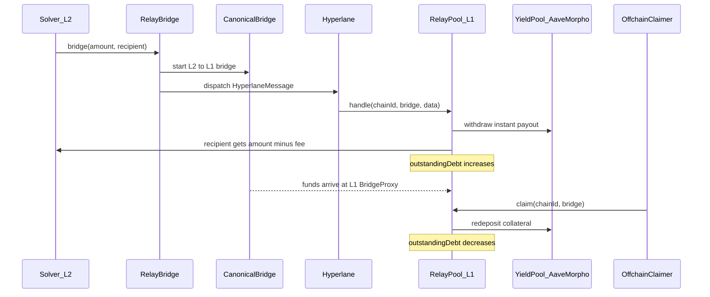
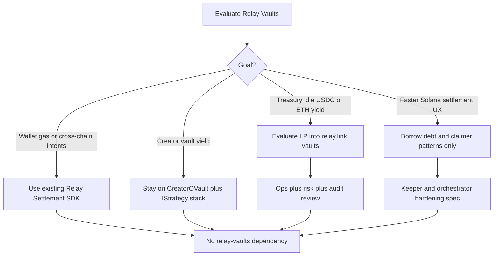

# Relay Vaults — Full Evaluation for 4626

Research date: 2026-05-22  
Source repo: [relayprotocol/relay-vaults](https://github.com/relayprotocol/relay-vaults)  
Related 4626 docs: [Relay-Sponsored Owner Mutation Flow](/operations/relay-sponsored-owner-mutation-flow)

## Executive summary

**Relay Vaults** and **Relay Settlement** are sibling products in the [relay.link](https://relay.link) ecosystem. 4626 already integrates **Relay Settlement** (`@relayprotocol/relay-sdk`, `/api/relay/*`) for wallet execution (CSW owner mutations, gas-sponsored UserOps). **Relay Vaults are not integrated** and serve a different purpose: ERC-4626 LP pools that **loan liquidity instantly** on Ethereum while slow canonical L2→L1 bridges settle.

**Default recommendation:** Treat relay-vaults as **reference architecture**, not a near-term product dependency. Creator vault economics should remain on `CreatorOVault` + paid `IStrategy` adapters. The only actionable dependency candidate is **optional protocol treasury LP** into existing WETH/USDC pools at [relay.link/vaults](https://relay.link/vaults) — a treasury allocation decision, not a vault architecture change.

---

## Glossary: Settlement vs Vaults

| Term | Product | What it does | 4626 usage |
|------|---------|--------------|------------|
| **Relay Settlement** | Intent solver + gas abstraction API | Fills cross-chain user intents; sponsors gas for bundled txs | Yes — [`frontend/api/_handlers/relay/`](/api/relay), [`docs/operations/relay-sponsored-owner-mutation-flow.md`](/operations/relay-sponsored-owner-mutation-flow) |
| **Relay Vaults** | ERC-4626 bridge-acceleration pools | LPs deposit on L1; solvers bridge from L2; pool instant-pays on Hyperlane message; slow bridge replenishes via `claim()` | No |
| **Relay Pool (`RelayPool`)** | L1 vault contract | Solmate ERC-4626 wrapper over Aave/Morpho; `handle()` / `claim()` debt lifecycle | N/A |
| **Relay Bridge (`RelayBridge`)** | L2 origin entry | Solver calls `bridge()`; starts canonical bridge + Hyperlane dispatch | N/A |
| **Claimer** | Off-chain service | Calls `RelayPool.claim()` when slow bridges finalize | N/A (4626 has Solana orchestrator instead) |

Do not conflate `/api/relay/quote` (Settlement deposit discovery for `EntryPoint.handleOps`) with Relay Vault LP deposits.

---

## What Relay Vaults solves

From the [whitepaper](https://github.com/relayprotocol/relay-vaults/blob/main/WHITEPAPER.md):

- Solvers cannot always fill large or exotic cross-chain orders instantly.
- Canonical bridges are cheap and unlimited size but slow (up to ~7 days).
- Relay Vaults target **~30 second payouts** backed by L1 pool liquidity, with collateral arriving later via the slow bridge.

**Design choice:** Embrace one-directional “toxic” flow (no netting). 100% of bridge volume eventually replenishes the pool, so each pool is **one-sided on L1**, isolated per asset, and permissionless-deployable. Solvers handle bi-directional netting; the pool absorbs one-way excess.

---

## Architecture

### Network topology

| Role | Chains (deployed) | Contracts |
|------|-------------------|-----------|
| **Pool network** | Ethereum mainnet (`chainId 1`); test/sepolia factories also exist | `RelayPool`, `RelayPoolFactory`, `RelayPoolNativeGateway` |
| **Origin networks** | Base (`8453`), Arbitrum, Optimism, Blast, zkSync Era, others | `RelayBridgeFactory`, per-asset `RelayBridge`, L2 `BridgeProxy` |

Factory addresses ship in `@relay-vaults/addresses` (e.g. mainnet `RelayPoolFactory` `0x7098c1873A6d6788726381E3a0855Da91331ff73`, Base `RelayPoolFactory` `0x679436B2c2A71d9317a9aC652d06CA2b958B6Cd4`).

### Contract stack

| Contract | Chain | Role |
|----------|-------|------|
| `RelayPool` | Pool (L1) | Solmate ERC-4626; `handle()` instant loans; `claim()` replenishment |
| `RelayBridge` | Origin L2 | Solver entry; slow bridge + Hyperlane message |
| `BridgeProxy` (paired) | L1 + L2 | OP Stack, Arbitrum Orbit, CCTP, zkSync native bridge adapters |
| `RelayPoolNativeGateway` | L1 | ETH ↔ WETH deposit path for ERC-4626 |
| `RelayPoolFactory` / `RelayBridgeFactory` | L1 / L2 | Permissionless deployment |
| `TokenSwap` | L1 | Uniswap V3 helper for stray tokens → pool asset |

### End-to-end solver bridge flow



### Roles

| Role | Action |
|------|--------|
| **LP** | Standard ERC-4626 `deposit` / `withdraw` via [relay.link/vaults](https://relay.link/vaults) or Hardhat tasks |
| **Solver** | Programmatic `RelayBridge.bridge()` on origins (no public UI) |
| **Pool curator (timelock owner)** | Add origins, change yield pool, streaming period, token swap |
| **Origin curator** | Fast `disableOrigin()` (sets `maxDebt = 0`) on compromised bridge |
| **Claimer (off-chain)** | Monitors slow bridge completion; calls `RelayPool.claim()` |
| **Hyperlane relayers** | Deliver messages to `handle()` |

### Off-chain ops model

Monorepo components:

- **`backend/`** — Ponder indexer + GraphQL API
- **`claimer/`** — Processes bridge claims (`docker run … claimer start`)

Without a running claimer, `outstandingDebt` is not cleared and L1 pool liquidity erodes. Hyperlane retries exist but manual CLI fallback may be required (`hyperlane status --id … --relay`).

---

## ERC-4626 implementation (Relay Vaults)

**Base library:** Solmate `ERC4626` (not OpenZeppelin). Individual contract files use `SPDX-License-Identifier: MIT`.

### Asset custody

`RelayPool` does **not** hold idle liquidity. Deposits forward immediately to an external **yield pool** (Aave, Morpho, or any ERC-4626):

- `afterDeposit` → `yieldPool.deposit()`
- `beforeWithdraw` → pull from `yieldPool`

### `totalAssets()` accounting

From `RelayPool.sol`:

```
totalAssets = yieldPoolBalance + outstandingDebt - pendingBridgeFees - remainsToStream()
```

| Component | Meaning |
|-----------|---------|
| `yieldPoolBalance` | Redeemable value of pool's yield-pool shares |
| `outstandingDebt` | Funds instant-paid to bridge recipients not yet replenished |
| `pendingBridgeFees` | Fees still inside yield pool until claim streams them |
| `remainsToStream()` | Unvested bridge fees (default ~7-day streaming period) |

This is **not** standard ERC-4626 semantics — bridge debt and fee streaming are protocol-specific extensions.

### Non-standard entrypoints

| Function | Caller | Purpose |
|----------|--------|---------|
| `handle(chainId, bridgeAddress, data)` | Hyperlane mailbox only | Verify origin, nonce, cooldown; instant-pay recipient; increase debt |
| `claim(chainId, bridge)` | Anyone (claimer bot in practice) | Pull bridged funds from L1 `BridgeProxy`; decrease debt; redeposit to yield pool |
| `processFailedHandler()` | Owner | Manual recovery for stuck Hyperlane messages |

### Per-origin risk knobs (`OriginSettings`)

- `maxDebt` — cap on instant loans from this origin
- `bridgeFee` — fractional bps (`denominator = 100_000_000_000`)
- `coolDown` — min delay after message timestamp before `handle()`
- `curator` — can emergency-disable origin

### Governance warning

Smart-contracts README explicitly states a misconfigured **curator can steal LP funds** — pool owner must be a **timelock** (≥7 days) backed by multisig or share-weighted governor.

---

## ERC-4626 comparison: Relay Vaults vs 4626 CreatorOVault

| Dimension | **4626 CreatorOVault** | **Relay Vaults RelayPool** |
|-----------|------------------------|----------------------------|
| **Purpose** | Creator Coin yield + ShareOFT user shares | Cross-chain solver liquidity + bridge acceleration |
| **ERC-4626 base** | OpenZeppelin (`contracts/vault/CreatorOVault.sol`) | Solmate |
| **Underlying asset** | Creator Coin (per-vault, Base-native) | WETH / USDC on **Ethereum L1** (and pool-network equivalents) |
| **Yield source** | Weighted `IStrategy` adapters (Charm LP, Ajna nested ERC-4626, Solana bridge+NAV) | Single external yield pool (Aave/Morpho) |
| **Cross-chain** | LayerZero OFT compose + `SolanaBridgeAdapter` (keeper-reported NAV) | Hyperlane fast message + canonical L2→L1 slow bridge |
| **Share layers** | ▢ vault shares → ■ ShareOFT via `CreatorOVaultWrapper` | Single ERC-4626 share token per pool |
| **Debt model** | `strategyDebt` / strategy NAV; withdrawal queue | `outstandingDebt` per origin until `claim()` |
| **LP vs solver paths** | Same deposit/withdraw for all LPs | **Separate:** LPs use ERC-4626; solvers use `RelayBridge.bridge()` |
| **Ops** | Keeper `tend()` / `report()` (`/api/keeper/*`) | Hyperlane relayers + claimer bot + timelock governance |
| **Deploy model** | Per-creator vault via `DeploymentBatcher` | Permissionless pool factory per asset |
| **Profit smoothing** | Time-based profit unlocking in core module | Bridge fee streaming over `streamingPeriod` |

**Closest 4626 analog:** `ERC4626StrategyAdapter` wrapping `AjnaERC4626Vault` — outer vault wraps inner ERC-4626 yield venue. Economic purpose differs: Ajna earns lending yield on Creator Coin; RelayPool earns lending yield **plus bridge fees** while temporarily lending against bridge collateral.

**4626 nested ERC-4626 stack:**

```
CreatorOVault (OZ ERC-4626, ▢ shares)
  └─ ERC4626StrategyAdapter (IStrategy)
       └─ AjnaERC4626Vault (inner ERC-4626, Ajna buckets)
```

---

## Integration path fit matrix (paths A–E)

| Path | Description | Verdict | Owner | Blockers |
|------|-------------|---------|-------|----------|
| **A** | Use `RelayPool` as a `CreatorOVault` strategy | **No-go** | Product / contracts | Creator Coins are Base-native; Relay pools require canonical L1 assets with OP Stack / Arbitrum / CCTP bridge proxies. No Relay infrastructure for Zora Creator Coins. |
| **B** | Protocol treasury LP into existing Relay Vaults | **Possible (orthogonal)** | Protocol treasury / ops | Valid treasury yield allocation, not product integration. Requires separate risk review, monitoring, timelock watch. Not covered by existing keeper jobs. |
| **C** | Adopt Relay **patterns** for Solana rebalance | **Inspirational only** | Infra / keeper | No dependency. See [Solana pattern memo](#solana-pattern-memo) below. |
| **D** | Use `@relay-vaults/client` in frontend/API | **Low value** | Product | Only useful for treasury dashboard or solver tooling. Adds second Relay product surface alongside Settlement SDK. |
| **E** | Extend Relay Settlement integration | **Already done** | Wallet / auth | Settlement API unchanged by vaults repo. Continue `/api/relay/*` for wallet ops. |

### Explicit non-goals

- Do **not** deploy a Creator Coin `RelayPool` without new bridge infrastructure and asset parity on Ethereum L1.
- Do **not** merge Relay Settlement SDK routes with Relay Vault contract calls.
- Do **not** route creator vault idle assets through Relay pools without a treasury-level governance vote and ops runbook.

---

## Solana pattern memo

Maps Relay Vault `handle` / `claim` / `outstandingDebt` patterns to 4626's Solana lane.

### Conceptual mapping

| Relay Vaults | 4626 Solana lane | Alignment |
|--------------|------------------|-----------|
| `RelayBridge.bridge()` starts slow bridge + fast message | `SolanaStrategy.rebalanceToSolana()` moves tokens to adapter; keeper calls `bridgeToSolana()` | **Partial** — 4626 has no instant recipient payout on fast message |
| `RelayPool.handle()` instant-pays from pool liquidity | N/A | **None** — SolanaStrategy does not front liquidity to end users |
| `outstandingDebt` until `claim()` | Tokens at adapter / remote NAV before keeper reconciliation | **Partial** — similar “assets in flight” concept, different proof model |
| Per-origin `maxDebt` | `strategyMaxAssets`, `maxNavDeltaBpsPerUpdate`, `minBaseLiquidityBps` | **High** — already similar risk caps |
| Fee streaming to LPs | Profit unlocking in `CreatorOVaultCoreModule` | **Medium** — same UX goal, different mechanism |
| Off-chain **claimer** | Solana orchestrator + `/api/keeper/solana/reconcile` | **High** — same ops category |

### 4626 Solana settlement today

**On-chain (`contracts/vault/strategies/SolanaStrategy.sol`):**

1. `rebalanceToSolana(amount)` — keeper moves Creator Coin from strategy → `SolanaBridgeAdapter` on Base.
2. `updateRemoteNav()` — keeper reports Solana-side NAV with delta caps, hourly anchor, `reportId` replay guard.
3. `reconcileFromSolana()` — marks tokens received back on Base after bridge.

**Post-adapter hop (`kpr/actions/keepr-solana-rebalance.action.ts`):**

- Polls adapter-held balances; dispatches `SolanaBridgeAdapter.bridgeToSolana()` (plain path live).
- Meteora atomic `bridgeToSolanaWithIxs()` **stubbed** — builder not shipped.
- Gated: `KPR_SOLANA_REBALANCE_EXECUTE=1`.

**Control plane (`frontend/api/_handlers/keeper/_solanaReconcile.ts` + `kpr/solana-keeper-orchestrator.ts`):**

- Checkpointed idempotent reconcile via `keepr_workflow_checkpoints` + control-plane operations.
- Actions: `relay_entries`, `settle_fees`, `winner_relay`, `price_monitor`, `graduation`, `rebalance`.
- Requires `SOLANA_ORCHESTRATOR_URL` on Vercel; missing → `skipped_unconfigured`.

### Gaps vs Relay claimer model

| Gap | Relay Vaults | 4626 today | Hardening idea |
|-----|--------------|------------|----------------|
| **In-flight accounting** | On-chain `outstandingDebt` per origin | Split across adapter balance + `remoteNav`; no single “debt until claim” counter | Add explicit `inFlightBridge` ledger on strategy or DB checkpoint tying adapter balance to pending bridge tx |
| **Claim automation** | Dedicated claimer service calls `claim()` on bridge finalization | Rebalance keeper partially stubbed; Meteora path blocked | Finish Meteora ix builder; wire orchestrator `rebalance` action to production env flags |
| **Replay protection** | Nonce map per `(chainId, bridge, nonce)` | `usedReportIds` on NAV updates | Extend idempotency to bridge tx hashes in checkpoints |
| **Cooldown before action** | `coolDown` on Hyperlane messages | NAV hourly anchor window | Already partially covered; document parallel intent |
| **Emergency disable** | Origin curator sets `maxDebt = 0` | `remoteNavEnabled`, `_emergencyPaused`, strategy removal | Document operator runbook for pausing Solana strategy weight |
| **Monitoring** | Indexer + GraphQL on bridge events | Control-plane ops + orchestrator health | Add alert on adapter balance above threshold without reconcile completion within SLA |

### Recommended keeper hardening (no code in this research pass)

1. **Ship Meteora `bridgeToSolanaWithIxs` builder** — unblocks creators with `creator_meteora_alpha_vaults` rows.
2. **Promote rebalance from plan-only to production** — set `KPR_SOLANA_REBALANCE_EXECUTE=1` and `SOLANA_ORCHESTRATOR_REBALANCE_ENABLED=1` with destination map populated.
3. **Checkpoint bridge tx hashes** — mirror Relay nonce dedupe in `keepr_workflow_checkpoints`.
4. **Adapter balance SLA alert** — if adapter `balanceOf(creatorToken)` > threshold for > N hours without successful reconcile, page ops (analogous to uncleared `outstandingDebt`).
5. **Document “in flight” state** in [`docs/operations/solana-bridge-naming-invariant.md`](../operations/solana-bridge-naming-invariant.md) — explicit Base→Solana two-hop diagram matching Relay’s handle/claim vocabulary for operator clarity.

---

## Protocol treasury LP option brief

**Scope:** Optional allocation of protocol treasury idle **USDC or WETH** into existing Relay Vault pools — **not** Creator Coin vault integration.

### Treasury context

- Protocol treasury Safe: `0x7d429e…f2d3` (1-of-2, documented in `AGENTS.md`).
- Treasury already receives creator strategy feature payments (USDC on Base) and protocol fee flows.

### Why consider it

- **Yield composition:** lending yield (Aave/Morpho via yield pool) + **bridge fees** from solver traffic.
- **Ecosystem alignment:** same vendor family as existing Relay Settlement integration for wallet ops.
- **Simple LP UX:** standard ERC-4626 deposit at [relay.link/vaults](https://relay.link/vaults).

### Pool selection criteria

| Criterion | Guidance |
|-----------|----------|
| **Asset match** | USDC or WETH pools on **Ethereum L1** (primary pool network). Base has factories but pool liquidity concentrates on L1 per Relay design. |
| **Yield pool backing** | Prefer pools using audited Aave/Morpho venues; verify on-chain `yieldPool` address before deposit. |
| **Origin diversity** | More authorized origins → more bridge fee volume but higher correlated `outstandingDebt` risk. |
| **Timelock delay** | Confirm pool owner is timelock with ≥7-day delay before depositing size. |
| **Outstanding debt headroom** | Monitor `outstandingDebt / maxDebt` per origin; spikes indicate claimer lag or bridge delays. |

### Expected yield sources

1. **Base yield** — external ERC-4626 / lending protocol APY on idle LP deposits.
2. **Bridge fees** — streamed to shareholders over ~7 days (`streamingPeriod`); not instant PPS jump.

### Monitoring checklist (ops)

- [ ] `RelayPool.outstandingDebt()` vs total pool TVL
- [ ] Per-origin `OriginSettings.outstandingDebt` vs `maxDebt`
- [ ] Claimer service health (Relay runs claimer; LPs rely on it indirectly)
- [ ] Hyperlane message failure rate / manual `processFailedHandler` events
- [ ] Timelock queued txs affecting `yieldPool`, origins, or curator
- [ ] Origin curator `disableOrigin` events

### Timelock watch workflow

1. Subscribe to pool owner (timelock) address on Etherscan / Safe notifications.
2. On queued tx: evaluate impact on `yieldPool` swap, new origins, or fee parameters.
3. If disagree: LP `withdraw` before timelock execution window closes (≥7 days per Relay docs).

### Decision gate

Requires **protocol treasury governance vote** separate from creator vault product work. Not a substitute for CreatorOVault strategy yield.

---

## Audit and license review

### Security audits

Per [relay-vaults/docs/README.md](https://github.com/relayprotocol/relay-vaults/blob/main/docs/README.md):

| Audit | File | Status (per Relay) |
|-------|------|-------------------|
| Spearbit / Cantina initial | `docs/report-cantinacode-relay-protocol-0203.pdf` | All Critical, High, Medium, Low **patched** |
| Spearbit / Cantina re-review | `docs/report-cantinacode-relay-protocol-rereview-0310.pdf` | Follow-up review |

**4626 action:** Read both PDFs before any treasury LP allocation or Solidity reuse. Do not rely on this summary alone for risk sign-off.

### License boundary

| Artifact | License | Implication for 4626 |
|----------|---------|----------------------|
| Repo root `LICENSE` | **GNU AGPL v3** | Forking/vendoring substantial repo code triggers AGPL obligations (including network use if modified code is served). |
| GitHub repo metadata | AGPL-3.0 badge | Consistent with root LICENSE |
| Root `package.json` | MIT (monorepo metadata) | Does not override root LICENSE for full repo |
| Solidity `RelayPool.sol` etc. | SPDX **MIT** per file | Per-file license only; combined work may still fall under repo terms when copied wholesale |
| Published npm (`@relay-vaults/abis`, `@relay-vaults/addresses`, `@relay-vaults/client`, …) | **MIT** | Safe to add as **read-only dependencies** for addresses/ABIs/client queries |

**Recommendations:**

| Action | Allowed without legal review? |
|--------|-------------------------------|
| Consume `@relay-vaults/addresses` / `@relay-vaults/client` as npm deps | Yes (MIT packages) |
| LP into deployed pools via standard ERC-4626 interface | Yes (on-chain interaction) |
| Copy-modify `RelayPool` / `RelayBridge` into `contracts/` | **No** — legal review required (AGPL + copyleft) |
| Run claimer/backend fork as a service | **No** — AGPL network copyleft likely applies |

4626 already uses `@relayprotocol/relay-sdk` (Settlement) — adding `@relay-vaults/client` is technically separate but increases Relay product surface; only add if treasury tooling needs it.

---

## Decision framework



---

## Key references

### External (relay-vaults)

- [Repository](https://github.com/relayprotocol/relay-vaults)
- [Whitepaper](https://github.com/relayprotocol/relay-vaults/blob/main/WHITEPAPER.md)
- [Smart contracts README](https://github.com/relayprotocol/relay-vaults/blob/main/smart-contracts/README.md)
- [LP UI](https://relay.link/vaults)
- [Cantina audit 1 (PDF)](https://github.com/relayprotocol/relay-vaults/blob/main/docs/report-cantinacode-relay-protocol-0203.pdf)
- [Cantina re-review (PDF)](https://github.com/relayprotocol/relay-vaults/blob/main/docs/report-cantinacode-relay-protocol-rereview-0310.pdf)

### 4626 baseline

- [`contracts/vault/CreatorOVault.sol`](../../contracts/vault/CreatorOVault.sol)
- [`contracts/vault/modules/CreatorOVaultCoreModule.sol`](../../contracts/vault/modules/CreatorOVaultCoreModule.sol)
- [`contracts/vault/strategies/ERC4626StrategyAdapter.sol`](../../contracts/vault/strategies/ERC4626StrategyAdapter.sol)
- [`contracts/vault/strategies/SolanaStrategy.sol`](../../contracts/vault/strategies/SolanaStrategy.sol)
- [`kpr/actions/keepr-solana-rebalance.action.ts`](../../kpr/actions/keepr-solana-rebalance.action.ts)
- [`frontend/api/_handlers/keeper/_solanaReconcile.ts`](../../frontend/api/_handlers/keeper/_solanaReconcile.ts)
- [`docs/operations/creator-strategy-features.md`](/operations/creator-strategy-features)
- [`docs/operations/relay-sponsored-owner-mutation-flow.md`](/operations/relay-sponsored-owner-mutation-flow)
