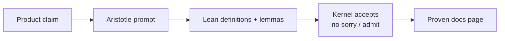

<nav class="audit-path" aria-label="Aristotle">
  <a class="audit-path__step" href="/audits">Audits hub</a>
  <a class="audit-path__step" href="/audits/aristotle">Aristotle</a>
  <a class="audit-path__step audit-path__step--current" href="/audits/aristotle">Introduction</a>
  <a class="audit-path__step" href="/audits/aristotle/curve-boost">2.5× boost (proven)</a>
  <a class="audit-path__step" href="/audits/aristotle/lean-proof-targets">Next targets</a>
</nav>

<section class="audit-hero">
  Aristotle · Lean&nbsp;4
  <h1 class="audit-hero__title">Introduction</h1>
  
Machine-checked proofs of lottery odds, boost math, fee splits, and payout fractions. These check formulas — they do not replace Solidity audits or Foundry tests.

  

    <a class="home-btn home-btn--primary" href="/audits/aristotle/curve-boost">Read proven 2.5× boost→</a>
    <a class="home-btn home-btn--ghost" href="/audits/aristotle/base-win-chance">Base win chance</a>
    <a class="home-btn home-btn--ghost" href="/audits/aristotle/lean-proof-targets">All Lean targets</a>
  

</section>

## What this is

**[Aristotle](https://aristotle.harmonic.fun/)** (from Harmonic) helps produce formal proofs. **Lean&nbsp;4** is the language and checker that accepts or rejects those proofs.

In plain English: we write a math claim the way the contracts compute it, then ask Lean to verify that the claim is true for every input in the model — not just the cases we tested by hand.

## What a proof means

1. **Model** — the formula in Lean (floors, clamps, BPS), matched to onchain integer math.
2. **Claim** — a property such as “raw boost is always between 1.0× and 2.5×.”
3. **Proof** — a chain of lemmas Lean’s kernel accepts.
4. **Done** — the project builds with **no `sorry` / `admit`**. Those keywords are unfinished holes (“TODO / trust me”). Empty means every step is closed.

If Lean accepts the file, the claim holds under that model. It does **not** mean “the whole protocol is safe.”

## Proofs vs audits vs tests

| | What it checks | Best for |
|---|----------------|----------|
| **June 2026 security review** | Code review findings, architecture, severity | Bugs, trust boundaries, release readiness |
| **Foundry tests** | Specific inputs and regressions you pick | Implementation wiring, edge cases you thought of |
| **Lean / Aristotle** | All inputs in a stated math model | Envelope properties (“never exceeds 2.5×”) |

You want all three. Lean does not replace the [Fable review](/audits/fable) or forge suites.

## How 4626 uses it

Operators keep Lean artifacts under `docs/audits/aristotle/<topic>/` in the repo. Public pages here summarize the readable claim, a worked example, the formula, and whether it is **Proven** or still queued.

## Published claims

| Claim | Status | Read |
|-------|--------|------|
| Personal lottery boost is **1.0×–2.5×** (Curve working balance + coverage blend) | **Proven** | [Curve 2.5× boost](/audits/aristotle/curve-boost) |
| Base win chance ($1 → 0.0004%) | **Proven** | [Base win chance](/audits/aristotle/base-win-chance) |
| Boosted win chance never exceeds the hard cap | **Proven** | [Post-boost pipeline](/audits/aristotle/post-boost-pipeline) |
| VRF roll matches the stated probability | **Proven** | [VRF fairness](/audits/aristotle/vrf-fairness) |
| Fee split BPS sum to 100%; floor residuals go to burn or voters (no unpaid dust) | **Proven** | [Fee-split](/audits/aristotle/gauge-fee-split) |
| Jackpot pays 69% of **reserve** (not fees twice) | **Proven** | [Jackpot payout](/audits/aristotle/jackpot-payout) |

## How to read a claim page

1. **Plain claim** — one sentence anyone can check against product docs.
2. **Worked example** — numbers you can recalculate by hand.
3. **Formula** — the onchain integer model.
4. **Proven / still open** — whether Lean already accepted it (and which project / lemmas when proven).

## What it does not mean

- Not whole-protocol formal verification.
- Not a substitute for Foundry or ops canaries (e.g. lottery boost sources may stay unset until enabled).
- Proofs are only as good as the **model matching the Solidity**. If code and model diverge, the proof is about the model.

## Related product docs

- [Fees, auction, and lottery](/overview/how-it-works)
- [LotteryManager](/contracts/utilities/lottery-manager)
- [GaugeController](/contracts/governance/gauge-controller)
- [June 2026 security review](/audits/fable)

  
Disclaimer

  
The five Lean targets below are marked <strong>Proven</strong> with Aristotle project IDs and repo artifacts under <code>docs/audits/aristotle/</code>. Proven models cover the stated formulas only — not runtime config, operator keys, or off-model Solidity paths.

