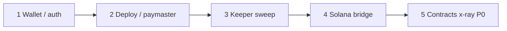

# Bug audit worksheet

Use this page when you need a **concrete audit order** and **file-level checklist**, not another high-level architecture essay.

**Canonical companions (read before changing behavior):**

| Doc | Use for |
|-----|---------|
| [ACCOUNT_MODEL.md](../ACCOUNT_MODEL.md) | Who signs, which address is canonical, populations (a)–(d) |
| [account-auth-invariants.md](../../frontend/docs/account-auth-invariants.md) | OTP, Telegram, waitlist, execution-ready |
| [4626-connection-methods.md](../4626-connection-methods.md) | `executionMode`, tx router, CSW vs EOA |
| [x-ray/review-todo.md](./x-ray/review-todo.md) | On-chain P0 (deploy, vault, OFT, lottery) |
| [x-ray/invariants.md](./x-ray/invariants.md) | Guards vs inferred vs cross-contract gaps |
| [x-ray/entry-points.md](./x-ray/entry-points.md) | Permissionless vs role-gated entry points |
| [codex/remediation-2026-04-02.md](./codex/remediation-2026-04-02.md) | Closed API/auth findings — regression net |
| [README.md](./README.md) | CI security gates and local `pnpm security:local` |

**Do not treat as product truth:** `docs/security/ci-red-baseline-audit.md` (Slither/gitleaks hygiene), `docs/operations/red-ci-tracking.md` (infra red checks).

---

## Repo map (where bugs hide)

| Lane | Path | Typical failure modes |
|------|------|------------------------|
| App + API | `frontend/` | Auth drift, wrong execution sender, gated UX lying about state |
| Protocol | `contracts/` | Phase ordering, vault accounting, bridge/OFT misroute |
| Keeper | `kpr/`, `frontend/api/_handlers/keeper/` | Wrong signer, `settledAt` too early, registry-only drops |
| Solana | `programs/creator-share-hook/`, `frontend/server/solana-provisioner/`, `kpr/solana-keeper-orchestrator.ts` | Mint parity drift, provisioner vs orchestrator confusion |
| Indexer / outreach | `indexer/` | Identity grain mismatch with Explore (do not wire CSW table to UI) |

---

## Suggested audit order (ROI)



1. **Wallet + auth** — highest user-visible regressions.
2. **Deploy + paymaster** — funds and sponsored UserOps.
3. **Keeper settlement** — canonical `settledAt` and vault listing.
4. **Solana** — two-hop bridge + naming parity.
5. **Contracts** — `review-todo.md` P0 when `forge test` is green.

Audit **one lane per PR**. Cross-lane drive-bys cause wallet/deploy regressions.

---

## Lane 1 — Wallet, auth, execution

### Invariants to verify

- [ ] Verified email is the account key; Telegram is linked, not recovery.
- [ ] `profiles.csw_address` is the asset-holding CSW; Privy counterfactuals must not overwrite it (`canonicalCswPersistence.ts`).
- [ ] User-initiated sponsored swaps: parent CSW sender + Privy embedded EOA owner (`executionTrack === 'legacy-owner-install'`).
- [ ] `GET /api/accounts/me` requires `X-Privy-Token`; session cookie alone is not Privy auth.
- [ ] Signer gates use `useWallets()`, not only `extractPrivyWalletsFromUser(privyUser)`.

### Files (read in this order)

| Step | Path | Question |
|------|------|----------|
| 1 | `frontend/docs/account-auth-invariants.md` | Does proposed change violate a rule? |
| 2 | `frontend/server/_lib/wallet/walletSync.ts` | New profile INSERT guarded by `assertNoWalletPrivyCollision`? |
| 3 | `frontend/server/_lib/wallet/canonicalCswPersistence.ts` | CSW writes go through resolver? |
| 4 | `frontend/server/_lib/identity/profileMerge.ts` | Tombstone + alias chase on lookups? |
| 5 | `frontend/server/_lib/wallet/executionTrack.ts` | Sub-account vs owner-install gating correct? |
| 6 | `frontend/api/_handlers/onboarding/*` | Owner preview / Relay preview fail-closed? |
| 7 | `frontend/src/features/waitlist/WaitlistFlow.tsx` | No fake “round full” when stats null? |
| 8 | `frontend/src/lib/swap/connectGate.ts`, `pages/Swap.tsx` | Gate matches `accounts/me` execution fields? |
| 9 | `frontend/src/lib/tx/txRouter.ts` | Canonical path stays on `canonical4337`; no paymaster fallback to direct gas? |
| 10 | `frontend/src/lib/relay/*` | Part 1 vs Part 2 owner slots; Base App RPC failures not mislabeled as Relay revert |

### Tests to run after edits

```bash
pnpm -C frontend typecheck
pnpm -C frontend lint
npx vitest run frontend/api/__tests__/accountsMe.test.ts
npx vitest run frontend/api/__tests__/onboarding
npx vitest run frontend/src/lib/swap/connectGate
npx vitest run frontend/src/lib/relay
```

### Known regression signals (from production learnings)

| Symptom | Likely area |
|---------|-------------|
| “Embedded wallet cannot sign” while owner on-chain | `Swap.tsx` / `useWallets()` vs metadata-only Privy extract |
| Stale Rabby shown as MAIN WALLET | `profiles.primary_wallet` — `fix-stale-external-primary-wallet.ts` |
| Owner install CTA for Zora user who already has embedded owner | Gate on `isOwnerAddress(embeddedEoa)` not “Zora linked” |
| Base App “Failed to fetch RPC” during signing | Pre-signing `wallet_prepareCalls` — not Relay Part 2 |
| Waitlist shows full round at 0/0 | `WaitlistFlow.tsx` + `/api/waitlist/stats` error handling |

---

## Lane 2 — Deploy and paymaster

### Invariants to verify

- [ ] Deploy preflight/status handlers are **read-only** (no provision/register side effects).
- [ ] `/api/deploy/config` available to authenticated deploy users (not admin-only).
- [ ] Deprecated batcher aliases fail closed (`deploymentBatcherConfigError.ts`).
- [ ] Phase 3 weights match paid strategy plan (`resolveWeights.ts`, paymaster gate).
- [ ] Creator must deposit 50M creator coin; CCA seed 99/1; one deploy per wallet per deployment version.

### Files

| Step | Path | Question |
|------|------|----------|
| 1 | `frontend/src/pages/deploy/DeployVault.tsx` | Session gating: parent CSW + embedded owner without extra wagmi CSW connect? |
| 2 | `frontend/src/pages/deploy/deployVaultHelpers.ts` | Salt override / batcher selector family correct? |
| 3 | `frontend/api/_handlers/deploy/*` | Config exposes `creatorVaultBatcherConfigError`? |
| 4 | `frontend/api/_handlers/paymaster/_paymaster.ts` | `gateRequestedStrategyWeights`; phase-2 invariants when enabled |
| 5 | `frontend/server/_lib/creatorStrategy/resolveWeights.ts` | Unpaid strategies weight 0; deploy blocked when none paid |
| 6 | `contracts/helpers/batchers/DeploymentBatcher.sol` | Phase order; `msg.sender == params.owner` on all phases |
| 7 | `contracts/factories/UniversalCreate2DeployerFromStore.sol` | Creator CSW not in `authorizedDeployers` by default |

### Tests

```bash
npx vitest run frontend/api/__tests__/deploy
npx vitest run frontend/api/__tests__/paymaster
forge test --match-path test/DeploymentBatcher
forge test --match-path test/vault
```

### Checklist from x-ray (P0)

Copy open items from [review-todo.md](./x-ray/review-todo.md) § P0 — Deploy Path Integrity into your PR description when touching batcher or CREATE2.

---

## Lane 3 — Keeper and settlement

### Invariants to verify

- [ ] `settledAt` only via `/api/keeper/sweep` when completion stage is `completed` (five audit §5.1 invariants).
- [ ] `kpr/actions/cca-finalization.action.ts` does **not** write `settledAt`.
- [ ] AKITA / grandfathered vaults: `validateKeeperVaultListing` fallback, not registry-only drop.
- [ ] Cron routes use `getDbForCron()`, not ad-hoc `getDb()`.

### Files

| Path | Question |
|------|----------|
| `frontend/api/_handlers/keeper/_sweep.ts` | Completion invariants enforced when flags on? |
| `frontend/server/_lib/onchain/creatorRegistryVerification.ts` | Grandfathered path for AKITA? |
| `kpr/utils/registry.ts` | Same listing rules as API? |
| `frontend/api/_handlers/keeper/jobs/*` | Machine auth on mutate paths? |

### Tests

```bash
npx vitest run frontend/api/__tests__/keeper
```

---

## Lane 4 — Solana bridge and provisioner

### Invariants to verify

- [ ] **Provisioner** (`solana-provisioner/`) ≠ **orchestrator** (`SOLANA_ORCHESTRATOR_URL`) — Vercel reconcile must not point at `/provision`.
- [ ] Mint naming: lowercase parity (`solanaBridgeTokenMetadata.ts`, `verify-solana-mint-parity.ts`).
- [ ] Share mesh vs legacy creator SPL — [solana-share-mesh-lottery-policy.md](../operations/solana-share-mesh-lottery-policy.md).
- [ ] Solana mutation routes require machine auth.

### Commands

```bash
pnpm -C frontend exec tsx scripts/verify-solana-mint-parity.ts --creator 0x<CREATOR>
```

---

## Lane 5 — API trust boundary (breadth pass)

Semgrep **blocks** on: `frontend/api/`, `frontend/server/_lib/`, `frontend/packages/server-core/src`.

| Family | Handler prefix | Auth pattern to verify |
|--------|----------------|------------------------|
| Auth / session | `api/_handlers/auth/` | HttpOnly session vs Privy headers |
| Accounts | `accounts/` | Privy token on `/me` |
| Telegram | `telegram/` | Mini App proof; single-use link tokens |
| Admin | `admin/` | Admin session + `CRON_SECRET` where documented |
| Keeper / cron | `keeper/`, `*cron*` | `getDbForCron`, machine/cron secret |
| Creator strategy pay | `creator/strategy/` | USDC log / x402 / Stripe webhook verification |
| AMOE | `server/_lib/lottery/` | Router env fail-closed; ZK asset paths |

```bash
pnpm security:local   # root; needs Docker for Semgrep
pnpm -C frontend test # full Vitest when touching API
```

---

## Lane 6 — Contracts (after forge is green)

Work from [review-todo.md](./x-ray/review-todo.md) in order:

1. `DeploymentBatcher` + `UniversalCreate2DeployerFromStore`
2. `CreatorOVault` + core/strategy modules (hostile withdraw accounting)
3. `CreatorShareOFT`, `CreatorOracle`, `CreatorLotteryManager`
4. `SolanaBridgeAdapter`, `SolanaStrategy`

For each inferred invariant in [invariants.md](./x-ray/invariants.md) marked **On-chain: No**, decide: bug, intended off-chain enforcement, or doc drift.

```bash
git submodule update --init --recursive
forge build
forge test
forge test --match-path test/vault/CreatorOVault
```

---

## PR hygiene (bug-fix PRs)

- [ ] One lane per PR; link this worksheet section in the description.
- [ ] Cite invariant doc if behavior changes (especially `ACCOUNT_MODEL.md`).
- [ ] Run targeted Vitest paths above; full `pnpm -C frontend test` before merge if API-wide.
- [ ] No deploy/preflight routes that mutate chain or provision Solana as a side effect.
- [ ] Do not commit dirty submodule pointers unless the submodule change is intentional.

---

## Quick reference — verification gates

| Gate | Command |
|------|---------|
| Frontend | `pnpm -C frontend typecheck && pnpm -C frontend lint && pnpm -C frontend test` |
| Contracts | `forge test` |
| Security local | `pnpm security:local` |
| Boundaries | `pnpm -C frontend guard:frontend-boundaries` |
| Release target | `./test/current-release-target-guard.sh` |

---

## Issue template (copy into GitHub)

```markdown
### Lane
<!-- wallet | deploy | keeper | solana | api | contracts -->

### Invariant violated
<!-- link ACCOUNT_MODEL / review-todo / acceptance doc -->

### Repro
1.
2.

### Expected vs actual

### Files touched / suspected

### Tests added or run
```

---

_Last updated: 2026-05-27. Update this page when a lane’s canonical doc or primary entry file moves._
