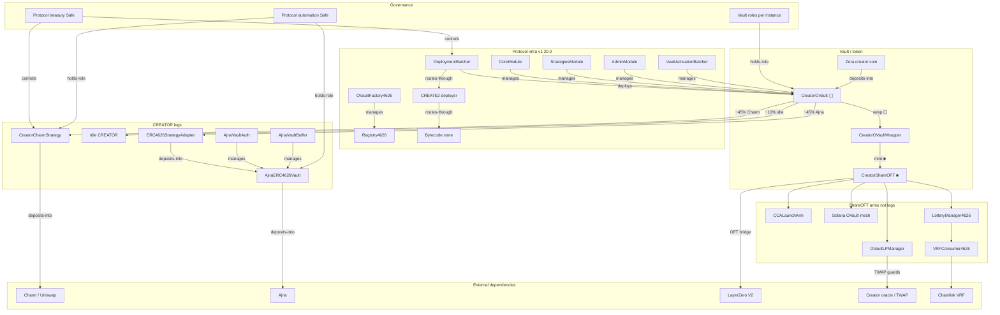

# CreatorOVault — contract dependency graph

Protocol-level dependency map for greenfield **CreatorOVault** stacks on Base (v1.20.0). Per-creator vault, wrapper, ShareOFT, and strategy addresses are emitted at deploy — verify onchain (or via Status vault report).

Source data: [`docs/audits/graphs/creator-ovault.yaml`](https://github.com/wenakita/4626/blob/main/docs/audits/graphs/creator-ovault.yaml) · Narrative: [CreatorOVault risk report](/audits/creator-ovault-report) · Addresses: [Contract addresses](/reference/addresses)

## Legend

### Node categories

| Category | Meaning |
|----------|---------|
| **Vault / Token** | Deposit surface and share tokens (▢ / ■) |
| **Strategy (leg)** | CREATOR yield sleeves via `addStrategy` |
| **Governance** | Safes and per-vault privileged roles |
| **Protocol Infra** | Shared factories, batchers, modules, bytecode |
| **External Dependency** | Protocols the legs/arms rely on |
| **ShareOFT Arm** | Launch / mesh / bridge / fee domain — **never** a vault leg |

### Edge kinds

| Kind | Meaning |
|------|---------|
| `deploys` | Creates or mints the target |
| `controls` | Ownership / privileged config root |
| `holds-role` | Role membership on the target |
| `manages` | Operational control (modules, auth, registry) |
| `allocates-to` | Vault CREATOR allocation to a leg |
| `deposits-into` | Capital or nested vault flow |
| `routes-through` | Path / bridge / wrap / infra hop |

**Trust reminder:** legs move creator-coin NAV inside the vault; arms move or monetize ■. Remote ■ never implies a remote CreatorOVault redeem of Base creator coin.

---

## Nodes

| ID | Label | Category | Address |
|----|-------|----------|---------|
| creator-ovault | CreatorOVault (▢) | vault | per-vault |
| wrapper | CreatorOVaultWrapper | vault | per-vault |
| share-oft | CreatorShareOFT (■) | vault | per-vault |
| charm-strategy | CreatorCharmStrategy | strategy | per-vault |
| ajna-adapter | ERC4626StrategyAdapter | strategy | per-vault |
| ajna-vault | AjnaERC4626Vault | strategy | per-vault |
| ajna-auth | AjnaVaultAuth | strategy | per-vault |
| ajna-buffer | AjnaVaultBuffer | strategy | per-vault |
| idle | Idle CREATOR | strategy | n/a (vault balance) |
| cca-arm | CCALaunchArm | arm | per-vault |
| mesh-lp | OVaultLPManager | arm | per-vault |
| solana-mesh | Solana OVault mesh | arm | per-route |
| treasury-safe | Protocol treasury Safe | governance | `0x7d429eCbdcE5ff516D6e0a93299cbBa97203f2d3` |
| automation-safe | Protocol automation Safe | governance | `0x08f0875E40781578F902998b2b831cc48d838eBE` |
| vault-roles | Vault roles (per instance) | governance | per-vault |
| registry | Registry4626 | infra | `0xF60a1490C4129f2b6ae540734D3C2C8C6111824e` |
| factory | OVaultFactory4626 | infra | `0x29AB55092F4009aa3F3603f32b11A6B02e6F0eb5` |
| batcher | DeploymentBatcher | infra | `0x83A9b2481E3e6d3a8fA12F6eB072253AAc518032` |
| activation-batcher | VaultActivationBatcher | infra | `0x37A9136dcD3e3245E4E992a1302dfEBD3d8673B3` |
| bytecode-store | UniversalBytecodeStoreV2 | infra | `0x8599CA87b28320158941C59CB3cd9a3f12083530` |
| create2 | UniversalCreate2DeployerFromStore | infra | `0xdffB25505F5050E15B3602296330Ef352127d1Ef` |
| core-module | CreatorOVaultCoreModule | infra | `0xD6B862783Fd362ccF0d39d86E6384D8770e78833` |
| strategies-module | CreatorOVaultStrategiesModule | infra | `0x968b8233053B64A93a4Cde044fFf4f43ea6D3c60` |
| admin-module | CreatorOVaultAdminModule | infra | `0x5bC4d71dB82081fCCF3647F1C094BEB202C0DB50` |
| lottery-manager | LotteryManager4626 | infra | `0x0fC6f30adFD9e82097895Bb166536FdFD8EaC97b` |
| vrf-consumer | VRFConsumer4626 | infra | `0x56E2453Bf8Cf2C3FC33E7D18Edc2310297f2a251` |
| creator-coin | Zora creator coin | dependency | per-creator |
| charm-uni | Charm / Uniswap liquidity | dependency | external |
| ajna-protocol | Ajna | dependency | external |
| layerzero | LayerZero V2 OFT | dependency | external |
| creator-oracle | Creator oracle / TWAP | dependency | per-vault / shared |
| chainlink-vrf | Chainlink VRF | dependency | external |

---

## Key edges

| From | To | Kind | Label |
|------|----|------|-------|
| treasury-safe | batcher | controls | wires helpers / phase1 module |
| batcher | create2 | routes-through | CREATE2 deploy |
| create2 | bytecode-store | routes-through | seeded bytecode |
| batcher | creator-ovault | deploys | Phase 1–3 greenfield |
| factory | registry | manages | registers vault stack |
| core-module | creator-ovault | manages | delegatecall core |
| strategies-module | creator-ovault | manages | delegatecall strategies |
| admin-module | creator-ovault | manages | delegatecall admin |
| activation-batcher | creator-ovault | manages | activation / finalize |
| vault-roles | creator-ovault | holds-role | owner management keeper emergency |
| treasury-safe | charm-strategy | controls | adapter ownership (typical) |
| automation-safe | charm-strategy | holds-role | Charm manager |
| automation-safe | ajna-vault | holds-role | Ajna admin |
| creator-coin | creator-ovault | deposits-into | deposit asset |
| creator-ovault | charm-strategy | allocates-to | ~45% Charm |
| creator-ovault | ajna-adapter | allocates-to | ~45% Ajna |
| creator-ovault | idle | allocates-to | ~10% idle |
| ajna-adapter | ajna-vault | deposits-into | nested ERC-4626 |
| ajna-auth | ajna-vault | manages | pause / auth |
| ajna-buffer | ajna-vault | manages | buffer / buckets |
| charm-strategy | charm-uni | deposits-into | LP inventory |
| ajna-vault | ajna-protocol | deposits-into | lending sleeve |
| creator-ovault | wrapper | routes-through | wrap ▢ |
| wrapper | share-oft | deploys | mint ■ |
| share-oft | cca-arm | routes-through | primary market |
| share-oft | mesh-lp | routes-through | V4 mesh |
| share-oft | solana-mesh | routes-through | ~30% ■ at finalize |
| share-oft | layerzero | routes-through | OFT bridge |
| mesh-lp | creator-oracle | routes-through | TWAP guards |
| share-oft | lottery-manager | routes-through | trade-fee / jackpot |
| lottery-manager | vrf-consumer | routes-through | VRF |
| vrf-consumer | chainlink-vrf | routes-through | randomness |

Prev: [CreatorOVault risk report](/audits/creator-ovault-report) · Next: [Security & audits](/audits)
