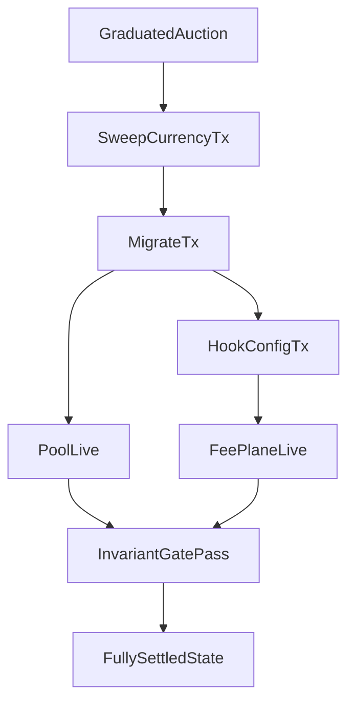

# 1. Final Canonical Spec

Scope baseline for this spec:
- Repo: `/home/akitav2/projects/4626`
- Commit reviewed: `87a4feb5e4b146c014324886f18128d65848e696`
- Canonical lane terms: `tradeFeeCollector` and `creatorCoinPayoutRecipient`

This system is not one fee pipe. It is multiple value lanes with separate triggers, units, custody domains, and authorities.

## Genesis Allocation Lane

- Source: `DeploymentBatcher.finalizePhase2(...)` split policy.
- Trigger: phase-2 finalize deposit/wrap flow.
- Unit: `shareOFT`.
- Path: 40% creator allocation is transferred to `CreatorLinearVesting`.
- Release mechanics: `CreatorLinearVesting.release()` linearly transfers vested `shareOFT` to `beneficiary`.
- Notes: percentage/duration are deployment policy; vesting contract itself enforces token/beneficiary/start/duration only.

## Trade-Fee Lane

- Source: `CreatorShareOFT` transfer fee logic.
- Native trigger: only `SwapOnly -> non-SwapOnly` in `_transferWithFees(...)`.
- Unit at intake: `shareOFT` buy fee amount.
- Hub path: `_sendFeesToGauge(...)` -> `CreatorGaugeController.receiveFees(...)`.
- Remote path: accumulate `pendingFees` -> `flushFees(...)` -> hub receiver -> `receiveBridgedFees()`.
- Optional additional plane: hook-configured fee lane (for example v4 sell-hook path) using recipient from `tradeFeeCollector` domain.
- Critical caveat: "buy+sell fee" is conditional and only true when hook fee plane is actively configured and aligned.

## Jackpot Lane

- Custodian: `CreatorGaugeController` (`jackpotReserve` in vault-share units).
- Payout authority: `CreatorLotteryManager` (authorized caller into `payJackpot(...)`).
- Trigger: lottery winner settlement path in manager.
- Unit: vault shares.
- Separation rule: manager does not custody reserve; gauge does not select winners.

## External Revenue Lane

- Source: external creator-coin earnings routed through CreatorCoin `payoutRecipient`.
- Canonical recipient term in this spec: `creatorCoinPayoutRecipient` (CreatorCoin `payoutRecipient`).
- Router mode: `PayoutRouter.convertAndQueue(...)` swaps token -> creator coin -> vault deposit -> queues burn stream shares.
- Unit transform: external token/ETH -> creator coin -> vault shares queued for burn stream.
- Product effect in router mode: holder PPS accretion, not direct creator treasury spend.

## Creator Ongoing Revenue Lane

- Source: `CreatorGaugeController` split parameter `creatorShareBps`.
- Unit: vault shares from gauge split stage.
- Recipient: `creatorTreasury` when `creatorShareBps > 0`.
- Guardrail: `setFeeSplit(...)` and `setCreatorTreasury(...)` enforce `CreatorTreasuryRequired` when creator lane is enabled.
- Default posture: lane is disabled by default (`creatorShareBps = 0`).

## Voter Rewards Lane

- Source: gauge split `protocol` branch (`protocolShareBps`).
- Preferred route: `VoterRewardsDistributor.notifyRewards(...)`.
- Fallbacks: protocol treasury, then jackpot fallback if downstream branch cannot route.
- Unit: vault shares.

## Burn Lane

- Immediate burn path: gauge calls `vault.burnSharesForPriceIncrease(...)`.
- Streamed burn path: `VaultShareBurnStream.queueShares(...)` then `drip()`/`checkpoint()`.
- Unit: vault shares.
- Effect: PPS accretion for holders.

## Launch/Activation Caveats (CCA)

- `CCALaunchStrategy.sweepCurrency()` settles auction currency.
- `CCALaunchStrategy.migrate()` initializes v4 pool and mints LP position.
- Hook activation is separate: `getTaxHookCalldata()`/`getCompleteAuctionCalldata()` expose calldata; hook config is not guaranteed by `migrate()` itself.
- Completion truth is therefore multi-step: sweep + migrate + hook fee-plane alignment + invariant pass.

# 2. Who Gets What Table

| Lane | Source trigger | Unit | Immediate recipient | Final beneficiary | Config dependencies |
|---|---|---|---|---|---|
| Genesis allocation | `DeploymentBatcher.finalizePhase2` split | `shareOFT` | `CreatorLinearVesting` | vesting `beneficiary` (creator) | split policy, vesting duration/start |
| Trade-fee (native) | `SwapOnly -> non-SwapOnly` transfer in `CreatorShareOFT` | `shareOFT` then vault shares | `CreatorGaugeController` | burn/jackpot/creator/voter-protocol lanes | address classification, hub config, gauge wiring |
| Trade-fee (hook plane) | hook-configured pool tax path | usually `WETH` or configured fee token | hook recipient (must be `tradeFeeCollector` domain) | same gauge split destinations after processing | hook enabled, correct pool key, recipient alignment |
| Jackpot reserve | gauge split lottery branch | vault shares | `CreatorGaugeController` reserve | lottery winners | lottery manager configured, reserve funded |
| External revenue | CreatorCoin `payoutRecipient` path | external token/ETH -> creator coin -> vault shares | `creatorCoinPayoutRecipient` (router mode: `PayoutRouter`) | holder PPS accretion in router mode; otherwise creator-coin-configured recipient flow | creator-coin payout-recipient mode, router path config |
| Creator ongoing | gauge split creator branch | vault shares | `creatorTreasury` | creator treasury | `creatorShareBps > 0`, nonzero treasury required |
| Voter rewards | gauge split protocol/voter branch | vault shares | `VoterRewardsDistributor` or fallback | ve voters (preferred), otherwise protocol/fallbacks | distributor config, treasury fallback |
| Burn | gauge burn branch + burn stream drip | vault shares | vault burn function | all holders via PPS increase | burn bps, burn stream liveness |

# 3. Naming Cleanup

Use lane-specific names everywhere; stop using overloaded generic words.

| Legacy/ambiguous term | Canonical term | When to use |
|---|---|---|
| `payoutRecipient` (generic) | `tradeFeeCollector` | trade-fee destination for ShareOFT/hook fee planes |
| `externalRevenueRecipient` (generic) | `creatorCoinPayoutRecipient` | creator-coin external earnings routing domain |
| "creator earnings" (unspecified) | `creator ongoing treasury lane` or `external revenue accretion lane` | pick one lane explicitly |
| "lottery wallet/manager" | `jackpotCustodian` = gauge, `jackpotPayoutAuthority` = lottery manager | custody vs authority must always be split |
| "protocol share" (always treasury) | `voter/protocol branch` | reflects distributor-first behavior with fallbacks |

Naming policy:
- In docs/UI/specs, every recipient statement must name the lane and canonical term.
- Use `creatorCoinPayoutRecipient` when referring to CreatorCoin `payoutRecipient`.
- Use `tradeFeeCollector` only for ShareOFT/hook trade-fee routing.

# 4. Docs Patch List

| File | Current state | Patch requirement |
|---|---|---|
| `docs/contracts/strategies/cca-launch.md` | Mostly aligned to non-automatic hook completion and onchain floor behavior | Keep as primary strategy truth; no semantic rollback to "migrate completes everything" |
| `frontend/src/pages/CompleteAuction.tsx` | Explicit manual steps (sweep -> migrate -> configure hook) and conditional fee-plane language | Keep lane wording; optionally render split values from live gauge reads instead of static labels |
| `frontend/api/_handlers/cre/keeper/_sweep.ts` | Canonical completion endpoint includes sweep+migrate+optional hook and invariant gate | Treat this as operational truth; keep response-stage vocabulary stable for runbooks |
| `cre/cre-workflows/auction-settlement/main.ts` | Marks settled only when completion endpoint returns `completed` | Keep this settled-state rule; do not regress to sweep-only settlement |
| `cre/actions/auction-settlement.action.ts` | Contains stale header wording around sweep semantics; implementation includes migrate but no hook/invariant stage | Patch header comments to match current completion semantics or mark this path non-canonical |
| `README.md` / tokenomics pages | Conditional fee-plane language is largely aligned | Keep "buy+sell claims require hook activation" rule explicit and prominent |

# 5. Deployment Invariant Checklist

## Mandatory invariants (must pass before "fully settled")

1. Trade-fee collector alignment:
   - `CCALaunchStrategy.feeRecipient == expected tradeFeeCollector`
   - `CreatorShareOFT.gaugeController == expected tradeFeeCollector`
2. External revenue lane alignment:
   - CreatorCoin `payoutRecipient` equals expected mode target
   - if router mode: `PayoutRouter.burnStream` matches expected burn stream
3. Creator lane safety:
   - if `creatorShareBps > 0`, `creatorTreasury != 0x0`
4. Completion mechanics:
   - `sweepCurrency` success
   - `migrate` success
   - hook config status = configured (or explicit owner-manual stage with no settled mark)
5. Settled-state gate:
   - DB `settledAt` is written only when completion stage is `completed`

## Keeper/automation gate policy

- `KEEPER_ENFORCE_COMPLETION_INVARIANTS` should remain enabled in production.
- `DEPLOY_ENFORCE_PHASE2_INVARIANTS` should remain enabled in production.
- Any override should emit an explicit operational alert and block public "fully live" claims.

## Automatic completion hardening plan

Implementation details:
- Keep `/api/cre/keeper/sweep` as the canonical completion state machine.
- Keep CRE workflow as a caller/orchestrator, not an alternate source of completion truth.
- If hook config cannot be executed by keeper due ownership constraints, keep stage `awaiting_owner_hook_config` and do not mark settled.
- Keep settlement stage machine explicit (`awaiting_migration_block`, `awaiting_owner_hook_config`, `invariant_failed`, `completed`) and alert on long-lived non-completed states.

# 6. Public Product Truth

4626 has separate value lanes:
- Genesis creator allocation is vesting-based.
- Trading fees route through a trade-fee collector lane.
- Jackpot reserves are custodied by the gauge and paid by lottery authority.
- External creator revenue can be routed to PPS accretion via router mode.

What users can safely be told:
- Launch completion is multi-step and only complete when sweep, migration, hook fee-plane activation, and invariant checks all pass.
- "Buy+sell fee" claims are conditional on active hook configuration, not guaranteed by ShareOFT native transfer logic alone.
- Creator ongoing treasury rewards are optional and config-dependent; they are not always on by default.

# 7. Remaining Unknowns

1. Creator-coin implementation source is out-of-repo in this workspace; this spec relies on observed interface usage for CreatorCoin `payoutRecipient` routing.
2. Hook ownership domain can still require owner-manual writes depending on deployed hook contract auth rules.
3. Environment-policy toggles can weaken hard gates if intentionally disabled; operational governance must treat this as a high-risk override.
4. An alternate settlement action file (`cre/actions/auction-settlement.action.ts`) can diverge from canonical completion semantics if used without guardrails.
5. Cross-chain timing still depends on remote fee flush cadence and keeper liveness (especially for smooth burn-stream progression).
