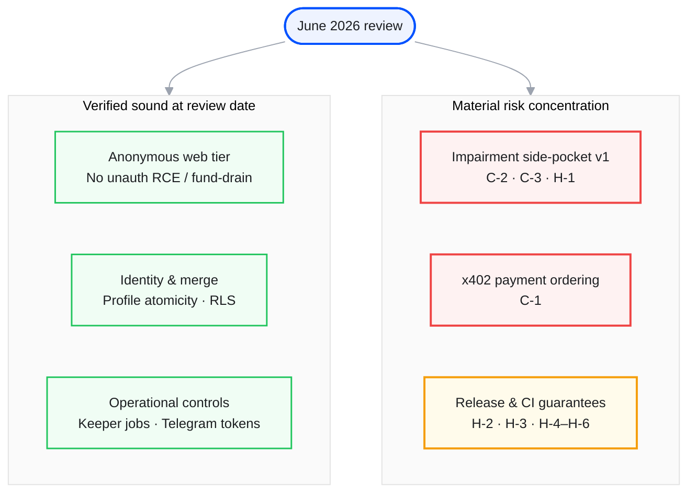
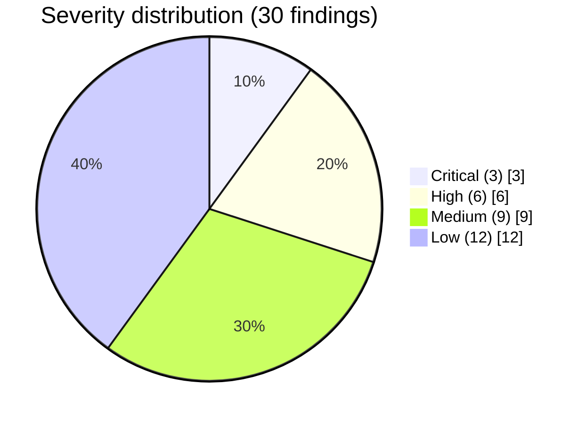
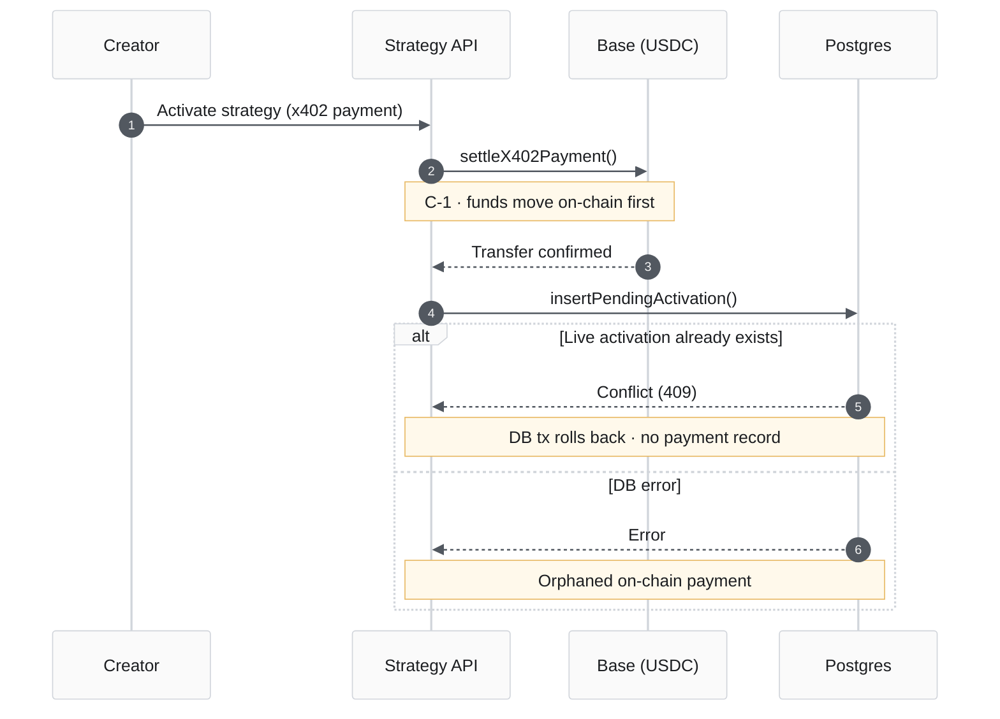

<nav class="audit-path" aria-label="Report sections">
  <a class="audit-path__step" href="/audits">Overview</a>
  <a class="audit-path__step" href="/audits/fable">Scope</a>
  <a class="audit-path__step audit-path__step--current" href="/audits/fable/findings-summary">Executive summary</a>
  <a class="audit-path__step" href="/audits/fable/full-repo-review-2026-06">Full report</a>
  <a class="audit-path__step" href="/audits/fable/key-sessions">Source sessions</a>
  <a class="audit-path__step" href="/audits/fable/sessions-index">Session chronology</a>
  <a class="audit-path__step" href="/audits/fable/transcripts">Transcript archive</a>
</nav>

# Executive summary

Distilled from the [full technical report](/audits/fable/full-repo-review-2026-06) (Report **4626-FABLE-2026-06**, June 2026). Severity reflects exploitability **and** trust-boundary assumptions at the time of review.

**Conclusion:** No remotely exploitable unauthenticated RCE or fund-drain was identified in the web tier. Material risk concentrated in **impairment side-pocket v1** (semi-trusted manager/keeper roles), **x402 payment ordering**, and **CI guard enforcement gaps**.

For evidence, architecture context, medium/low findings, and remediation guidance, continue to the [full report](/audits/fable/full-repo-review-2026-06).

## Risk landscape

## Finding register

## Severity classification

| Level | Definition |
| --- | --- |
| **Critical** | Credible path to fund loss, auth bypass, or integrity failure under documented trust assumptions |
| **High** | Serious correctness or security gap that could become critical under realistic conditions, or breaks release/CI guarantees |
| **Medium** | Material hardening, data-integrity, or operational issue without direct anonymous exploit |
| **Low** | Defense-in-depth, informational, or backlog-quality item |

## Critical findings

  

    Critical
    C-1
  

  <h3 class="audit-finding__title">x402 payment settles before entitlement validation</h3>
  
Strategy activation broadcasts an on-chain USDC transfer before confirming no live activation exists. A subsequent database failure can leave a settled on-chain payment with no corresponding entitlement record.

  
<code>frontend/api/_handlers/creator/strategy/_x402-activate.ts</code>

  

    Critical
    C-2
  

  <h3 class="audit-finding__title">Impairment claims lack cumulative supply cap enforcement</h3>
  
On-chain logic does not enforce that cumulative minted claims remain within <code>totalClaimSupply</code>. Shared escrow holds multiple epochs; over-claim in one epoch can drain tokens reserved for another.

  
<code>CreatorOVaultCoreModule.sol</code> · <code>CreatorORecoveryEscrow.sol</code>

  

    Critical
    C-3
  

  <h3 class="audit-finding__title">Impairment root persists after false-alarm resolution</h3>
  
<code>clearImpairmentTrip</code> marks an epoch resolved but leaves snapshot root and claim supply active, preserving a claim surface inconsistent with public impairment disclosures.

  
<code>CreatorOVaultCoreModule.sol</code> · <a href="/reference/impairment-v1-disclosures">Impairment v1 disclosures</a>

## High findings

  

    High
    H-1
  

  <h3 class="audit-finding__title">Impairment recovery may double-count creator coin in totalAssets</h3>
  
When recovery asset equals creator coin, the transfer path does not decrement tracked coin balance until the next sync, temporarily overstating share price. No keeper amount cap is enforced.

  

    High
    H-2
  

  <h3 class="audit-finding__title">Live deploy not blocked during dry-run</h3>
  
The deploy flow can submit a live transaction while a dry-run is in progress — the <code>dryRunBusy</code> guard is missing from submit logic and button disabled state.

  
<code>DeployVault.tsx</code>

  

    High
    H-3
  

  <h3 class="audit-finding__title">Swap auto-quote can interrupt review/submit</h3>
  
Background re-quoting during <code>review</code> or <code>quote</code> states invalidates in-flight work and can abort submission after partial signing steps.

  
<code>Swap.tsx</code> · <code>useSwapExecution.ts</code>

  

    High
    H-4 – H-6
  

  <h3 class="audit-finding__title">CI enforcement gaps</h3>
  
Semgrep may be non-blocking due to shell pipe behavior; repository boundary guards are not fully wired into gating CI; a control-plane cron workflow fails at install due to lockfile toolchain mismatch.

## Positive observations

| Area | Assessment |
| --- | --- |
| Anonymous web-tier exploit surface | No unauthenticated RCE or fund-drain identified |
| Profile merge atomicity | Verified sound |
| Keeper job claim semantics | Verified sound |
| Telegram link-token replay | Verified sound |
| Canonical CSW policy guard | Passing in baseline |
| Migration RLS posture | Verified sound |

## Additional findings

The full report registers **9 medium** and **12 low** findings covering cron database access patterns, x402 nonce persistence, Stripe webhook body handling, CSP configuration, alias resolution gaps, and related items. See [Section 4 — Prioritized findings](/audits/fable/full-repo-review-2026-06#4-prioritized-findings).

## Source material

Primary analysis: [Full-codebase review session](/audits/fable/transcripts/full-codebase-review-primary-audit-0a513245) (eight parallel lanes). Security follow-up: [dedicated security pass](/audits/fable/transcripts/security-pass-on-full-codebase-review-c603521c).

<nav class="audit-flow-nav" aria-label="Continue reading">
  <a class="audit-flow-nav__link audit-flow-nav__link--prev" href="/audits/fable">← Scope &amp; methodology</a>
  Executive summary
  <a class="audit-flow-nav__link audit-flow-nav__link--next" href="/audits/fable/full-repo-review-2026-06">Full report →</a>
</nav>
