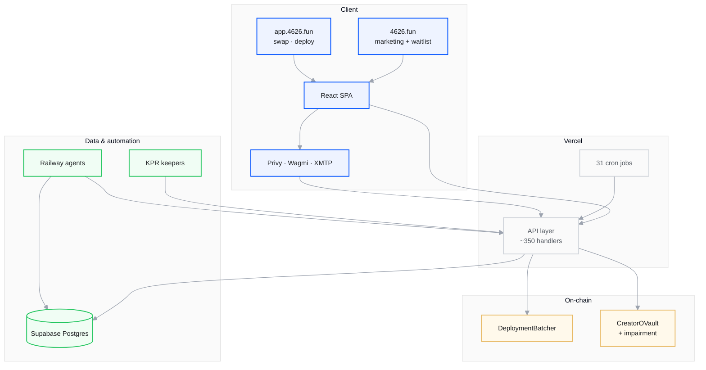
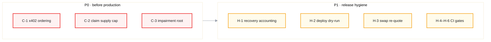

<nav class="audit-path" aria-label="Report sections">
  <a class="audit-path__step" href="/audits">Overview</a>
  <a class="audit-path__step" href="/audits/fable">Scope</a>
  <a class="audit-path__step" href="/audits/fable/findings-summary">Executive summary</a>
  <a class="audit-path__step audit-path__step--current" href="/audits/fable/full-repo-review-2026-06">Full report</a>
  <a class="audit-path__step" href="/audits/fable/key-sessions">Source sessions</a>
  <a class="audit-path__step" href="/audits/fable/sessions-index">Session chronology</a>
  <a class="audit-path__step" href="/audits/fable/transcripts">Transcript archive</a>
</nav>

# Full-codebase review — wenakita/4626

<div class="audit-doc-control">
  <div class="audit-doc-control__title">Report 4626-FABLE-2026-06</div>
  <table>
    <tbody>
      <tr><th>Report ID</th><td>4626-FABLE-2026-06</td></tr>
      <tr><th>Date</th><td>June 2026</td></tr>
      <tr><th>Repository</th><td><a href="https://github.com/wenakita/4626">wenakita/4626</a></td></tr>
      <tr><th>Review type</th><td>Agent-assisted read-only codebase review (Cursor Fable 5)</td></tr>
      <tr><th>Reviewer role</th><td>Senior staff engineer / security reviewer / QA lead / release engineer</td></tr>
      <tr><th>Primary session</th><td><a href="/audits/fable/transcripts/full-codebase-review-primary-audit-0a513245">0a513245…</a></td></tr>
    </tbody>
  </table>
</div>

<div class="docs-at-a-glance">

**Executive summary available:** For a concise register of critical and high findings, read the [executive summary](/audits/fable/findings-summary) first. This document is the complete technical report.

</div>

**Method:** Multi-pass read-only review. Baseline validation commands, parallel subsystem subagents, manual verification of high-severity candidates. Findings graded VERIFIED / REFUTED / ALREADY-KNOWN with file:line evidence.

**Scope:** Full monorepo — frontend SPA, ~350 Vercel API handlers, Foundry contracts, KPR keepers, Solana program, Railway agents.

---

## 1. Executive summary

The repo is a large, mature monorepo (frontend SPA + ~350 Vercel API handlers, Foundry contracts, KPR keepers, Solana program, Railway agents). Engineering hygiene is **above average**: SHA-pinned CI actions, no `pull_request_target`, RLS on every new table, transactional profile-merge, race-safe keeper-job claiming, tombstone/alias cascades on most identity lookups, and a documented canonical-CSW invariant enforced by a CI guard.

The review found **no remotely-exploitable unauthenticated RCE / fund-drain in the web tier**. The most material risks are:

1. **Contracts — impairment side-pocket v1** has three real on-chain issues (no `totalClaimSupply` cap enforcement + uncapped shared escrow → cross-epoch drain; `notifyImpairmentRecovery` coin-balance accounting gap; stale-root lifecycle after `clearImpairmentTrip`). These require a malicious/buggy **manager or keeper** (semi-trusted), so they are governance-trust escalations, not anonymous exploits — but the side-pocket is new code with thin test coverage.
2. **`x402` paid-strategy activation settles USDC on-chain *before* any entitlement check**, and a post-settlement insert failure rolls back *all* payment rows — a real-money path that can take a payment and leave zero DB record.
3. **CI enforcement gaps**: Semgrep is documented as blocking but the `| tee` pipe likely masks its exit code; two guards that fail on committed code (`guard:frontend-boundaries`, `guard:server-core-boundary`) and `guard:schema` are **not** all wired into `test.yml`; a cron workflow (`control-plane-stuck-scan.yml`) is broken (npm/lockfile mismatch) and silently red.
4. **Working-tree drift**: typecheck (6 errors) and Vitest (78 failures / 19 files) are red on the current dirty tree — uncommitted WIP, not a shipped regression, but it means the local tree is not release-clean.

**Release-readiness verdict: NOT READY to tag a clean release from the current working tree.** The tree is dirty with failing typecheck/tests; the impairment contract findings and the x402 ordering bug should be resolved (or explicitly risk-accepted with disclosures updated) before any deploy that exercises those paths. The web tier itself is in good shape once the working tree is committed/cleaned and CI gates are repaired.

---

## 2. Commands run (baseline, Pass 0)

| Command | Result | Root cause / note |
|---|---|---|
| `pnpm install` (root) + `pnpm -C frontend install` | OK | Two lockfiles, as documented. |
| `pnpm -C frontend lint` | **PASS** (exit 0) | Clean. |
| `pnpm -C frontend guard:canonical-csw` | **PASS** (exit 0) | No retired env / stray CSW literals. |
| `pnpm -C kpr typecheck` | **PASS** (exit 0) | No-regression gate holds. |
| `forge build` | **PASS** | Submodules present. |
| `forge test` | **1 FAIL** | Environmental only — one test reaches `wss://eu.endpoints.matrixed.link` (RPC) and fails offline. Not a code defect; token in URL is env-supplied, not committed. |
| `pnpm -C frontend typecheck` | **FAIL (6 errors)** | Dirty working tree (uncommitted WIP in `AccountSetupWorkspaceView.tsx`, `useAccountSetupController.ts`, `useMyReferralCode.ts`, `xmtp/provider.tsx`). Not a committed regression. |
| `pnpm -C frontend test` (Vitest) | **FAIL (78 tests / 19 files)** | Predominantly `api/__tests__` and `src/features/waitlist`; attributable to working-tree drift + test content drift. |
| `pnpm -C frontend guard:schema` | **FAIL** | Raw DDL string in committed `frontend/server/_lib/agents/base-mcp/approvalFlow.ts` — guard catches it but CI may not run this guard in the gating job (see §6). |
| `pnpm -C frontend guard:frontend-boundaries` | **FAIL** | 5 `api-no-src` violations in committed code (`_vanityPerVaultVersion.ts`, `_vanityShareOftSalt.ts`, `v2/session/_createCore.ts`, `_preview-add-owner.ts` ×2). **Not wired into any workflow.** |
| `pnpm -C frontend guard:server-core-boundary` | **FAIL** | 7 violations in committed code (`admin/ethos/_health|_indexes|_refresh.ts`, `v1/alfaclub/_counter-trade-status.ts`) importing `server/_lib/*` directly. |
| `pnpm audit --prod` (root) | 1 low | Acceptable. |
| `pnpm -C frontend audit --prod` | 6 moderate, 4 high | See §8 (dependency posture). |
| `pnpm security:local` (Semgrep) | Skipped | Needs Docker; environmental. |

> **Working-tree note:** ~20 modified files are uncommitted (notably `_continueCore.ts`, `_dryRunCore.ts`, `_paymaster.ts`, `keeperJobRunner.ts`, `schemaBootstrap.ts`, `_solanaReconcile.ts`, `dailyBrief.ts`, `txRouter.ts`, plus the new `20260711000000_solana_share_mesh_mappings.sql` migration). They are part of the reviewed state and are the proximate cause of the red typecheck/Vitest.

---

## 3. Architecture map

Three Vercel HTML shells share one React bundle; host decided at runtime:

- **`4626.fun/`** → `public/immersive/index.html` (static marketing island); other `4626.fun` paths → `index.html` SPA (waitlist, FAQ, explore, positions).
- **`app.4626.fun/*`** → `app.html` SPA (swap, deploy, admin). `app.4626.fun/waitlist*` → 308 to `4626.fun/waitlist`.
- API: `/api/(.*)` → `frontend/api/[...path].ts` → static route map in `_handlers/_routes*.ts` (~350 handlers across inline + prefixed + `v1` loaders).

**Auth lanes:** Privy `X-Privy-Token` (verifyAuthToken); HttpOnly `cv_auth_session` HMAC cookie (SIWE); Vercel cron `CRON_SECRET`; machine `KPR_API_KEY` (constant-time); admin (session address/email, `ADMIN_API_TOKEN`, or dual session+`CRON_SECRET` for profile merge). `cv_auth_session` uses `Domain=.4626.fun` so sessions survive marketing↔app navigation.

**Background:** 31 Vercel crons (creator metrics, AlfaClub bridge, AMOE, Zora/Ethos sync, keeper-job enqueue) using `getDbForCron`; `keeper_jobs` queue (claim/run/complete) with allowlisted outbound; 16 KPR workflows + Solana orchestrator; Railway Eliza/XMTP + Hermit runtimes.

**Data:** 127 Supabase migrations (SSoT); runtime `schemaBootstrap.ts` delegates via `ensureMigrationApplied` (no raw DDL allowed); profile-merge + tombstone/alias infra.

**Riskiest boundaries (judgment):** `/api/paymaster` JSON-RPC proxy (~3.8k lines, sponsors UserOps), machine-auth keeper surface, webhook ingress (Telegram/Stripe), `POST /api/admin/profiles/merge`, deploy-session owner delegation, Privy-token-vs-session split, Solana provisioner/orchestrator, AlfaClub chat-bridge cron.



---

## 4. Prioritized findings

Severity reflects exploitability **and** trust assumptions. "Manager/keeper" = semi-trusted protocol roles (not anonymous).



### CRITICAL

#### C-1 — x402 strategy activation settles USDC on-chain before entitlement check; failed insert loses all payment records
**Status: VERIFIED** · `frontend/api/_handlers/creator/strategy/_x402-activate.ts`
- Line ~206 `settleX402Payment(parsed.payment)` broadcasts the EIP-3009 `transferWithAuthorization` (creator USDC → treasury) **before** any `hasLiveActivationForFeature` pre-check.
- Lines ~225–247 only then run `insertPendingActivation` inside `runInTransaction`. A `live_activation_exists` conflict returns 409 — but USDC is already moved.
- `upsertPaymentOrder` (~249) and `recordPaymentEvent` (~262) share the **same** transaction as the failing insert, so rollback erases them too. Net: a settled on-chain payment with **zero rows in any payment table** — only the on-chain tx and a 409 response. The `db_error` catch (~279–285) has the same property.
- The plain-USDC path (`_activate.ts`) is safer because the *user* broadcasts the transfer; here the **server** initiates the irreversible move.

**Fix:** call `hasLiveActivationForFeature` (exists at `activations.ts:114`) before `settleX402Payment`; on any post-settlement failure, durably record the orphaned settlement **outside** the rolled-back tx for refund ops.
**Regression test:** unit test on `_x402-activate` with a mocked settle that succeeds and an `insertPendingActivation` that throws `live_activation_exists`; assert (a) settle is **not** reached when a live activation already exists, and (b) when an orphan does occur, a durable `payment_event`/orphan row survives.

#### C-2 — Impairment: no on-chain `totalClaimSupply` cap + uncapped shared escrow → cross-epoch drain
**Status: VERIFIED** · `contracts/vault/modules/CreatorOVaultCoreModule.sol:964-1015`, `contracts/vault/CreatorORecoveryEscrow.sol:24-33`
- `mintImpairmentClaim` (964) verifies the Merkle proof and blocks per-account double-mint, but **never** checks cumulative minted claims against `epoch.totalClaimSupply`.
- Payout `gross = (totalRecovered * claimUnits) / totalClaimSupply` (line 1002). If the manager-proposed Merkle leaves sum to **more** than `totalClaimSupply`, total payouts exceed `totalRecovered`.
- `CreatorORecoveryEscrow.claimRecovery` (29-33) holds **multiple epochs' assets in one ERC20 balance**, increments `claimedByEpochAsset` but **never enforces `claimed <= recovered`** before `safeTransfer`. So one epoch's over-claim drains tokens reserved for other epochs.

**Fix:** enforce a cumulative cap in `mintFromVault` (claims contract) or check `recoveredByEpochAsset[epochId][asset] >= claimedByEpochAsset[...] + amount` in `escrow.claimRecovery`.
**Regression test:** Foundry test: propose a root whose leaves sum to `2 * totalClaimSupply`, fund recovery for epoch A only, mint+claim epoch A to drain past `recoveredByEpochAsset`, assert a second epoch B claim does not lose funds (expect revert / cap).

#### C-3 — Impairment: stale root lifecycle after `clearImpairmentTrip` leaves a live claim surface on false-alarm epochs
**Status: VERIFIED** · `CreatorOVaultCoreModule.sol:885-897`, `964-995`
- `clearImpairmentTrip` (885) sets status `Resolved` but **does not** clear `snapshotRoot`, `totalClaimSupply`, or `recoveryAsset`. (Contrast `clearImpairmentRootAfterChallenge` at 932 which *does* zero them.)
- Both `mintImpairmentClaim` (972) and `notifyImpairmentRecovery` (987) accept `Resolved`. So a manager can trip → `proposeImpairmentRoot` → `clearImpairmentTrip` (bypassing challenge/finalize), leaving a claimable root on a "false alarm" epoch. If a keeper later calls `notifyImpairmentRecovery`, claimants extract value against a stale epoch.

**Fix:** `clearImpairmentTrip` should reject when a root was already proposed (force `clearImpairmentRootAfterChallenge`), or zero the root/supply/asset on clear; and/or restrict `mintImpairmentClaim`/`notify` to `Finalized` only.
**Regression test:** Foundry: trip → propose root → clear trip → assert `mintImpairmentClaim` reverts (root surface gone) and `notifyImpairmentRecovery` reverts on the cleared epoch.

> C-2/C-3 contradict `docs/reference/impairment-v1-disclosures.md` (which implies finalization/challenge gating governs claims). **These are new, not previously disclosed.** Update disclosures or fix.

### HIGH

#### H-1 — Impairment: `notifyImpairmentRecovery` inflates `totalAssets()` when recovery asset == creator coin; keeper has no amount limit
**Status: VERIFIED** · `CreatorOVaultCoreModule.sol:985-995`
- `IERC20(epoch.recoveryAsset).safeTransfer(escrow, amount)` (991) is a raw transfer that does **not** decrement the vault's tracked `coinBalance`. `recoveryAsset` is set arbitrarily at `proposeImpairmentRoot` and can be the creator coin. Until the next `_syncCoinBalance()` (deposit/withdraw), `totalAssets()` overstates PPS, so depositors in that window mint fewer shares at an inflated price.
- `notifyImpairmentRecovery` has no zero-amount guard and no cap; a keeper can move arbitrary vault-owned creator coin into escrow for distribution to claim holders — a semi-trusted-role escalation.

**Fix:** if `recoveryAsset == creatorCoin`, route through the coin-balance accounting (decrement tracked balance), or recompute `totalAssets` from live balances; add an amount cap / source check.
**Regression test:** Foundry: set recoveryAsset = creator coin, `notifyImpairmentRecovery(amount)`, assert `totalAssets()` does not double-count the transferred amount and a subsequent depositor's share price is unchanged.

#### H-2 — Deploy: "1-Click Deploy" button ignores `dryRunBusy` (live deploy during in-flight dry-run)
**Status: VERIFIED** · `frontend/src/pages/deploy/DeployVault.tsx:4544-4547, 8314-8321`
- `submit()` early-returns on `busy || exportBusy` but **not** `dryRunBusy`; the primary deploy button is `disabled={disabled || exportBusy}` only. Dry-run gates *itself* but does not block the real gas-sponsored deploy.

**Fix:** add `dryRunBusy` to the `submit()` guard and the deploy button `disabled`.
**Regression test:** RTL test: set `dryRunBusy=true`, assert deploy button disabled and `submit()` is a no-op.

#### H-3 — Swap: auto-quote can abort an in-progress review/submit
**Status: VERIFIED** · `frontend/src/pages/Swap.tsx:903-913`, `frontend/src/hooks/useSwapExecution.ts:1737-1740`
- The debounced quote effect only skips on `txState === 'signing'` and `busyRef === 'executeSwap'`; it does **not** skip during `busy === 'review'`/`'quote'`. `handleReviewTrade` and `handleQuote` share `quoteRunRef`, so an auto-quote bumps the epoch and makes review bail mid-flight (`if (runId !== quoteRunRef.current) return`) — potentially after partial approval/sign work. `handleReviewTrade` also doesn't guard on general `busy`.

**Fix:** pause auto-quote when `busy ∈ {review, quote}` or `txState === 'pending'`; guard `handleReviewTrade` on `busy`.
**Regression test:** hook test: enter `review`, fire input-change debounce, assert no new quote epoch is started and review completes.

#### H-4 — CI: Semgrep documented as blocking but `| tee` masks its exit code
**Status: VERIFIED** · `.github/workflows/security-scanning.yml:217-227`
- `docker run ... semgrep ... | tee "$RUNNER_TEMP/semgrep.txt"` with no `set -o pipefail` / `shell: bash`; the step takes `tee`'s exit (0). No follow-up `exit 1` on findings (only an `if: always()` summary). AGENTS.md and `docs/audits/README.md` claim blocking Semgrep — it likely is not.

**Fix:** add `shell: bash` + `set -o pipefail`, or drop the pipe and add an explicit findings-gate step.

#### H-5 — CI: gating guards not all wired into `test.yml`; committed code fails three guards
**Status: VERIFIED** · `.github/workflows/test.yml`, guard runs in §2
- `guard:frontend-boundaries` is in **no** workflow; committed code has 5 violations.
- `guard:server-core-boundary` violations exist in committed code (7).
- `guard:schema` flags committed `approvalFlow.ts`. `pnpm -C kpr typecheck` is not in any workflow either.
- Net: `main` can be green in CI while these guards would fail locally — the guards exist but don't gate.

**Fix:** add `guard:frontend-boundaries`, `guard:server-core-boundary` (confirm presence), `guard:schema`, and `pnpm -C kpr typecheck` to the `api-tests` gating job; fix the existing violations or allowlist them explicitly.

#### H-6 — CI: `control-plane-stuck-scan.yml` is broken (npm/lockfile mismatch) → chronic silent red
**Status: VERIFIED** · `.github/workflows/control-plane-stuck-scan.yml:15-27`
- Uses `cache: npm` + `cache-dependency-path: frontend/package-lock.json` and `npm ci`, but `frontend/` is pnpm (no `package-lock.json`). The `*/30` cron likely fails at install every run — a stuck-control-plane detector that itself never runs. Operational blind spot.

**Fix:** rewrite to pnpm + `frontend/pnpm-lock.yaml` (mirror `alfaclub-auth-health-monitor.yml`).

### MEDIUM

#### M-1 — Cron-reachable stores use plain `getDb()` (or a fallback that defeats `getDbForCron`)
**Status: VERIFIED** · multiple — `server/_lib/zora/creatorMetricsSync.ts:542,589,848,1223` (`(await getDbForCron()) ?? (await getDb())` — fallback fires exactly when the deadline-protected connect failed, then blocks with no deadline); `lottery/amoeReplayStore.ts:273`, `amoeBurnRefund.ts:171`, `amoeLedgerPublisher.ts:968`; `alfaclub/chatTokenStore.ts` (127,154,192,284,314,398), `chatIngestStore.ts:82`, and sibling AlfaClub cron-tick stores. Repo policy requires `getDbForCron()` on cron paths to avoid `:00` pile-ups.
**Fix:** drop the `?? getDb()` fallback in `creatorMetricsSync.ts`; migrate AMOE/AlfaClub cron-reachable stores to `getDbForCron`.

#### M-2 — x402 nonce unique index is dead (column never written)
**Status: VERIFIED** · `supabase/migrations/20260419180000_creator_strategy_payment_paths.sql:39-43`, `_x402-activate.ts:240`
- The `UNIQUE (payment_from, x402_authorization_nonce) WHERE x402_authorization_nonce IS NOT NULL` index is documented as replay protection, but the nonce is only written into `metadata` JSON (`x402Nonce`); the dedicated column is never populated, so the predicate never matches. Real replay protection currently rests on on-chain EIP-3009 nonce consumption + `unique_payment_tx` — so this is a defense-in-depth gap, not an active exploit.
**Fix:** write `x402_authorization_nonce` into its column in the same insert.

#### M-3 — `isUniqueViolation` over-broad fallback misclassifies constraint violations
**Status: VERIFIED** · `server/_lib/creatorStrategy/activations.ts:193-200`
- The `|| /creator_strategy_features_/i` fallback returns true for **any** constraint on the table, so a `unique_payment_tx` (duplicate hash / replay) is reported as `live_activation_exists`, misrouting ops/refund triage. Same risk in `insertStripeCheckoutActivation`.
**Fix:** match the specific constraint name only.

#### M-4 — Two profile lookups skip the alias cascade
**Status: VERIFIED** · `server/_lib/agents/base-mcp/accountResolver.ts:73-76` (direct `WHERE privy_user_id = ... AND merged_into_profile_id IS NULL`, no `privy_user_aliases` consult → aliased merged user resolves null, Base MCP sees no execution context); `api/_handlers/auth/_privy.ts:168` (`resolvePersistedSessionAddress` direct lookup, no alias, no tombstone filter).
**Fix:** route both through `listProfileIdsForPrivyUser` / the alias cascade.

#### M-5 — `runInTransaction` silent atomicity drop + single-client starvation under `POSTGRES_POOL_MAX=1`
**Status: VERIFIED (guard-rail)** · `server/_lib/db/postgres.ts:179-184,499`
- When `cachedRawPool` lacks `connect`, it runs `fn(db)` with **no transaction and no warning** — callers like `executeProfileMergeInTransaction` believe they're atomic. With pool max 1, a callback that internally calls `getDb()`/`pool.connect()` would deadlock until timeout. No current callback does this (all thread `txDb`), so it's a latent hazard.
**Fix:** log/throw in the no-pool fallback (at least for merge); document the "thread `txDb`, never call `getDb()` inside" rule.

#### M-6 — Creator-strategy UI allows concurrent payments across features; no Stripe URL allowlist; no tx-hash validation
**Status: VERIFIED** · `frontend/src/pages/CreatorStrategyFeatures.tsx:115-119,141,161-166`
- `inflightFeature` is per-key, so Stripe on feature A + x402 on feature B can run concurrently (duplicate authorizations / conflicting wallet prompts). `window.location.href = json.data.sessionUrl` has no `https://checkout.stripe.com/` allowlist. USDC path sends any non-empty `window.prompt` string with no `^0x[0-9a-fA-F]{64}$` check.
**Fix:** global single in-flight payment; restrict redirect host; client-side tx-hash regex.

#### M-7 — CI: duplicate Cloudflare proxy deploy on every `main` push to proxy paths; inconsistent action pinning
**Status: VERIFIED** · `cloudflare-alfaclub-proxy-deploy.yml` + `deploy-alfaclub-proxy.yml`
- Both fire on the same paths/branch (one `wrangler-action@v3` tag, one `pnpm exec wrangler` with `@v4` tag actions) → double deploy + drift.
**Fix:** consolidate to one workflow; pin by SHA.

#### M-8 — Stripe webhook reconstructs raw body via `JSON.stringify` → can drop legitimate paid activations
**Status: VERIFIED (availability, not forgery)** · `frontend/api/_handlers/creator/strategy/stripe/_webhook.ts:54-70`, `frontend/api/[...path].ts:1-16`
- The per-handler `config = { api: { bodyParser: false } }` export is dead — the **deployed** function is the `[...path].ts` catch-all, which exports no such config. If the platform pre-parses the JSON body, `readRawBody` falls back to `Buffer.from(JSON.stringify(req.body))`; Stripe `constructEvent` needs byte-exact raw payload, so the HMAC fails and legitimate `checkout.session.completed` events are rejected (400). Fails **closed** — no forgery, but real `$499` Stripe activations can silently fail. Runtime-dependent (only breaks if the catch-all pre-parses for that content-type).
**Fix:** disable body parsing at the dispatched function level (or special-case the Stripe webhook to read the raw stream before any parse) and verify against untouched bytes.
**Regression test:** integration test posting a real Stripe test-mode signature through the catch-all; assert the event verifies and the activation row is written.

#### M-9 — CSP ships `script-src 'unsafe-inline'`, negating XSS containment
**Status: VERIFIED** · `frontend/vercel.json:195`
- `script-src 'self' 'unsafe-inline' 'wasm-unsafe-eval' …; script-src-elem 'self' 'unsafe-inline' …`. Any injected inline `<script>`/handler executes, so a single stored-XSS sink (creator names, Zora handles, chat content) becomes fully exploitable. `object-src 'none'`, `base-uri 'self'`, `frame-ancestors 'self'` are correctly set, so this is the main CSP weakness.
**Fix:** move to nonce/hash-based `script-src 'self' 'nonce-<per-request>'`; drop `'unsafe-inline'`; keep `'wasm-unsafe-eval'` only if WASM needs it.

### LOW

- **L-1** — `points` NULL `source_id` unprotected for non-`csw_link` sources (latent; every current call site passes non-null). `supabase/migrations/20260402100000_*:195-199`, `waitlistPoints.ts:206,225`.
- **L-2** — Daily check-in points award non-atomic with check-in row; failed points insert is a permanent dead-end (6 pts). `lottery/lotteryAmoe.ts`.
- **L-3** — `api/_handlers/zora/_metrics.ts:267-269` runs three full-table `SUM()` on `creator_coins` per request on a public endpoint (one-row results; seq-scan shaped on a growing table).
- **L-4** — `toParsableAmount` validates via `Number()` before `parseUnits` (precision edge cases for very long fractional / scientific notation). `useSwapExecution.ts:369-376`.
- **L-5** — `openTelegramExternalLink` / Stripe redirect lack a scheme allowlist (current callers pass fixed URLs). `telegram/telegramWebApp.ts:257-273`.
- **L-6** — Swap submit is check-then-act (`busy` checked, set later) — UI disables the button, but StrictMode/programmatic timing leaves a thin double-submit window. Add a ref mutex. `useSwapExecution.ts:2838-2852`.
- **L-7** — Deploy server-continue auto-resume effect re-fires whenever `busy` flips false if a transient poll error left the session in localStorage. `DeployVault.tsx:3320-3351`.
- **L-8** — `gitleaks.toml` global `bAlanciaga-master/` exemption disables all detectors for that tree; tracked `.env.backup`/`.env.production` are rule-scoped exempt from `generic-api-key`.
- **L-9** — Several workflows lack explicit `permissions:` blocks (rely on repo default). `test.yml`, `docs.yml`, others.
- **L-10** — `docs/audits/README.md` says Slither is "report-only" but `security-scanning.yml:283-298` blocks on high-impact on `main`. Doc drift.
- **L-11** — Non-constant-time secret comparisons: Solana route provisioner `header === \`Bearer ${secret}\`` (`deploy/_provisionSolanaRoute.ts:76-82`) and Telegram webhook `x-telegram-bot-api-secret-token` `!==` (`telegram/_webhook.runtime.ts`). Both fail closed; use `crypto.timingSafeEqual` like `requireKeeprApiKey`.
- **L-12** — Public-ish `VITE_THEGRAPH_API_KEY` / `VITE_ZORA_PUBLIC_API_KEY` inlined into the client bundle (quota/billing risk only; no server secrets leak via `VITE_*`). Confirm they are intentional rate-limited public keys or proxy server-side.

### REFUTED / NOT A DEFECT

- **Impaired strategy withdrawable / contributes to `totalAssets`** — **REFUTED.** `_getStrategyAssetsSafe` returns 0 for impaired strategies and `_withdrawFromStrategies` skips them entirely; `finalizeImpairment` excludes book value. The side-pocket exclusion works as designed.
- **`claimImpairmentRecovery` claimable from cleared epoch** — mostly mitigated: it lacks an explicit status check but fails safe (`totalClaimSupply == 0` or zero `totalRecovered` → `NothingToClaim`). The real exposure is C-3's stale-root path, not this function alone.
- **Merkle leaf/second-preimage** — sound: leaf preimage is 96 bytes (`abi.encode(epochId, account, amount)`) vs 64-byte internal nodes; proper domain separation.
- **Reentrancy on impairment functions** — sound: `nonReentrant` at the wrapper, `SafeERC20` in escrow.
- **`forge test` failure** — environmental (offline RPC), not a code defect; the token in the URL is env-supplied, not committed.
- **Profile merge atomicity, keeper-job claim races, Telegram link-token single-use, AMOE replay index, Stripe entitlement gate, payment numeric handling, migration RLS posture** — **VERIFIED SOUND** (see §VERIFIED in data-layer review).

---

## 5. Test-coverage gaps (by pyramid layer)

- **Contracts (unit/invariant):** impairment side-pocket is the largest gap. Missing: cross-epoch escrow drain (C-2), stale-root after clear (C-3), recovery-asset == creator-coin accounting (H-1), `totalClaimSupply` mismatch (under/over). Add Foundry invariant tests for the impairment state machine.
- **API (integration):** x402 failure ordering (C-1) has no test for "settle succeeds, insert fails." Cron `getDbForCron` enforcement (M-1) is untested. No test asserts the x402 nonce column is written (M-2).
- **Frontend (component/hook):** deploy `dryRunBusy` gating (H-2), auto-quote-vs-review interaction (H-3), concurrent cross-feature payment (M-6) lack tests.
- **CI (meta):** no test that Semgrep actually fails on a seeded finding (H-4); no check that all canonical guards are wired into the gating job (H-5).

## 6. Suggested test commands (once fixes land)

```bash
# contracts
forge test --match-contract Impairment -vvv
forge test --match-test testCrossEpochEscrowDrain
# api / hooks
npx vitest run frontend/api/__tests__/creator-strategy-x402.test.ts
npx vitest run frontend/src/hooks/useSwapExecution.test.ts
# guards (wire these into test.yml)
pnpm -C frontend guard:schema && pnpm -C frontend guard:frontend-boundaries && pnpm -C frontend guard:server-core-boundary
pnpm -C kpr typecheck
```

## 7. CI/CD + security recommendations

1. Fix Semgrep gate (`shell: bash` + `set -o pipefail` or explicit findings step) — **H-4**.
2. Wire `guard:frontend-boundaries`, `guard:server-core-boundary`, `guard:schema`, `pnpm -C kpr typecheck` into the gating `test.yml` job; fix the existing committed violations — **H-5**.
3. Rewrite `control-plane-stuck-scan.yml` to pnpm — **H-6**.
4. Consolidate the two Cloudflare deploy workflows; SHA-pin `wrangler-action` and remaining `@v3/@v4` actions; pin Semgrep/Slither/ACP CLI versions — **M-7**.
5. Add `pnpm -C kpr audit` to `security-scanning.yml`; reconcile `docs/audits/README.md` with actual Slither/Semgrep behavior.
6. Tighten `gitleaks.toml` global allowlist; add explicit `permissions: contents: read` to workflows missing it.

## 8. Dependency posture

- Root audit: 1 low. Frontend audit (`--prod`): 6 moderate + 4 high — review the high advisories (the surfaced one was `GHSA-2gcr-mfcq-wcc3`); confirm they are transitive/dev-reachable only or pin via the existing `overrides` set.
- Heavy but intentional override/patch surface (axios, undici, ws, `svix>uuid@10`, patched `elliptic@6.6.1`), `onlyBuiltDependencies` allowlist, no `postinstall`/`preinstall` in frontend — sane supply-chain posture. Dependabot covers `/`, `/frontend`, `/kpr`, Actions.

## 9. Quick wins (low risk, high value)

1. Add `dryRunBusy` to deploy `submit()` + button `disabled` (H-2) — one-line guard.
2. Pause auto-quote on `busy ∈ {review, quote}` (H-3).
3. Fix `isUniqueViolation` to match the specific constraint (M-3) — same module as the payment handlers.
4. Write `x402_authorization_nonce` into its column (M-2).
5. Fix `control-plane-stuck-scan.yml` install (H-6).
6. Add Stripe redirect host allowlist + tx-hash regex (M-6).

## 10. Release-readiness verdict

**NOT READY for a clean release tag from the current working tree.**

- **Blockers for a clean tag:** dirty working tree with failing typecheck (6) and Vitest (78) — commit/clean first; repair CI gates (H-4, H-5, H-6) so green CI means something.
- **Blockers for deploying impairment / x402 paths:** resolve or explicitly risk-accept (with updated disclosures) C-1 (x402 ordering), C-2/C-3/H-1 (impairment). These paths should not go to production unaddressed.
- **Otherwise:** the web tier, auth model, identity/merge, keeper-job queue, and migration/RLS posture are in good shape. No anonymous unauthenticated fund-drain or RCE was found in the application tier.

> Next steps (separate, explicitly-approved passes per the agreed workflow): a focused bug-hunt pass and regression-test implementation for C-1/C-2/C-3/H-1/H-2/H-3 — none performed in this read-only review.

<nav class="audit-flow-nav" aria-label="Continue reading">
  <a class="audit-flow-nav__link audit-flow-nav__link--prev" href="/audits/fable/findings-summary">← Executive summary</a>
  <span class="audit-flow-nav__step">Full report</span>
  <a class="audit-flow-nav__link audit-flow-nav__link--next" href="/audits/fable/key-sessions">Source sessions →</a>
</nav>
