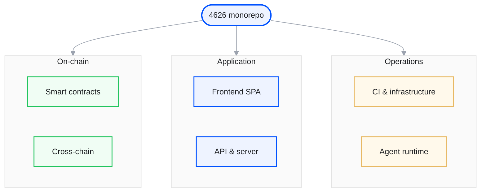

<div class="audit-hub">

<nav class="audit-path" aria-label="Report sections">
  <a class="audit-path__step" href="/audits">Overview</a>
  <a class="audit-path__step audit-path__step--current" href="/audits/fable">Scope</a>
  <a class="audit-path__step" href="/audits/fable/findings-summary">Executive summary</a>
  <a class="audit-path__step" href="/audits/fable/full-repo-review-2026-06">Full report</a>
  <a class="audit-path__step" href="/audits/fable/key-sessions">Source sessions</a>
  <a class="audit-path__step" href="/audits/fable/sessions-index">Session chronology</a>
  <a class="audit-path__step" href="/audits/fable/transcripts">Transcript archive</a>
</nav>

<section class="audit-hero">
  <span class="audit-hero__eyebrow"><span class="audit-hero__dot"></span>June 2026 · Agent-assisted review</span>
  <h1 class="audit-hero__title">Scope &amp; methodology</h1>
  <p class="audit-hero__subtitle">Read-only, multi-pass review of the <strong>wenakita/4626</strong> monorepo using Cursor Fable 5, with parallel subsystem analysis and manual verification of high-severity candidates at file:line granularity.</p>
  <div class="home-hero__actions">
    <a class="home-btn home-btn--primary" href="/audits/fable/findings-summary">Executive summary<span class="home-btn__arrow" aria-hidden="true">→</span></a>
    <a class="home-btn home-btn--ghost" href="/audits/fable/full-repo-review-2026-06">Full technical report</a>
  </div>
</section>

<div class="audit-doc-control">
  <div class="audit-doc-control__title">Report metadata</div>
  <table>
    <tbody>
      <tr><th>Report ID</th><td>4626-FABLE-2026-06</td></tr>
      <tr><th>Review tool</th><td>Cursor Fable 5 (<code>claude-fable-5-thinking-high</code>)</td></tr>
      <tr><th>Review mode</th><td>Read-only — no production code modified as part of the review</td></tr>
      <tr><th>Validation</th><td>Baseline lint / typecheck / test / forge gates; parallel subagents; manual candidate verification</td></tr>
      <tr><th>Finding grades</th><td>VERIFIED · REFUTED · ALREADY-KNOWN (with evidence citations)</td></tr>
      <tr><th>Primary session</th><td><a href="/audits/fable/transcripts/full-codebase-review-primary-audit-0a513245">Full-codebase review (0a513245…)</a></td></tr>
    </tbody>
  </table>
</div>

<div class="audit-verdict">
  <div class="audit-verdict__label">Release conclusion (at review date)</div>
  <div class="audit-verdict__text">The working tree was <strong>not ready</strong> for a clean release tag — impairment side-pocket and x402 payment paths required resolution or explicit risk acceptance. The review did <strong>not</strong> identify a remotely exploitable unauthenticated RCE or web-tier fund-drain.</div>
</div>

<div class="audit-stat-row">
  <div class="audit-stat">
    <span class="audit-stat__value">8</span>
    <span class="audit-stat__label">Parallel analysis lanes</span>
  </div>
  <div class="audit-stat">
    <span class="audit-stat__value">350+</span>
    <span class="audit-stat__label">API handlers reviewed</span>
  </div>
  <div class="audit-stat">
    <span class="audit-stat__value">3 + 6</span>
    <span class="audit-stat__label">Critical + high findings</span>
  </div>
  <div class="audit-stat">
    <span class="audit-stat__value">72+</span>
    <span class="audit-stat__label">Forge unit tests in baseline</span>
  </div>
</div>

## Review coverage



## In-scope systems

<div class="audit-scope-grid">
  <div class="audit-scope-card">
    <span class="audit-scope-card__title">Smart contracts</span>
    <span class="audit-scope-card__body">CreatorOVault, impairment side-pocket, ShareOFT, DeploymentBatcher, lottery and gauge modules</span>
  </div>
  <div class="audit-scope-card">
    <span class="audit-scope-card__title">Application frontend</span>
    <span class="audit-scope-card__body">Swap, deploy, waitlist and auth, wallet execution (canonical ERC-4337 and EOA tracks)</span>
  </div>
  <div class="audit-scope-card">
    <span class="audit-scope-card__title">API &amp; server</span>
    <span class="audit-scope-card__body">Vercel handlers, paymaster, keeper jobs, Stripe and x402 strategy payments</span>
  </div>
  <div class="audit-scope-card">
    <span class="audit-scope-card__title">Infrastructure</span>
    <span class="audit-scope-card__body">GitHub Actions CI, Semgrep and Slither gates, cron workflows, dependency posture</span>
  </div>
  <div class="audit-scope-card">
    <span class="audit-scope-card__title">Cross-chain</span>
    <span class="audit-scope-card__body">Solana share-mesh program, bridge adapter, KPR keeper workflows</span>
  </div>
  <div class="audit-scope-card">
    <span class="audit-scope-card__title">Agent runtime</span>
    <span class="audit-scope-card__body">Railway XMTP/Eliza runtime, Hermit, Telegram Mini App flows</span>
  </div>
</div>

## Methodology

```mermaid
%%{init: {
  'theme': 'base',
  'themeVariables': {
    'fontFamily': 'Inter, system-ui, sans-serif',
    'fontSize': '13px',
    'primaryColor': '#eef3ff',
    'primaryTextColor': '#1c1e21',
    'primaryBorderColor': '#0052FF',
    'lineColor': '#9ca3af'
  }
}}%%
flowchart LR
  A["① Baseline<br/>lint · test · forge"] --> B["② Primary review<br/>0a513245…"]
  B --> C["③ Parallel lanes<br/>8 subsystems"]
  C --> D["④ Security pass<br/>c603521c…"]
  D --> E["⑤ Evidence grading<br/>VERIFIED · REFUTED"]
  E --> F["Report register<br/>4626-FABLE-2026-06"]

  classDef step fill:#fafafa,stroke:#d1d5db,stroke-width:1px,color:#525860
  classDef core fill:#eef3ff,stroke:#0052FF,stroke-width:2px,color:#1c1e21
  classDef out fill:#fff9eb,stroke:#E8B964,stroke-width:2px,color:#1c1e21

  class A step
  class B,C,D core
  class E step
  class F out
```



1. **Repository baseline** — Install dependencies, run lint, typecheck, unit tests, forge build/test, and repository guard scripts.
2. **Primary review** — Full-codebase template executed in session <a href="/audits/fable/transcripts/full-codebase-review-primary-audit-0a513245">0a513245…</a> with parallel lanes: architecture, CI/CD, frontend, data layer, security, and contracts.
3. **Security follow-up** — Dedicated pass in session <a href="/audits/fable/transcripts/security-pass-on-full-codebase-review-c603521c">c603521c…</a> on the same scope.
4. **Production readiness** — Follow-on sessions (including <a href="/audits/fable/transcripts/production-readiness-planning-6318a55b">6318a55b…</a>) traced launch blockers into remediation planning.
5. **Evidence grading** — Each candidate finding verified or refuted with file:line references before inclusion in the report register.

## Out of scope

- Formal verification or manual proof review of contract economics
- Live mainnet penetration testing or funded exploit attempts
- Third-party infrastructure operated outside the repository (Privy, Supabase, Railway) beyond integration boundaries documented in code
- Post-review remediation verification unless separately documented

## Citation

```text
4626 Agent-Assisted Codebase Review (June 2026). Report 4626-FABLE-2026-06.
https://docs.4626.fun/audits/fable/full-repo-review-2026-06
```

<nav class="audit-flow-nav" aria-label="Continue reading">
  <a class="audit-flow-nav__link audit-flow-nav__link--prev" href="/audits">← Overview</a>
  <span class="audit-flow-nav__step">Scope &amp; methodology</span>
  <a class="audit-flow-nav__link audit-flow-nav__link--next" href="/audits/fable/findings-summary">Executive summary →</a>
</nav>

</div>
