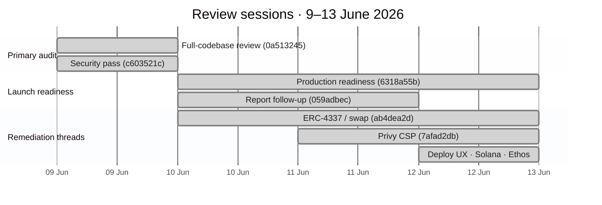
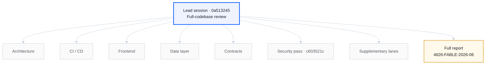

<nav class="audit-path" aria-label="Report sections">
  <a class="audit-path__step" href="/audits">Overview</a>
  <a class="audit-path__step" href="/audits/fable">Scope</a>
  <a class="audit-path__step" href="/audits/fable/findings-summary">Executive summary</a>
  <a class="audit-path__step" href="/audits/fable/full-repo-review-2026-06">Full report</a>
  <a class="audit-path__step audit-path__step--current" href="/audits/fable/key-sessions">Source sessions</a>
  <a class="audit-path__step" href="/audits/fable/sessions-index">Session chronology</a>
  <a class="audit-path__step" href="/audits/fable/transcripts">Transcript archive</a>
</nav>

# Appendix A — Source sessions

Curated session register for Report **4626-FABLE-2026-06**. Read the [executive summary](/audits/fable/findings-summary) and [full report](/audits/fable/full-repo-review-2026-06) first; use this appendix for supplementary engagement records.

Each link opens a readable session export (tool output omitted). For complete machine-readable logs, download [fable-chats-4626-2026-06.zip](/audits/fable-chats-4626-2026-06.zip).

## Engagement timeline

## Parallel workstream structure

## Primary review (9 June 2026)

| Session | Role | Record |
| --- | --- | --- |
| `0a513245…` | **Lead full-codebase review** — produced the [full report](/audits/fable/full-repo-review-2026-06) with eight parallel workstreams | [View](/audits/fable/transcripts/full-codebase-review-primary-audit-0a513245) |
| `c603521c…` | **Independent security pass** on the same scope | [View](/audits/fable/transcripts/security-pass-on-full-codebase-review-c603521c) |

### Parallel workstreams (lead session `0a513245…`)

| Workstream | Record |
| --- | --- |
| Architecture | [View](/audits/fable/transcripts/architecture-analysis-lane-b8ddd1b3) |
| CI/CD | [View](/audits/fable/transcripts/ci-cd-analysis-lane-c1a231e1) |
| Frontend | [View](/audits/fable/transcripts/frontend-analysis-lane-6c9354f7) |
| Data layer | [View](/audits/fable/transcripts/data-layer-analysis-lane-5a3eda06) |
| Contracts | [View](/audits/fable/transcripts/contracts-analysis-lane-071ad150) |

## Remediation & launch readiness (10–12 June 2026)

| Session | Subject | Record |
| --- | --- | --- |
| `6318a55b…` | Production readiness assessment | [View](/audits/fable/transcripts/production-readiness-planning-6318a55b) |
| `059adbec…` | Follow-up on report findings | [View](/audits/fable/transcripts/full-repo-review-follow-up-059adbec) |
| `ab4dea2d…` | ERC-4337 UserOp and swap routing | [View](/audits/fable/transcripts/erc-4337-userop-swap-routing-debug-ab4dea2d) |
| `5596f8da…` | Swap failure investigation | [View](/audits/fable/transcripts/swap-failures-investigation-5596f8da) |
| `7afad2db…` | Privy CSP and frame-ancestors policy | [View](/audits/fable/transcripts/privy-csp-frame-ancestors-7afad2db) |
| `d6b4e576…` | Deploy vault UX | [View](/audits/fable/transcripts/deploy-vault-page-redesign-d6b4e576) |
| `bf2f96cc…` | Solana verified build | [View](/audits/fable/transcripts/solana-explorer-verified-build-bf2f96cc) |
| `93c08966…` | Supabase Ethos integration | [View](/audits/fable/transcripts/supabase-ethos-tables-93c08966) |

## Supplementary review (9 June 2026)

| Session | Subject | Record |
| --- | --- | --- |
| `2f3a0cb7…` | Static analysis follow-up | [View](/audits/fable/transcripts/static-scan-deeper-review-2f3a0cb7) |
| `db706ee8…` | security.txt program | [View](/audits/fable/transcripts/security-txt-program-db706ee8) |

## Additional appendices

- [Appendix B — Session chronology](/audits/fable/sessions-index) — day-by-day session register (9–13 June 2026)
- [Appendix C — Transcript archive](/audits/fable/transcripts) — all published session exports
- [Machine-readable archive](/audits/fable-chats-4626-2026-06.zip) — complete JSONL logs

<nav class="audit-flow-nav" aria-label="Continue reading">
  <a class="audit-flow-nav__link audit-flow-nav__link--prev" href="/audits/fable/full-repo-review-2026-06">← Full report</a>
  Appendix A
  <a class="audit-flow-nav__link audit-flow-nav__link--next" href="/audits/fable/sessions-index">Session chronology →</a>
</nav>
