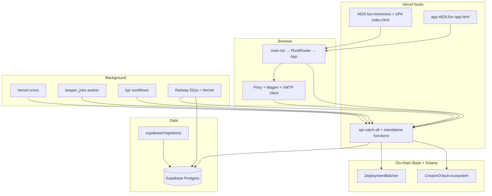

<div class="audit-transcript-meta">
[← Source sessions](/audits/fable/key-sessions) · [Transcript archive](/audits/fable/transcripts) · [Executive summary](/audits/fable/findings-summary)
</div>
# Architecture analysis lane
| Field | Value |
| --- | --- |
| Session ID | `b8ddd1b3-72ff-4e86-a662-31bbc98fa14f` |
| Lead session | `0a513245-3ae2-4076-a9b0-bc1de524c38f` |
| Record type | Parallel workstream export |
:::note Appendix record
Readable export of a supplementary review session. Tool outputs and system context are omitted; download the [JSONL archive](/audits/fable-chats-4626-2026-06.zip) for the complete log.
:::
## Engagement brief

You are doing the architecture-mapping pass of a full-codebase review of the 4626 monorepo at /home/akitav2/projects/4626 (a creator-vault DeFi platform: Vite/React SPA + Vercel serverless API + Foundry Solidity contracts + keeper bots + Solana program). READ-ONLY: do not modify any files.

Produce a precise architecture map grounded in actual code (cite file paths, and line numbers for key wiring):

1. Frontend entrypoints: frontend/index.html vs app.html vs public/immersive/index.html, how frontend/vercel.json routes hosts (4626.fun vs app.4626.fun), frontend/src/main.tsx provider tree, router setup, key route groups (waitlist, swap, deploy, explore, positions, telegram).
2. API surface: frontend/api/[...path].ts catch-all → frontend/api/_handlers/_routes.ts (and _routes.*.ts siblings). Count approximate route groups; identify the auth lanes used (Privy X-Privy-Token, HttpOnly cv_auth_session cookie, machine auth CRON_SECRET/KPR_API_KEY, admin auth) and which helper functions implement each (look in frontend/server/_lib/ for auth helpers).
3. Server libs: enumerate the major domains under frontend/server/_lib/ (wallet/ERC-4337, identity, onboarding/waitlist, lottery/AMOE, keeperJobs, alfaclub, hermit, dune, uniswap, zora, etc.) with one-line purpose each.
4. Background work: Vercel crons in frontend/vercel.json (list them), keeper_jobs queue handlers (frontend/api/_handlers/keeper/), kpr/ workflows (list workflow files), Railway agents (frontend/server/agents/eliza, hermit).
5. Contracts: list the major contracts in contracts/ by subsystem (deployment batcher + modules/helpers, vault + modules, ShareOFT/gauge/lottery, payout router, solana bridge, alfaclub) with file paths.
6. Data layer: count supabase/migrations/ files, note the most recent 10 migration names, and how runtime schema bootstrap works (frontend/server/_lib/db/schemaBootstrap.ts).
7. External services touched (Privy, Supabase, Coinbase CDP paymaster/bundler, Relay, Zora API, Uniswap, LayerZero, Stripe, Telegram, XMTP, Pinata, Dune, DeBank, Etherscan, Hyperliquid, AlfaClub) — for each, where the client lives.
8. Riskiest boundaries in your judgment (e.g., paymaster sponsorship gate, machine-auth endpoints, webhook handlers, profile merge).

Return a structured markdown report. Be thorough but concise. Thoroughness: very thorough.

## Analysis

Mapping the monorepo architecture from the codebase. Gathering entrypoints, routing, API surface, and server structure in parallel.

[REDACTED]

*Tools invoked:* UpdateCurrentStep, Read, Read, Glob, Glob, Glob

## Analysis

[REDACTED]

*Tools invoked:* Read, Read, Read, Glob, Grep, Glob

## Analysis

[REDACTED]

*Tools invoked:* Read, Read, Read, Read, Read, Grep, Shell, Shell

## Analysis

[REDACTED]

*Tools invoked:* Read, Read, Read, Glob, Grep, Read

## Analysis

[REDACTED]

*Tools invoked:* Glob, Read, Read, Grep, Read, Shell

## Analysis

[REDACTED]

*Tools invoked:* Read, Grep, Grep, Read, Read, Glob

## Analysis

[REDACTED]

*Tools invoked:* Read, Grep, Read, Grep, Glob, Grep

## Analysis

[REDACTED]

*Tools invoked:* Grep, Grep, Read, Read, Grep, Shell

## Analysis

[REDACTED]

*Tools invoked:* Read, Grep, Read, Grep, Grep, Grep

## Analysis

[REDACTED]

*Tools invoked:* Glob, Grep, Read, Grep, Grep, Grep, Grep, Grep, Grep

## Analysis

[REDACTED]

*Tools invoked:* Read, Read, Grep, Grep, Grep, Read, Read, Read

## Analysis

[REDACTED]

*Tools invoked:* Grep, Read, Grep, Read, Glob, Grep, Grep

## Analysis

[REDACTED]

*Tools invoked:* Grep, Read, Read, Grep, Shell, Read, Grep

## Analysis

[REDACTED]

*Tools invoked:* Grep, Read, Glob, Read, Grep, Grep, Read

## Analysis

[REDACTED]

*Tools invoked:* Grep, Glob, Read, Grep, Read, Read

## Analysis

[REDACTED]

*Tools invoked:* Grep, Grep, Read, Read, Read

## Analysis

[REDACTED]

*Tools invoked:* Grep, Read, Read

## Analysis

[REDACTED]

*Tools invoked:* Grep, Read, Read

## Analysis

[REDACTED]

*Tools invoked:* Grep, Grep

## Analysis

[REDACTED]

*Tools invoked:* UpdateCurrentStep

## Analysis

# 4626 Monorepo Architecture Map

Grounded in `/home/akitav2/projects/4626` as of this review pass.

---

## 1. Frontend entrypoints and routing

### Three HTML shells, one React bundle

| Shell | Path | Boot script | Role |
|-------|------|-------------|------|
| Marketing immersive home | `frontend/public/immersive/index.html` | Static (R3F/marketing JS under `/immersive/`) | **4626.fun `/`** — hero vault, waitlist CTA links into SPA |
| Marketing SPA | `frontend/index.html` | `/src/main.tsx` (line 247) | SPA routes on **4626.fun** except `/` |
| App SPA | `frontend/app.html` | `/src/main.tsx` (line 272) | **app.4626.fun** authenticated product shell |

Both SPA shells mount the same `frontend/src/main.tsx` tree; host behavior is decided at runtime via `getHostMode()` in `frontend/src/lib/env/host`.

### `frontend/vercel.json` host routing (production)

Key rules from `frontend/vercel.json`:

```402:598:frontend/vercel.json
    {
      "src": "/",
      "has": [{ "type": "host", "value": "app.4626.fun" }],
      "dest": "/app.html"
    },
    ...
    {
      "src": "/",
      "has": [{ "type": "host", "value": "4626.fun" }],
      "dest": "/immersive/index.html"
    },
    ...
    {
      "src": "/waitlist(.*)",
      "has": [{ "type": "host", "value": "app.4626.fun" }],
      "status": 308,
      "headers": { "location": "https://4626.fun/waitlist" }
    },
    {
      "src": "/((?!assets/).*)",
      "has": [{ "type": "host", "value": "app.4626.fun" }],
      "dest": "/app.html"
    },
    {
      "src": "/((?!assets/).*)",
      "dest": "/index.html"
    }
```

**Summary:**
- **4626.fun `/`** → `public/immersive/index.html` (static marketing island; `<base href="/immersive/">` at line 11).
- **4626.fun** other paths → `index.html` (React SPA: waitlist, FAQ, explore, positions on marketing host).
- **app.4626.fun** → `app.html` (React SPA: swap, deploy, admin).
- **app.4626.fun/waitlist*** → 308 to `https://4626.fun/waitlist`.
- **hermit.4626.fun** → Telegram Hermit webhook rewrite (lines 518–536).
- **v1.4626.fun** → 308 to app (lines 182–190).
- API: `/api/(.*)` → catch-all `api/[...path].ts` (line 538–539).

Cookie domain `.4626.fun` (documented in AGENTS.md) lets `cv_auth_session` survive marketing ↔ app navigation.

### Provider / router tree (`main.tsx` → `RootRouter` → `App`)

**Root mount** (`frontend/src/main.tsx`):

```373:389:frontend/src/main.tsx
  ReactDOM.createRoot(document.getElementById('root')!).render(
    <React.StrictMode>
      <RootErrorBoundary>
        <ThemeProvider>
          <TooltipProvider>
            <AppToaster />
            <BrowserRouter>
              <RootRouter />
            </BrowserRouter>
          </TooltipProvider>
        </ThemeProvider>
      </RootErrorBoundary>
    </React.StrictMode>,
  )
```

**`RootRouter`** (`frontend/src/RootRouter.tsx`):
- Wraps routes in `AppLoadingProvider` + `AppCanvas` + `AppLoadingOverlay`.
- **Marketing host** (`hostMode === 'marketing'`): `/`, `/waitlist`, `/r/:referralCode` under non-interactive `Layout`.
- **App-only paths** on marketing host → redirect to `APP_ORIGIN` (app.4626.fun).
- **`/telegram/link`**, **`/telegram/menu`** → redirect to standalone `telegram-link.html` (Privy-free Telegram WebView).
- **`*`** → `ProtectedAppBoundary` → `AppQueryProvider` → `App`.

**`App` route guards** (`frontend/src/App.tsx` + `routeGuards.tsx` + `lazyRoutes.tsx`):

| Layer | Component | Providers / behavior |
|-------|-----------|----------------------|
| Host | `HostGuard` | Host-mode enforcement |
| Marketing | `Layout interactive={false}` | FAQ, arena, positions (no Privy at layout) |
| Account | `LazyAuthWalletBoundary` | `PrivyClientProvider` → `WalletProviders` (Wagmi) |
| App chrome | `AuthenticatedAppLayout` | `AccountContextProvider` → `Layout` |
| Access | `LazyAccessBoundary` / `LazyPrivyBoundary` | Privy-only vs full wallet |
| Gating | `SessionAcceptedRoute` | `LazyRequireSession` → `LazyRequireAccepted` (waitlist approval) |
| Deploy/swap CSW | `SmartWalletRoute` | `SmartWalletsRouteProvider` |
| Admin | `LazyRequireAdmin` | Admin session check |

### Key route groups (`frontend/src/app/routeDefinitions.tsx`)

| Group | Paths | Gate |
|-------|-------|------|
| **Waitlist** | `/waitlist`, `/r/:referralCode` (RootRouter); `/add-owner` redirects to waitlist | Marketing host; Privy in waitlist flow |
| **Swap** | `/swap` | Session + accepted + Privy |
| **Deploy** | `/deploy`, `/deploy/coin`, `/deploy/vault` | + `SmartWalletRoute` |
| **Explore** | `/explore/*`, creator/content detail | Session accepted (Explore can be looser than swap) |
| **Positions** | `/positions`, `/arena/positions` | Marketing layout (also on 4626.fun) |
| **Telegram** | `/telegram/link`, `/telegram/menu` → `telegram-link.html` | Isolated HTML shell |
| **Account / owner install** | `/accounts`, `/add` | Auth wallet boundary |
| **Admin** | `/admin/*` | Accepted + admin |
| **Creator strategy / lottery** | `/creator/strategy/features`, `/amoe/tasks`, `/vote` | Accepted app routes |

Note: **`/portfolio`** has SEO headers in `vercel.json` but no current page under `frontend/src/pages/`; holdings surface through the account tray (`ConnectButton` + `/api/wallet/trayPortfolio`).

---

## 2. API surface

### Dispatch chain

```1:14:frontend/api/[...path].ts
import { dispatchCatchAllRequest } from './_lib/dispatchCatchAll.js'

export default async function handler(req: VercelRequest, res: VercelResponse) {
  const { getApiHandler } = await import('./_handlers/_routes.js')
  return dispatchCatchAllRequest({
    req,
    res,
    prefixes: ['/api/', '/__api/'],
    resolveHandler: getApiHandler,
    routeLabel: 'api',
    jsonRpcCompatSubpath: 'paymaster',
  })
}
```

**Static route map:** `frontend/api/_handlers/_routes.ts` merges:
- ~**150** inline loaders in `apiRouteLoaders`
- Prefixed siblings: `_routes.auth.ts` (10), `_routes.cdp.ts` (2), `_routes.deploy.ts` (3), `_routes.image.ts` (11), `_routes.keepr.ts` (8), `_routes.lens.ts` (4), `_routes.telegram.ts` (10), `_routes.uniswap.ts` (11), `_routes.waitlist.ts` (12), `_routes.wallet.solana.ts` (3), `_routes.zora.ts` (19)
- **`/api/v1/*`** delegated to `_routes.v1.ts` (**118** loaders)

**Approximate total:** ~**350** registered HTTP handlers (plus standalone functions: `api/agent/process.ts`, `api/keepr/actions/execute.ts`, `api/social-preview.ts`, SEO handlers).

### Route group taxonomy (approximate)

| Group | Examples | Count (order of magnitude) |
|-------|----------|----------------------------|
| Auth / session | `auth/*`, `onboarding/*` | ~25 |
| Accounts / wallet | `accounts/*`, `wallet/*`, `portfolio/me` | ~20 |
| Deploy | `deploy/*`, `deploy/v2/session/*`, `paymaster` | ~25 |
| Keeper / control plane | `keeper/*`, `keeper/jobs/*`, `keeper/control-plane/*` | ~45 |
| Keepr legacy bridge | `keepr/*` | ~8 |
| Zora / metrics | `zora/*`, `sync-creator-metrics` | ~25 |
| Uniswap | `uniswap/*` | ~11 |
| v1 public API | `v1/lottery/*`, `v1/chat/*`, `v1/alfaclub/*`, `v1/agents/*` | ~118 |
| Admin | `admin/*` | ~20 |
| Telegram | `telegram/*` | ~10+ |
| Creator strategy / Stripe | `creator/strategy/*` | ~5 |
| Analytics / DeBank | `analytics/*`, `debank/*` | ~8 |
| Hermit / agents | `hermit/draft`, `agent/*`, `agents` | ~10 |

### Auth lanes and implementing helpers

| Lane | Mechanism | Primary modules |
|------|-----------|-----------------|
| **Privy `X-Privy-Token`** | Bearer or header; `PrivyClient.verifyAuthToken` | `getPrivyTokenFromRequest` + `verifyPrivyRequest` in `frontend/server/_lib/wallet/canonicalCswDelegation.ts` (lines 99–107, 419–431); `verifyPrivyForAccounts` in `frontend/server/_lib/identity/accountsIdentity.ts` |
| **HttpOnly `cv_auth_session`** | HMAC session cookie from SIWE | `COOKIE_SESSION` + `readSessionFromRequest` in `frontend/server/auth/_shared.ts` (lines 17–18); minted in `frontend/api/_handlers/auth/_verify.ts`; consumed via `readRequestPrincipal` in `frontend/server/_lib/auth/requestPrincipal.ts` |
| **Vercel cron `CRON_SECRET`** | `Authorization: Bearer` | `isAuthorizedCron` in `frontend/server/_lib/lottery/cronAuth.ts`; `isCronSecretAuthorized` in `frontend/server/_lib/alfaclub/alfaclubCronAuth.ts` |
| **Machine `KPR_API_KEY`** | Bearer constant-time compare | `requireKeeprApiKey` in `frontend/packages/server-core/src/machine-auth.ts` (used by `keeper/_tend.ts`, `_sweep.ts`, etc.) |
| **Admin** | (a) Session: `getSessionAddress` + `isAdminAddress` / `isAdminEmail` (`frontend/server/_lib/auth/session.ts`, `auth/_admin.ts`); (b) Machine: `requireAdminApiToken` (`ADMIN_API_TOKEN`); (c) Dual: profile merge requires admin session **and** `CRON_SECRET` (`frontend/api/_handlers/admin/profiles/_merge.ts`) |

Additional patterns:
- **SIWA agent auth:** `readSiwaAgentFromRequest` in `requestPrincipal.ts`
- **Telegram webhook secrets:** `TELEGRAM_WEBHOOK_SECRET`, `ALFACLUB_TELEGRAM_WEBHOOK_SECRET`, etc. in `telegram/_webhook.runtime.ts` and ingress modules
- **Stripe webhook:** signature verification in `frontend/server/_lib/creatorStrategy/stripe.ts` via `_webhook.ts`
- **Solana orchestrator:** optional `SOLANA_ORCHESTRATOR_API_KEY` Bearer on keeper reconcile paths

---

## 3. Server libs (`frontend/server/_lib/`)

Top-level domains (40 folders) with one-line purpose:

| Domain | Purpose |
|--------|---------|
| `admin` | Admin audit logging and ops helpers |
| `agent` / `agents` | Agent registration, capabilities, runtime helpers |
| `agentControl` | Keepr trust zones, action typing for job worker |
| `ajnaVaultManager` | Ajna vault automation / rebalance coordination |
| `alfaclub` | AlfaClub chat bridge, Hyperliquid reads, counter-trade, daily brief |
| `arena` | Arena identity / room mapping for trading surfaces |
| `auction` | CCA auction read/compute helpers |
| `auth` | Session principal, deploy auth, admin address/email checks |
| `chat` | Chat directory, presence, Ethos hydration |
| `controlPlane` | Vault deploy settlement orchestration, payment ops |
| `creatorStrategy` | Paid strategy catalog, activation, Stripe/x402, provisioning |
| `db` | Postgres pool, **`schemaBootstrap.ts`**, Supabase admin |
| `debug` | Dev/diagnostic utilities |
| `deploy` | Deploy sessions, fork prep, batcher auth, phase helpers |
| `dev` | Local dev env helpers |
| `dune` | Dune Analytics API client + SQL templates |
| `hermit` | Creative Hermit skill router, meme/IPFS pipeline |
| `identity` | Profiles, merge primitive, accounts identity, Privy resolution |
| `image` | Token icon render pipeline orchestration |
| `infra` | Logger, trust origins, rate-limit helpers |
| `keeper` | Strategy health gates, keeper HTTP bridge logic |
| `keeperJobs` | `keeper_jobs` queue claim/run/complete |
| `keepr` | Legacy Keepr HTTP client wrappers |
| `lens` | Lens/Grove agent registration |
| `lottery` | AMOE ZK submit, credits, cron auth, Twitter/XMTP check-in |
| `messaging` | XMTP-adjacent server messaging utilities |
| `onboarding` | Waitlist schema, points, bootstrap, wallet collision |
| `onchain` | Base reads, payout router paths, Solana mint parity, registry |
| `paymaster` | Custom owner sponsorship tokens, paymaster policy helpers |
| `payments` | x402 / payment verification shared logic |
| `relay` | Relay Settlement quote, notify-deposit, owner-mutation flows |
| `token` | Managed token list, metadata |
| `uniswap` | Pool history, token pool series (subgraph + Zora fallback) |
| `waitlist` | Waitlist scoring, Airtable sync, leaderboard |
| `wallet` | CSW delegation, Privy wallets, ERC-4337 env, tray portfolio, sync |
| `workspace` | AlfaClub workspace RBAC |
| `zora` | Creator metrics sync, explore sparklines, trade quotes |
| `zora-csw` | Zora CSW indexer enrichment, Ethos refresh |
| `zora-profiles` | Zora profile refresh cron store |

Related non-`_lib` server trees:
- `frontend/server/auth/` — SIWE verify, shared cookie/session
- `frontend/server/uniswap/` — Trading API proxy + guards
- `frontend/server/solana-provisioner/` — Solana route provisioner HTTP service
- `frontend/server/agents/` — Railway runtimes (below)

Shared package: `frontend/packages/server-core/` (auth envelope, CORS, machine-auth, `getDbForCron`, etc.).

---

## 4. Background work

### Vercel crons (`frontend/vercel.json` lines 43–167) — **31** schedules

| Category | Paths |
|----------|-------|
| Creator metrics | `/api/sync-creator-metrics?mode=hot|backfill` |
| Waitlist ops | `/api/waitlist/airtable-sync` |
| AlfaClub | `/api/v1/alfaclub/run`, `chat-bridge-run`, `proliquid-score-run`, `radar`, `daily-brief`, `chat-token-refresh`, `position-alerts`, `room-label-sync`, `counter-trade-run` |
| AMOE lottery | `/api/v1/lottery/amoe/retry-cron`, `publish-cron`, `burn-refund-cron` |
| Zora indexer | `/api/v1/zora-csw/scan-cron`, `enrich-cron`; `/api/v1/zora-profiles/refresh-cron` |
| Ethos | `/api/v1/chat/ethos-sync`, `ethos-sync-hot` |
| Keeper jobs | `/api/keeper/jobs/run`, `process-keepr-actions`, multiple `enqueue-*` (sweep, vault, active-vaults, bridge-integrity, ethos, strategy, solana, ajna, signals) |

Cron auth: `isAuthorizedCron` / AlfaClub variant; DB via **`getDbForCron()`** for pile-up safety.

### `keeper_jobs` queue (`frontend/api/_handlers/keeper/`)

**Job coordination API:** enqueue, claim, complete, status, health, run (`jobs/_run.ts` calls `runKeeperJobTick` in `frontend/server/_lib/keeperJobs/keeperJobRunner.ts`).

**Worker behavior:** claims jobs, executes allowlisted internal HTTP only (`/api/keeper/`, `/api/keepr/actions/`), uses `KPR_API_KEY` when calling those endpoints.

**Direct keeper mutation endpoints** (machine auth via `requireKeeprApiKey`): `_tend.ts`, `_report.ts`, `_sweep.ts`, `_rebalanceStrategies.ts`, `_payoutRouterHarvest.ts`, `_bridgeIntegrity.ts`, `_solanaReconcile.ts`, CRE ingest endpoints, control-plane routes, etc.

Local worker: `pnpm -C frontend keeper:jobs:worker`.

### KPR workflows (`kpr/workflows/`) — **16** files

`4626.workflow.ts`, `vault-keeper.workflow.ts`, `vault-strategy-reallocator.workflow.ts`, `payout-router-harvest.workflow.ts`, `cca-finalization.workflow.ts`, `bridge-integrity-monitor.workflow.ts`, `strategy-signal-listener.workflow.ts`, `charm-rebalance-manager.workflow.ts`, `ajna-bucket-manager.workflow.ts`, `keepr-action-queue.workflow.ts`, `keepr-solana-relay-entries.workflow.ts`, `keepr-solana-settle-fees.workflow.ts`, `keepr-solana-rebalance.workflow.ts`, `keepr-solana-winner-relay.workflow.ts`, `keepr-solana-price-monitor.workflow.ts`, `keepr-solana-graduation.workflow.ts`.

Entry: `kpr/runner.ts`; Solana orchestrator: `kpr/solana-keeper-orchestrator.ts` (separate systemd service on ops host).

### Railway agents

| Service | Path | Role |
|---------|------|------|
| **Eliza / XMTP Keepr** | `frontend/server/agents/eliza/index.ts` | Primary XMTP consumer; plugins (keepr, kpr, zora, telegram, alfaclub, uniswap, …); canonical CSW + Privy delegated signer |
| **Hermit** | `frontend/server/agents/hermit/index.ts` | AlfaClub chat bridge + creative lane; isolated from Keepr; `/healthz` bootstrap in `bootstrap.ts` |

Vercel fallback: `api/agent/process.ts` (lightweight XMTP process, isolated bundle).

---

## 5. Contracts (`contracts/`)

Major subsystems by path:

### Deployment batcher + helpers

| File | Contents |
|------|----------|
| `contracts/helpers/batchers/DeploymentBatcher.sol` | Shell + **`DeploymentBatcherPhase1Module`**, **`Phase2Module`**, **`Phase3Helper`** (co-located, lines ~702+) |
| `contracts/helpers/batchers/VaultActivationBatcher.sol` | Post-deploy activation batch |
| `contracts/helpers/batchers/VaultAuxiliaryDeployBatcher.sol` | Aux contract batch deploy |
| `contracts/helpers/batchers/StrategyDeploymentBatcher.sol` | Strategy deployment batching |
| `contracts/helpers/infra/UniversalBytecodeStore.sol` / `V2` | CREATE2 bytecode store |
| `contracts/helpers/infra/OFTBootstrapRegistry.sol` | LayerZero OFT bootstrap |
| `contracts/factories/UniversalCreate2DeployerFromStore.sol` | ACL-gated CREATE2 deployer |

### Vault + modules

| File | Role |
|------|------|
| `contracts/vault/CreatorOVault.sol` | Main ERC-4626 vault |
| `contracts/vault/CreatorOVaultWrapper.sol` | Wrap/unwrap + cooldown |
| `contracts/vault/modules/CreatorOVault{Core,Admin,Strategies}Module.sol` | Modular vault logic |
| `contracts/vault/modules/CreatorOVaultModuleStorage.sol` | Module storage version (v2/v3 impairment) |
| `contracts/vault/CreatorOImpairmentClaims.sol` / `CreatorORecoveryEscrow.sol` | Impairment side-pocket v1 |
| `contracts/vault/strategies/*` | CCA, Charm, Ajna, Solana, ERC4626 adapters, UniV4 strategies |

### ShareOFT / gauge / lottery

| File | Role |
|------|------|
| `contracts/utilities/messaging/CreatorShareOFT.sol` | Share OFT + fee routing |
| `contracts/utilities/messaging/OVaultHubComposer.sol` | OVault mesh compose |
| `contracts/governance/CreatorGaugeController.sol` | Gauge / jackpot custody |
| `contracts/governance/CreatorLotteryManager` → `contracts/utilities/lottery/CreatorLotteryManager.sol` | Jackpot payout authority |
| `contracts/utilities/lottery/zk/LotteryAmoeRouter.sol` | AMOE ZK router |
| `contracts/utilities/lottery/randomness/*` | VRF / Drand / router |

### Payout router

| File | Role |
|------|------|
| `contracts/utilities/routers/PayoutRouter.sol` | Creator coin external revenue conversion |
| `contracts/utilities/routers/VaultShareBurnStream.sol` | Weekly burn drip |
| `contracts/utilities/routers/CreatorCoinPolicyController.sol` | Policy controller |

### Solana bridge

| File | Role |
|------|------|
| `contracts/utilities/bridge/SolanaBridgeAdapter.sol` | Base ↔ Solana bridge adapter |
| `contracts/vault/strategies/SolanaBridgeStrategy.sol` / `SolanaStrategy.sol` | Vault-side Solana allocation |

### AlfaClub

| File | Role |
|------|------|
| `contracts/alfaclub/AlfaCreatorKeyLPFactory.sol` | Creator coin + FriendKey LP factory |
| `contracts/alfaclub/AlfaCreatorKeyPool.sol` | xy=k pool |

### Core registry / oracle

`contracts/core/CreatorRegistry.sol`, `contracts/utilities/oracles/CreatorOracle.sol`, `contracts/services/ovault/CreatorOVaultComposerHub.sol`.

**Solana program (separate tree):** `programs/creator-share-hook/` (Anchor; mainnet program id in AGENTS.md).

---

## 6. Data layer

### Migrations

- **Count:** **127** files in `supabase/migrations/`
- **Most recent 10** (by filename timestamp):
  1. `20260711000000_solana_share_mesh_mappings.sql`
  2. `20260710000000_alfaclub_room_label_cache.sql`
  3. `20260709000000_alfaclub_counter_trade_engine.sql`
  4. `20260708000000_alfaclub_arena_identity_mappings.sql`
  5. `20260707000000_alfaclub_position_alerts.sql`
  6. `20260706000000_alfaclub_command_reply_ledger.sql`
  7. `20260705010000_cleanup_retention_after_query_temp_io_drop.sql`
  8. `20260705000000_drop_orphan_query_temp_io_snapshots.sql`
  9. `20260606010000_alfaclub_proliquid_signal_ingest.sql`
  10. `20260611100000_keeper_cre_attestation_schema.sql`

### Runtime schema bootstrap

`frontend/server/_lib/db/schemaBootstrap.ts`:
- **SSoT:** all DDL in `supabase/migrations/`; runtime must not emit raw `CREATE TABLE` strings (CI guard `pnpm -C frontend guard:schema`).
- **`ensureMigrationApplied(db, filename)`** — reads migration SQL from bundled `supabase/migrations/**` (included in Vercel catch-all `includeFiles`), splits statements, applies idempotently.
- **`withEnsureOnce(name, fn)`** — per-process concurrent-safe single flight.
- Named delegates: `ensureAlfaclubSchema`, `ensureAmoeSchema`, `ensureChatSchema`, `ensureCriticalAppTables`, `ensureKeeperCreSchema`, `ensureSolanaShareMeshMappingsSchema`, etc. (20+ helpers exported from same file).

Pattern: handlers call domain-specific `ensure*Schema(db)` on cold start instead of inline DDL.

---

## 7. External services — client locations

| Service | Client / integration location |
|---------|-------------------------------|
| **Privy** | Client: `frontend/src/lib/privy/client.tsx`; Server: `canonicalCswDelegation.ts`, `privyWalletApi.ts`, `telegram/_webhook.runtime.ts` |
| **Supabase / Postgres** | `frontend/server/_lib/db/postgres.ts`, `supabaseAdmin.ts`; migrations in `supabase/migrations/` |
| **Coinbase CDP paymaster/bundler** | Client AA: `frontend/src/lib/aa/coinbaseErc4337.ts`; API: `frontend/api/_handlers/paymaster/_paymaster.ts`; CDP routes: `_routes.cdp.ts` |
| **Relay Settlement** | `frontend/server/_lib/relay/*`; API: `api/_handlers/relay/*`; client owner-install in `frontend/src/lib/wallet/` |
| **Zora** | `frontend/server/_lib/zora/*`, `frontend/src/lib/zora/*`; API: `api/_handlers/zora/*`, `v1/*` |
| **Uniswap** | `frontend/server/uniswap/trading.js`; API: `api/_handlers/uniswap/*`; client swap in `frontend/src/lib/uniswap/`, `useSwapExecution` |
| **LayerZero / OFT** | Contracts: ShareOFT, OFTBootstrapRegistry; client deploy: `finalizeShareBridgeFee.ts`, `shareBridgeOftWiring.ts` |
| **Stripe** | `frontend/server/_lib/creatorStrategy/stripe.ts`; webhooks/checkout handlers under `api/_handlers/creator/strategy/stripe/` |
| **Telegram** | `frontend/api/_handlers/telegram/*` (large `_webhook.runtime.ts`); Mini App: `telegram-link.html`, `_miniapp-session.ts` |
| **XMTP** | Client: `frontend/src/lib/xmtp/provider.tsx`; Server agent: `frontend/server/agents/eliza/`; signer: `privyXmtpSigner.ts` |
| **Pinata / IPFS** | Hermit: `frontend/server/_lib/hermit/*`; Vercel rewrite `/ipfs/*` → `pinata.4626.fun` |
| **Dune** | `frontend/server/_lib/dune/duneApi.ts`; API: `api/_handlers/analytics/_dune.ts` |
| **DeBank** | API: `api/_handlers/debank/*`; tray fallback: `server/_lib/wallet/` (tray portfolio resolution) |
| **Etherscan (Base v2)** | `frontend/server/_lib/wallet/baseTrayPortfolioEtherscan.ts`; UI links throughout app |
| **Hyperliquid** | `frontend/server/_lib/alfaclub/hyperliquid.ts`; positions UI: `frontend/src/pages/Positions.tsx` |
| **AlfaClub** | `frontend/server/_lib/alfaclub/chatBridge.ts`, `roomTimeline.ts`; API: `api/_handlers/v1/alfaclub/*`; optional Cloudflare proxy: `alfaclub/infra/cloudflare-proxy/` |
| **Ethos** | `frontend/server/_lib/zora/creatorEthosProjection.ts`; crons `v1/chat/ethos-sync*` |
| **Twitter/X** | `frontend/server/twitter/twitterEnv.ts`; AMOE check-in handlers |

---

## 8. Riskiest boundaries (judgment)

1. **`/api/paymaster` JSON-RPC proxy** (`frontend/api/_handlers/paymaster/_paymaster.ts`, ~3.8k lines)  
   Sponsors ERC-4337 UserOps for deploy + canonical swaps. Gates include `gateRequestedStrategyWeights`, deploy-session tokens, canonical CSW policy, impairment aux plans, and payout-router approvals. Misconfiguration or bypass = direct gas/protocol subsidy abuse.

2. **Machine-auth keeper surface** (`requireKeeprApiKey`, cron enqueue endpoints)  
   `_sweep.ts`, `_tend.ts`, `_markSettled.ts`, control-plane provision/settle can mutate vault lifecycle and on-chain state. `keeper_jobs` worker restricts outbound paths but cron + key compromise is high blast radius.

3. **Webhook ingress (unsigned or shared-secret)**  
   - Telegram `_webhook.runtime.ts` (~8k lines): bot commands, deploy progress, trading.  
   - Stripe `_webhook.ts`: activates `$499` strategy entitlements.  
   - Hermit/proliquid Telegram ingress on `hermit.4626.fun`.  
   Secret rotation drift (notably AlfaClub proxy vs Vercel) has caused production 401 loops.

4. **`POST /api/admin/profiles/merge`**  
   Dual auth (admin session + `CRON_SECRET`) but executes irreversible identity consolidation (`profileMerge.ts`). Tombstone/alias bugs resurrect fragmented identities if merge primitive drifts.

5. **Deploy session continue / owner delegation**  
   Temporary Privy server wallet as CSW owner (`deploy/v2/session/*`, `paymaster` deploy paths). Owner not removed → persistent server control of creator CSW.

6. **Privy token vs session cookie split**  
   Users can hold `cv_auth_session` without active Privy (`HttpOnly` ≠ Privy session). Handlers that accept only one lane can show false "signed in" or block swap incorrectly; conversely, conflating lanes weakens auth.

7. **Solana provisioner + orchestrator**  
   `frontend/server/solana-provisioner/` and `SOLANA_ORCHESTRATOR_URL` mutate mainnet infra; conflating provisioner URL with orchestrator breaks reconcile silently (`skipped_unconfigured`).

8. **AlfaClub chat bridge cron (every minute)**  
   `chat-bridge-run` holds live AlfaClub JWT, posts to rooms, ingests messages — credential leakage or proxy misconfig affects trading/social rooms (e.g. 1659).

---

## Architecture diagram (high level)



---

This map is intended as a navigation index for deeper security, deploy, or feature reviews. Switch to Agent mode if you want this persisted as a repo doc or expanded with sequence diagrams for a specific flow (e.g. canonical swap, deploy session, or AMOE submit).

[REDACTED]

