<section class="audit-hero">
  Security disclosure
  <h1 class="audit-hero__title">Security &amp; audits</h1>
  
Published security review materials for integrators, auditors, and token holders: scope and methodology, executive findings, the full technical report, and supplementary session records.

  

    <a class="home-btn home-btn--primary" href="/audits/fable/findings-summary">Executive summary→</a>
    <a class="home-btn home-btn--ghost" href="/audits/fable">Scope &amp; methodology</a>
  

</section>

<nav class="audit-path" aria-label="Report sections">
  <a class="audit-path__step audit-path__step--current" href="/audits">Overview</a>
  <a class="audit-path__step" href="/audits/fable">Scope</a>
  <a class="audit-path__step" href="/audits/fable/findings-summary">Executive summary</a>
  <a class="audit-path__step" href="/audits/fable/full-repo-review-2026-06">Full report</a>
  <a class="audit-path__step" href="/audits/fable/key-sessions">Source sessions</a>
  <a class="audit-path__step" href="/audits/fable/sessions-index">Session chronology</a>
  <a class="audit-path__step" href="/audits/fable/transcripts">Transcript archive</a>
</nav>

## Report structure

Recommended reading order for Report **4626-FABLE-2026-06**:

```mermaid
%%{init: {
  'theme': 'base',
  'themeVariables': {
    'fontFamily': 'Inter, system-ui, sans-serif',
    'fontSize': '13px',
    'primaryColor': '#eef3ff',
    'primaryTextColor': '#1c1e21',
    'primaryBorderColor': '#0052FF',
    'secondaryColor': '#fafafa',
    'secondaryTextColor': '#525860',
    'secondaryBorderColor': '#e3e3e3',
    'tertiaryColor': '#fff9eb',
    'tertiaryTextColor': '#1c1e21',
    'tertiaryBorderColor': '#E8B964',
    'lineColor': '#9ca3af',
    'clusterBkg': '#fafafa',
    'clusterBorder': '#e3e3e3',
    'titleColor': '#1c1e21'
  }
}}%%
flowchart LR
  O["Overview"] --> S["Scope"]
  S --> E["Executive<br/>summary"]
  E --> R["Full report"]
  R --> A["Source<br/>sessions"]
  A --> B["Session<br/>chronology"]
  B --> C["Transcript<br/>archive"]

  classDef start fill:#eef3ff,stroke:#0052FF,stroke-width:2px,color:#1c1e21
  classDef featured fill:#fff9eb,stroke:#E8B964,stroke-width:2px,color:#1c1e21
  classDef appendix fill:#fafafa,stroke:#d1d5db,stroke-width:1px,color:#525860

  class O start
  class E featured
  class A,B,C appendix
```

  
Published review

  <table>
    <tbody>
      <tr><th>Report</th><td>4626 Technical Security Review — June 2026</td></tr>
      <tr><th>Repository</th><td><a href="https://github.com/wenakita/4626">wenakita/4626</a></td></tr>
      <tr><th>Review period</th><td>9–13 June 2026</td></tr>
      <tr><th>Primary deliverable</th><td><a href="/audits/fable/full-repo-review-2026-06">Full technical report</a></td></tr>
    </tbody>
  </table>

  

    8
    Parallel workstreams
  

  

    47
    Lead review sessions
  

  

    97
    Published session records
  

  

    3 + 6
    Critical + high findings
  

## June 2026 security review

  <a class="home-card audit-card audit-card--featured" href="/audits/fable/findings-summary">
    Recommended first read
    Executive summary
    Critical and high-severity findings with severity definitions and primary evidence references.
  </a>
  <a class="home-card audit-card" href="/audits/fable">
    Scope
    Scope &amp; methodology
    Systems in scope, validation approach, evidence grading, and release-readiness conclusion at review date.
  </a>
  <a class="home-card audit-card" href="/audits/fable/full-repo-review-2026-06">
    Full report
    Full technical report
    Architecture map, complete finding register (C/H/M/L), baseline validation, test gaps, and remediation guidance.
  </a>
  <a class="home-card audit-card" href="/audits/fable/key-sessions">
    Appendix A
    Source sessions
    Curated session register linking to supplementary engagement records.
  </a>

  
Limitations &amp; disclaimer

  
This publication documents a <strong>read-only technical security review</strong> of the 4626 monorepo conducted in June 2026. It is <strong>not</strong> a formal smart-contract audit certificate from an independent security firm and does not constitute legal or investment advice. Findings reflect repository state at review time; verify remediation status against current code and public disclosures before launch or integration decisions. Appendices contain supplementary session records — authoritative written conclusions are in the executive summary and full report.

  <a class="home-links__item" href="/audits/fable/transcripts">Transcript archive</a>
  ·
  <a class="home-links__item" href="/audits/fable/sessions-index">Session chronology</a>
  ·
  <a class="home-links__item" href="/audits/fable-chats-4626-2026-06.zip">Machine-readable logs (JSONL)</a>
  ·
  <a class="home-links__item" href="/reference/impairment-v1-disclosures">Impairment disclosures</a>

<nav class="audit-flow-nav" aria-label="Continue reading">
  
  <a class="audit-flow-nav__link audit-flow-nav__link--next" href="/audits/fable/findings-summary">Executive summary →</a>
</nav>

