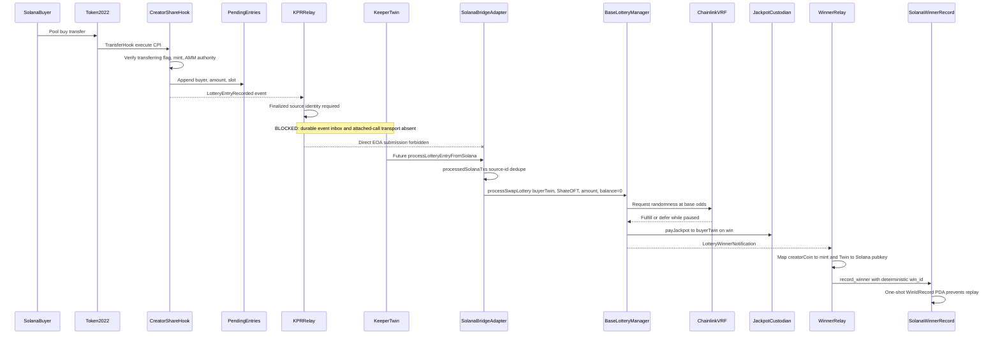

# Solana lottery relay + Base LotteryManager audit

Date: 2026-07-11  
Scope: source, tests, docs, and read-only production state  
Safety posture: no deployment, provisioning, registration, transaction submission, pool creation, program upgrade, relay enablement, or boost activation occurred.

## Verdict

`Solana personal veLottery boost safe to enable: NO`

`Solana base-odds relay safe to enable: NO`

The relay must remain disabled. The current source has no Solana→Base attached-call transport capable of making the keeper's predicted Twin the adapter caller, the pending-entry snapshot has no stable source-event identity, and the live v1.18 adapter points to the superseded LotteryManager. Personal boost additionally lacks a canonical EVM beneficiary and attributable creator Share coverage for the same identity.

## End-to-end sequence

## Identity model

| Boundary | Identity | Trust/binding | Result |
|---|---|---|---|
| Hook entry owner | Destination Token-2022 account owner | Bound by Token-2022 transfer-in-progress checks | Solana `Pubkey` |
| Base entry beneficiary | `BRIDGE.getPredictedTwinAddress(buyerSolanaPubkey)` | Deterministic bridge Twin derivation | Base Twin contract, not EOA or CSW |
| Personal veLottery account | None | No cryptographic Solana wallet → canonical EVM account binding exists | Personal boost unavailable |
| Base payout owner | Same Base Twin stored as VRF request user | LM pays the request user | ShareOFT remains at Twin |
| Solana winner display | `SOLANA_TWIN_TO_PUBKEY_MAPPING` | Operator mapping; now required to be injective | Solana winner pubkey |
| Canonical 4626 account | Verified-email account / parent CSW | Not part of this relay path | Must not be inferred |

Entry ownership and Base payout ownership are therefore the deterministic Twin. The later Solana winner record is a notification mapping, not a custody transfer. A future linked-account design must prove the mapping and payout choice explicitly rather than treating 32-byte Solana keys as EVM addresses.

## Token and unit mapping

| Asset/value | Domain | Unit | Must not be confused with |
|---|---|---|---|
| Creator Coin | Base | ERC-20 smallest units | ShareOFT |
| ShareOFT | Base | ERC-20 smallest units, commonly 18 decimals | Creator Coin |
| Share mesh mint | Solana | Standard SPL/LZ mint units | Token-2022 hook mint |
| Hook mint | Solana | Token-2022 units with TransferHook | Standard SPL mint rejected/handled differently by venues |
| Bridge-wrapped creator SPL | Solana | Legacy creator-asset units | Share token of either kind |
| `LotteryEntry.amount` | Solana hook | Hook-mint smallest units (`u64`) | USD |
| Adapter scaled amount | Base adapter | ShareOFT smallest units using registered decimal pair | `swapAmountUSD` |
| LM swap USD | Base LM pricing | 6-decimal USD | Token amount |
| `sharesPaid` winner record | Base event → Solana | Base ShareOFT amount constrained to `u64` | Hook-mint amount |

The adapter passes ShareOFT and the scaled token amount to LM; LM performs oracle pricing. Missing, stale, future-dated, malformed, or excessive-deviation prices skip the entry through LM fail-closed pricing. The KPR price monitor is not the entry-pricing authority.

## Findings

### P0

#### SOL-P0-01 — No authorized Solana→Base submission transport

- Location: `contracts/shared/bridge/SolanaBridgeAdapter.sol:223-227,685-690`; `kpr/actions/keepr-solana-relay-entries.action.ts:1-69`
- Scenario: KPR previously called the adapter with `KPR_PRIVATE_KEY`. The adapter requires `msg.sender` to equal the keeper pubkey's predicted Twin, so the call reverts. Replacing this with an EOA authorization would widen authority and violate the product invariant.
- Environment: all relay environments.
- Status: **Mitigated**. The action now fails before RPC, Base submission, or Solana buffer clearing. A real attached-call transport remains open.

#### SOL-P0-02 — Source entries have no stable unique event identity

- Location: `programs/creator-share-hook/src/state/pending_entries.rs:13-20`; adapter replay map at `contracts/shared/bridge/SolanaBridgeAdapter.sol:672-674`.
- Scenario: the buffer stores only `(buyer, amount, slot)`. Two equal buys in one slot collide under the former synthetic hash. Ring positions are reused and reset, so they are not durable identities.
- Environment: all relay environments.
- Status: **Open**. Required design is finalized transaction/event ingestion keyed by `(genesis hash, program id, signature, event log index)` with durable cursor/inbox state.

#### SOL-P0-03 — Live v1.18 adapter points at superseded LM

- Location: canonical targets in `docs/reference/addresses.md:31-33`; read-only call recorded in the validation workpaper.
- Scenario: current LM authorizes adapter `0x9A6181…`, but that adapter's `lotteryManager()` returns superseded `0xbE87AD…`, whose canary is inactive. Entries cannot be claimed to reach current LM.
- Environment: Base mainnet.
- Status: **Open operational blocker**. No wiring transaction was authorized by this audit.

#### SOL-P0-04 — B2 pool/mint architecture is contradictory

- Location: `AGENTS.md:385-400`; `docs/_internal/operations/solana/solana-share-mesh-budget-paths.md:105-120`.
- Scenario: the canonical architecture says Meteora DLMM rejects TransferHook mints and uses standard SPL for trading, while the B2 runbook requires the pool and hook on the same Token-2022 mint. No qualifying pool buy can be assumed until venue compatibility is proven.
- Environment: Solana mainnet and rehearsals.
- Status: **Open**. B2 documentation now marks enablement blocked.

### P1

#### SOL-P1-01 — No durable atomic inbox/cursor or crash recovery

- Location: `kpr/actions/keepr-solana-relay-entries.action.ts`; no relay inbox migration exists.
- Scenario: buffer reads, Base submission, and Solana clear cannot be made atomic. A crash after Base execution needs an on-chain `processedSolanaTxs(sourceId)` check plus durable status before retry.
- Environment: keeper/orchestrator.
- Status: **Open**; relay is hard-disabled.

#### SOL-P1-02 — Live buffer can overflow and drop eligibility

- Location: `programs/creator-share-hook/src/state/pending_entries.rs:70-85`.
- Scenario: the 256-entry ring drops the oldest entry. An alert cannot reconstruct the lost signature/event index.
- Environment: active high-volume hook mint.
- Status: **Open**. Event-log ingestion must be canonical; buffer becomes reconciliation only.

#### SOL-P1-03 — Winner mapping was conflict-prone and oversized payouts were coerced

- Location: `kpr/actions/keepr-solana-winner-relay.action.ts:121-169,226-319`.
- Scenario: two Twins could map to one Solana pubkey, and `sharesPaid > u64` was silently capped, allowing entry/payout records to diverge.
- Environment: winner relay.
- Status: **Fixed in source**. Lookup maps are injective and invalid `sharesPaid` values quarantine instead of truncating.

#### SOL-P1-04 — Non-EVM registry reverse mapping could be overwritten

- Location: `contracts/shared/core/Registry4626.sol:625-650`.
- Scenario: two creator tokens could claim the same Solana peer, changing reverse lookup ownership.
- Environment: future registry configuration.
- Status: **Fixed in source**, deployment required before live protection changes.

#### SOL-P1-05 — B2 readiness soft-passed unverifiable ownership

- Location: `frontend/server/_lib/onchain/solanaB2Readiness.ts:44-119`.
- Scenario: missing RPC passed readiness; any non-empty mint owner passed the owner check.
- Environment: API/control plane.
- Status: **Fixed**. Missing RPC fails readiness, reads use finalized commitment, and the owner check requires Token-2022 exactly.

#### SOL-P1-06 — Active KPR defaults targeted retired contracts

- Location: `kpr/utils/solanaCanonicalAddresses.ts:1-40` and KPR env/deploy examples.
- Scenario: an unset env normalized to v1.13 adapter/LM addresses.
- Environment: KPR bootstrap and operator scripts.
- Status: **Fixed** with v1.18 defaults and release guard coverage.

### P2/P3 residuals

- `relay_entries` re-emits `LotteryEntryRecorded`, creating event-name ambiguity; future ingestion must classify the enclosing instruction, not only the event discriminator.
- `record_winner` trusts the keeper for winner and amount and permits a default winner pubkey; `win_id` prevents replay but is not a Base proof.
- Winner relay uses an operator mapping and does not independently call the bridge to prove that the mapped Solana pubkey predicts the event's Twin.
- Base winner `originChain` is not sufficient for Solana attribution because adapter entries use the local LM path; creator and Twin mappings remain required.
- Hook Anchor integration tests do not exercise a real Token-2022 transfer-hook buy path end to end.
- Several hook error variants are not emitted by current handlers, weakening operational diagnosis.

## veLottery analysis

The adapter calls:

`processSwapLottery(buyerTwin, shareOFT, scaledAmount, 0)`

The zero balance means covered creator Share USD is zero for this entry path. Even if a Twin happened to hold ShareOFT, the relay does not prove that balance belongs to a linked canonical 4626 account or that the Solana trade and Base coverage share one beneficiary. The path therefore lacks:

1. a canonical EVM account eligible for `effectiveVeLotteryOf`;
2. attributable creator Share coverage for that same account;
3. replay-safe trade/account linkage.

Solana entries must remain base-odds-only. Gauge PPM is a separate Base additive path and remains bounded by LM `maxWinChance`; both live boost sources were zero during this audit.

## Fixed / Open / Deferred

### Fixed in this PR

- Fail-closed KPR relay action; no direct EOA write and no buffer clear.
- v1.18 KPR defaults/examples and address guard.
- B2 readiness fail-closed RPC and exact Token-2022 owner validation.
- Injective winner mappings and strict `u64` payout validation.
- Registry bytes32 reverse-map conflict protection in source.
- Adapter tests for direct-EOA rejection, replay, and distinct source IDs.

### Open

- Finalized source-event ingestion and permanent durable inbox.
- Solana→Base attached-call transport through the keeper Twin.
- Live adapter → current LM wiring.
- Cryptographic winner mapping/reconciliation.
- Real Token-2022 hook buy integration test.

### Deferred

- Personal veLottery attribution across chains.
- Any Solana program/contract deployment for source-only hardening.
- B2 pool design until venue support and token identity are proven.

## Future enablement checklist

1. Keep `SOLANA_ORCHESTRATOR_RELAY_ENTRIES_ENABLED=0`; remove `relay_entries` from reconcile actions.
2. Resolve the standard-SPL versus Token-2022 pool design and prove one real buy emits exactly one authentic eligibility event.
3. Build finalized event ingestion with genesis hash, program id, signature, instruction/event index, permanent uniqueness, atomic cursor advancement, quarantine, and `FOR UPDATE SKIP LOCKED` leases.
4. Build and independently review the Solana→Base attached-call transport; prove the adapter sees the predicted keeper Twin.
5. Reconcile every legacy buffered entry to finalized transaction history; quarantine any unmatched entry.
6. Verify v1.18 adapter registration, decimal pairs, per-entry caps, keeper allowlist, adapter→current-LM wiring, and current-LM→adapter authorization.
7. Prove crash-after-submit recovery by reading `processedSolanaTxs(sourceId)` before retry.
8. Prove Base VRF pause/deferred/callback behavior and absolute probability ceiling with personal boost still disabled.
9. Prove winner event → creator mint → Twin → Solana pubkey → `win_id` binding and duplicate rejection.
10. Run a non-mutating dry run, then require a separate explicit operational authorization for any canary. This audit does not grant it.

Rollback before and during any future canary: set the relay flag to `0`, remove `relay_entries` from reconcile actions, stop the relay worker, preserve the durable inbox/quarantine, and leave the program and LM unchanged. No program downgrade is required to disable relay.

## Final safety statement

This audit did not enable relay: local KPR is `0`, Vercel production is empty, and the source action hard-fails even if invoked. Railway production could not be independently read because its MCP/CLI credentials were unauthorized, so no stronger environment claim is made. `boostManager()` and `vaultGaugeVoting()` remained zero. `armBoostSourceTimelock()` was not called. No Base or Solana transaction, deployment, upgrade, registration, provisioning, pool creation, or live configuration mutation occurred.
