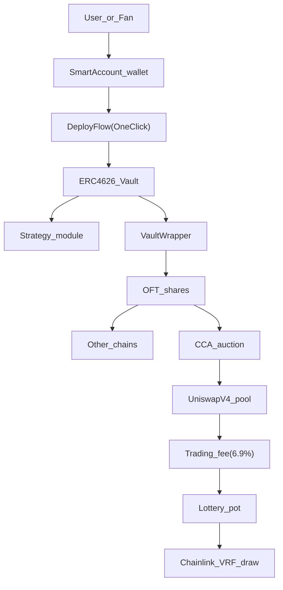

# Four Compressions

CreatorVault is easiest to understand as a system that compresses distance:

- **Deployment**: many contracts and roles become one creator action.
- **Geography**: shares become portable without fragmenting semantics.
- **Distribution**: launch becomes price discovery, not private access.
- **Engagement**: trading creates a provable onchain game loop.

## Reading Path

1. [Deployment](/compressions/deployment)
2. [Geography (Multichain)](/compressions/geography)
3. [Distribution (Launch)](/compressions/distribution)
4. [Engagement (Game Loop)](/compressions/engagement)

## System Flow (High Level)

## Next Actions

- [Getting Started](/getting-started)
- [Architecture](/architecture)
- [Three Primitives](/primitives)

