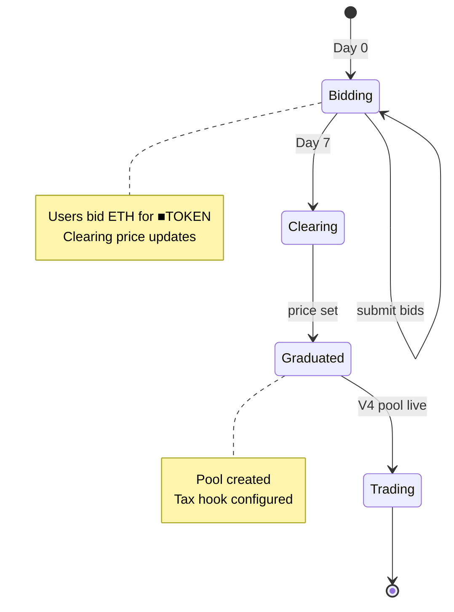
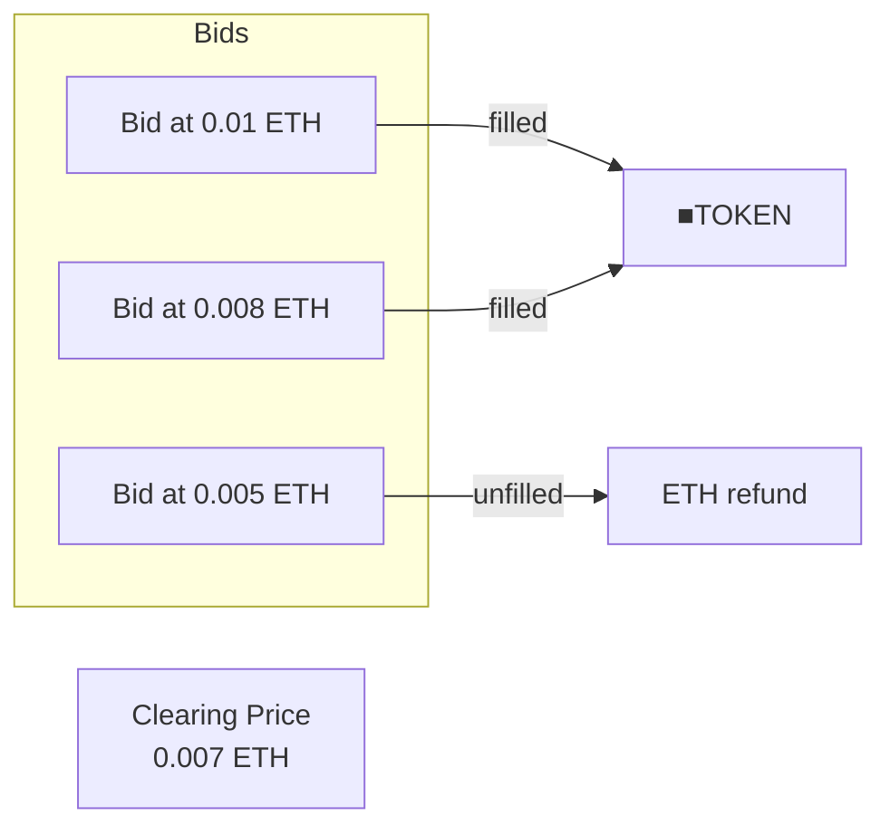
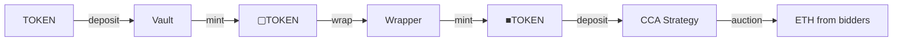
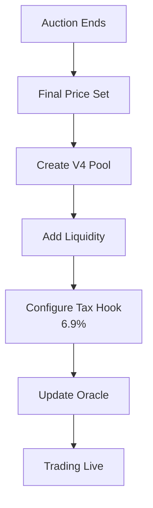

# Continuous Clearing Auction

The CCA Launch Strategy uses Uniswap's Continuous Clearing Auction mechanism for fair token launches.

---

## Why CCA

Traditional token launches have problems:

| Problem | CCA solution |
|---------|--------------|
| Sniping | All bidders get same clearing price |
| MEV/sandwich | No timing advantage |
| Information asymmetry | Price discovery is gradual |
| Whale dominance | Early participants rewarded |

CCA is an official Uniswap mechanism deployed on Base, Mainnet, and other chains.

---

## How it works

### Auction lifecycle



### Clearing mechanism

All bidders above the clearing price receive tokens at the same price.



---

## Token auctioned

The CCA strategy auctions **■TOKEN** (wrapped vault shares), not TOKEN directly:



### Why auction wrapped shares

- ■TOKEN is cross-chain capable (LayerZero OFT)
- Represents claim on diversified vault yield
- Price discovery for vault itself, not just underlying
- Raised ETH bootstraps LP liquidity

---

## Bidding

### Submit a bid

```solidity
// Bid 1 ETH for ■TOKEN with max price of 0.001 ETH per token
auction.submitBid{value: 1 ether}(
    maxPrice,        // Max ETH/TOKEN you'll pay
    amount,          // Amount of TOKEN desired
    owner,           // Bid owner
    prevTickPrice,   // For ordering (0 for simple bids)
    hookData         // Optional hook data
);
```

### Bid states

| State | Meaning |
|-------|---------|
| Active | Bid placed, may be filled |
| Filled | Above clearing price, will receive tokens |
| Unfilled | Below clearing price, ETH refundable |
| Claimed | Tokens/ETH claimed |

### Claim tokens

After auction ends:

```solidity
// If bid was filled
auction.claimTokens(bidId);

// If bid was unfilled
auction.exitBid(bidId);
```

---

## Graduation

When the auction ends, it "graduates" to a Uniswap V4 pool:



### Tax hook configuration

The strategy configures a 6.9% tax hook on graduation:

```solidity
// Called automatically on graduation
ITaxHook(taxHook).setTaxConfig(
    address(shareOFT),  // Token
    address(0),         // ETH counter asset
    feeRecipient,       // GaugeController
    690,                // 6.9% tax rate
    true,               // Counter is ETH
    true,               // Enabled
    false               // Not locked (can update)
);
```

---

## Configuration

| Parameter | Default | Purpose |
|-----------|---------|---------|
| Pool fee tier | 0.3% | V4 pool fee |
| Tax rate | 6.9% | Buy fee on V4 pool |
| Duration | 7 days | Auction length |

CCA uses Uniswap's official factory (`0xcca1101...`).

---

## Post-graduation

After the auction ends:
1. Final clearing price is set
2. V4 pool is created with liquidity
3. Tax hook is configured (6.9%)
4. Trading begins on V4

See [CCA Launch Strategy](/contracts/strategies/cca-launch) for contract API.

---

## Related

- [CCA Launch Strategy](/contracts/strategies/cca-launch) - Contract API
- [Token model](/overview/token-model) - Why ■TOKEN is auctioned
- [Fee flow](/overview/fee-flow) - What happens to raised funds
