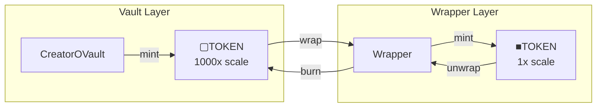

# CreatorOVaultWrapper

Converts between vault shares (▢[creatorCoin]) and wrapped OFT shares (■[creatorCoin]).
Normalizes the vault's 1000x decimals offset for intuitive user-facing amounts.

> **Summary**
> - Wraps ▢[creatorCoin] to ■[creatorCoin] at 1000:1 ratio
> - Provides one-step deposit and withdraw functions
> - Maintains deterministic conversion with no slippage

---

## Source

| Contract | Path |
|----------|------|
| CreatorOVaultWrapper | [`contracts/vault/CreatorOVaultWrapper.sol`](https://github.com/wenakita/4626/blob/main/contracts/vault/CreatorOVaultWrapper.sol) |

---

## Purpose

The wrapper normalizes the vault's decimals offset for user-facing operations.
Without the wrapper, a user depositing 100 TOKEN receives 100,000 ▢TOKEN.
The wrapper converts this to 100 ■TOKEN.

The wrapper is responsible for:
- Converting ▢[creatorCoin] ↔ ■[creatorCoin] at fixed 1000:1 ratio
- Providing one-step deposit/withdraw functions
- Tracking locked ▢[creatorCoin] backing minted ■[creatorCoin]

The wrapper is not responsible for:
- Custody of underlying creatorCoin (vault handles this)
- Trading or bridging (ShareOFT handles this)
- Fee collection (GaugeController handles this)

---

## Invariants

1. Conversion ratio is always exactly 1000:1 (▢ to ■)
2. `totalMinted × 1000 = totalLocked`
3. Conversions are deterministic with no price impact
4. Wrapper must be authorized as minter on ShareOFT

---

## Core Flows

### Conversion Flow

The following diagram shows the wrapper's position in the token hierarchy.
All conversions are deterministic at the fixed 1000:1 ratio.

*This diagram shows token flow only. Underlying asset custody remains with the vault.*

### Conversion Examples

| Direction | Conversion | Example |
|-----------|------------|---------|
| Wrap | ▢TOKEN / 1000 = ■TOKEN | 5000 ▢AKITA → 5 ■AKITA |
| Unwrap | ■TOKEN × 1000 = ▢TOKEN | 5 ■AKITA → 5000 ▢AKITA |

### One-Step Operations

For users going directly from underlying to wrapped token:

- **deposit**: creatorCoin → vault deposit → wrap → ■TOKEN
- **withdraw**: ■TOKEN → unwrap → vault withdraw → creatorCoin

---

## Access Control

| Role | Permissions |
|------|-------------|
| Owner | Configure vault and ShareOFT addresses |
| Users | Wrap, unwrap, deposit, withdraw |

---

## Failure Modes

### Common Reverts

| Error | Cause |
|-------|-------|
| `InsufficientBalance` | Attempting to unwrap more than owned |
| `NotAuthorized` | Wrapper not authorized as ShareOFT minter |
| `ZeroAmount` | Attempting zero-value conversion |

### Operational Pitfalls

- Wrapper must be authorized on ShareOFT before use
- Vault approval required before wrapping
- Unwrapping requires ■TOKEN balance

---

## Integration Notes

### For Users

1. Approve the wrapper for creatorCoin spending
2. Call `deposit(amount)` to receive ■TOKEN
3. Or wrap existing ▢TOKEN via `wrap(amount)`

### For Integrators

- Use wrapper for user-facing operations
- Interact directly with vault for protocol-level integrations
- Conversion is always 1000:1, no oracle or slippage

### Non-Guarantees

- Wrapper does not provide price discovery
- Redemption value depends on vault share price
- ■TOKEN price on DEX may differ from underlying value

---

## Related Contracts

- [CreatorOVault](/contracts/core/creator-ovault) — Source of ▢TOKEN
- [CreatorShareOFT](/contracts/core/creator-share-oft) — Target ■TOKEN
- [Token Model](/overview/token-model) — Token relationships

---

### Implementation Reference

This document describes design intent.
For exact behavior and edge cases, refer to the Solidity implementation.

[View on GitHub](https://github.com/wenakita/4626/blob/main/contracts/vault/CreatorOVaultWrapper.sol)
