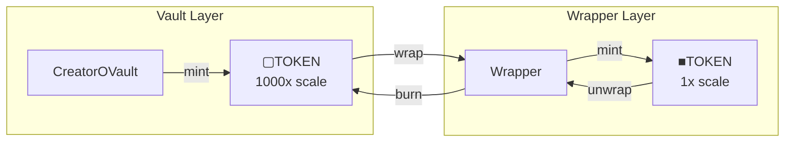

# CreatorOVaultWrapper

Converts between vault shares (▢TOKEN) and wrapped OFT shares (■TOKEN) with normalization.

---

## Source

| Contract | Path |
|----------|------|
| CreatorOVaultWrapper | [`contracts/vault/CreatorOVaultWrapper.sol`](https://github.com/wenakita/4626/blob/main/contracts/vault/CreatorOVaultWrapper.sol) |

---

## Purpose

The wrapper normalizes the vault's 1000x decimals offset so users see intuitive token amounts. Without the wrapper, a user depositing 100 TOKEN would receive 100,000 ▢TOKEN. The wrapper converts this to 100 ■TOKEN.

This normalization layer exists because:
- The vault requires a decimals offset for security (inflation attack prevention)
- Users expect 1:1 deposit-to-token ratios
- The wrapped token (■TOKEN) is the user-facing tradeable asset

---

## System role

The wrapper sits between the vault and the OFT, handling bidirectional conversion:

| Direction | Conversion | Example |
|-----------|------------|---------|
| Wrap | ▢TOKEN / 1000 = ■TOKEN | 5000 ▢AKITA → 5 ■AKITA |
| Unwrap | ■TOKEN × 1000 = ▢TOKEN | 5 ■AKITA → 5000 ▢AKITA |

---

## Key behaviors

### One-step operations

The wrapper provides convenience functions for users who want to go directly from TOKEN to ■TOKEN:

- **deposit**: TOKEN → vault deposit → wrap → ■TOKEN
- **withdraw**: ■TOKEN → unwrap → vault withdraw → TOKEN

These combine multiple operations into single transactions.

### Core conversion

For integrations working directly with vault shares:

- **wrap**: Transfer ▢TOKEN in, mint ■TOKEN out
- **unwrap**: Burn ■TOKEN in, transfer ▢TOKEN out

### Accounting

The wrapper maintains its own accounting:
- `totalLocked`: Total ▢TOKEN held (backing the minted ■TOKEN)
- `totalMinted`: Total ■TOKEN in circulation

These values must remain in sync for the wrapper to function correctly.

---

## Invariants

| Invariant | Description |
|-----------|-------------|
| Conversion ratio | Always exactly 1000:1 (▢TOKEN:■TOKEN) |
| Backing | totalMinted × 1000 = totalLocked |
| No slippage | Conversions are deterministic, no price impact |

---

## Integration points

| Integrates with | Purpose |
|-----------------|---------|
| [CreatorOVault](./creator-ovault) | Source of ▢TOKEN |
| [CreatorShareOFT](./creator-share-oft) | Target ■TOKEN |
| Frontend | User-facing deposit/withdraw |

---

## Implementation details

For function signatures and events, see the [source code](https://github.com/wenakita/4626/blob/main/contracts/vault/CreatorOVaultWrapper.sol).

Key implementation notes:
- The `NORMALIZATION_FACTOR` is hardcoded to 1000
- The wrapper must be authorized as a minter on the ShareOFT
- Vault approval is required before wrapping

---

## Related

- [Token Model](/overview/token-model) - Token relationships
- [CreatorOVault](./creator-ovault) - Vault contract
- [CreatorShareOFT](./creator-share-oft) - OFT contract
