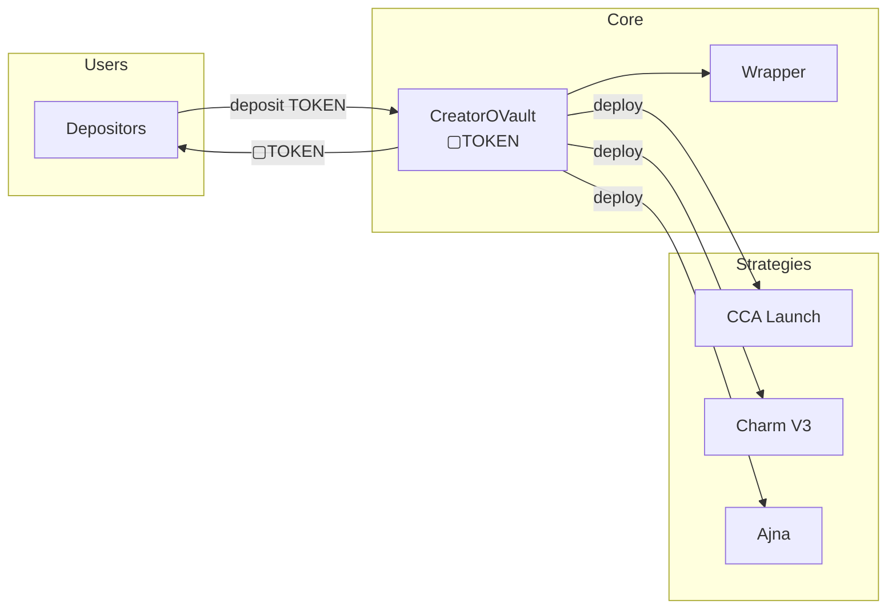

# CreatorOVault

ERC-4626 compliant tokenized vault for creator coins with multi-strategy yield generation.

---

## Source

| Contract | Path |
|----------|------|
| CreatorOVault | [`contracts/vault/CreatorOVault.sol`](https://github.com/wenakita/4626/blob/main/contracts/vault/CreatorOVault.sol) |

---

## Purpose

CreatorOVault serves as the core accounting layer for each creator's tokenized vault. It accepts deposits of the underlying creator coin (TOKEN), issues proportional vault shares (▢TOKEN), and coordinates capital deployment to yield strategies.

The vault is the single source of truth for:
- Total assets under management
- Share-to-asset conversion rates
- Strategy allocations and debt tracking
- Profit and loss accounting

---

## System role

The vault sits between users and strategies, providing a unified interface for deposits and withdrawals while abstracting the complexity of multi-strategy yield generation.

---

## Key behaviors

### Deposit and withdrawal

Users deposit TOKEN and receive ▢TOKEN (vault shares). The share price starts at approximately 1:1000 (due to the decimals offset) and increases as the vault generates yield.

Withdrawals can be instant or queued depending on size. Large withdrawals above the threshold must be queued to prevent MEV exploitation.

### Strategy management

The vault supports up to 5 concurrent strategies, each with a weight in basis points. When keepers call `deployToStrategies()`, idle capital is distributed proportionally.

Strategies report profits and losses via the `report()` function. Profits are subject to gradual unlocking to prevent manipulation.

### Price per share

The vault tracks `pricePerShare()` which represents the value of one vault share in terms of the underlying asset. This value:
- Starts at 1e18 (normalized)
- Increases as strategies generate yield
- Can be boosted by share burns from fee distribution

---

## Invariants

The vault enforces these invariants:

| Invariant | Enforcement |
|-----------|-------------|
| No inflation attacks | `_decimalsOffset() = 3` creates 1000 virtual shares |
| Minimum first deposit | 5,000,000 TOKEN minimum prevents dust attacks |
| Flash loan protection | 1 block delay between deposit and withdrawal |
| Price stability | Max 10% price change per transaction |
| Large withdrawal protection | Queuing required above threshold |

---

## Access control

| Role | Permissions |
|------|-------------|
| Owner | Full control, strategy management, emergency shutdown |
| Management | Strategy parameters, keeper assignment |
| Keeper | Deploy to strategies, report profits |
| Emergency Admin | Pause operations, emergency withdrawal |

---

## Integration points

| Integrates with | Purpose |
|-----------------|---------|
| [CreatorOVaultWrapper](./creator-ovault-wrapper) | Converts ▢TOKEN to ■TOKEN |
| [Strategies](/contracts/strategies) | Capital deployment |
| [GaugeController](/contracts/governance/gauge-controller) | Share burns from fees |

---

## Implementation details

For function signatures, events, and error definitions, see the [source code](https://github.com/wenakita/4626/blob/main/contracts/vault/CreatorOVault.sol).

Key implementation notes:
- Inherits from OpenZeppelin's ERC4626Upgradeable
- Uses a 10^3 decimals offset for security
- Implements custom profit unlocking to smooth returns
- Supports ownership rescue for stuck positions

---

## Related

- [Token Model](/overview/token-model) - ▢TOKEN explained
- [Vault Concepts](/concepts/vault) - Deep dive on vault mechanics
- [Architecture](/overview/architecture) - System design
