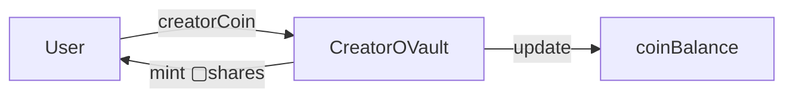
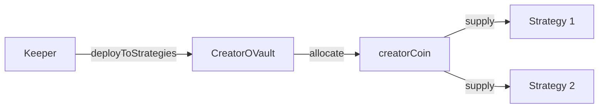
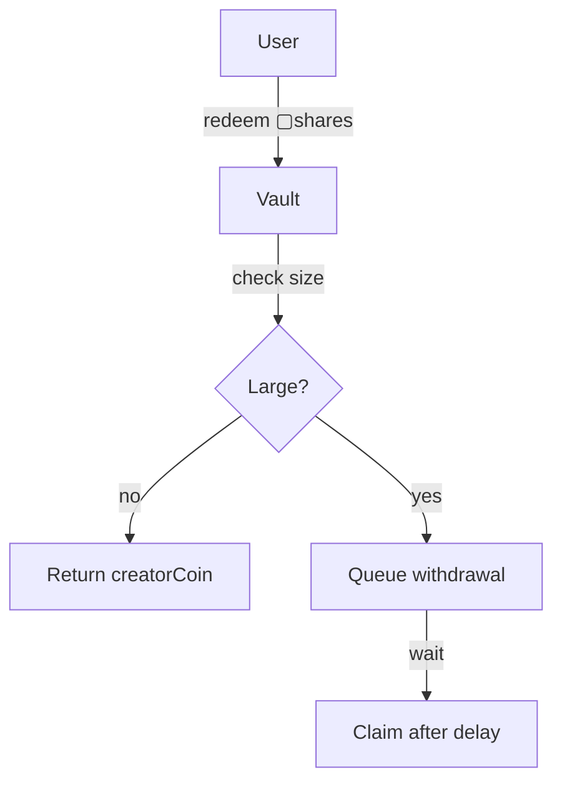

# CreatorOVault

The canonical custody and accounting layer for creatorCoins.
Implements ERC-4626 semantics while delegating yield generation to external strategies.

> **Summary**
> - Holds custody of the underlying creatorCoin
> - Mints and burns ERC-4626 vault shares (▢[creatorCoin])
> - Allocates underlying assets to yield strategies

---

## Source

| Contract | Path |
|----------|------|
| CreatorOVault | [`contracts/vault/CreatorOVault.sol`](https://github.com/wenakita/4626/blob/main/contracts/vault/CreatorOVault.sol) |

---

## Purpose

CreatorOVault provides a single accounting surface for deposits and withdrawals while abstracting strategy selection and yield execution.

It does not execute yield logic itself.

The vault is responsible for:
- Custody of creatorCoin deposits
- ERC-4626 compliant share accounting
- Strategy allocation and deallocation
- Profit/loss processing from strategy reports

The vault is not responsible for:
- Yield generation (strategies handle this)
- Cross-chain transfers (ShareOFT handles this)
- Fee collection (GaugeController handles this)

---

## Invariants

1. `totalAssets() / totalSupply()` always reflects accurate redemption value
2. `_decimalsOffset() = 3` creates 1000 virtual shares to prevent inflation attacks
3. First deposit must be at least 5,000,000 tokens
4. Minimum 1 block between deposit and withdrawal (flash loan protection)
5. Maximum 10% price change per transaction
6. Large withdrawals require queuing
7. `totalDebt == sum(strategyDebt[s] for s in strategies)`
8. `totalAssets() == coinBalance + totalDebt`

---

## Core Flows

### Deposit

The following diagram shows asset movement during deposit.
Only the underlying creatorCoin moves; vault shares are minted as accounting receipts.

*This diagram shows deposit flow only. Strategy deployment is a separate operation.*

### Strategy Deployment

The following diagram shows how idle assets are deployed to yield strategies.
Strategies only receive creatorCoin, never vault shares.

*This diagram intentionally excludes governance and fee flows.*

### Withdrawal

*Large withdrawals are queued to prevent bank-run scenarios.*

---

## Access Control

| Role | Permissions |
|------|-------------|
| Owner | Full control, strategy management, emergency shutdown |
| Management | Strategy parameters, keeper assignment, thresholds |
| Keeper | Deploy to strategies, report profits, rebalance |
| Emergency Admin | Pause operations, emergency withdrawal |
| Users | Deposit, withdraw, queue withdrawals |

---

## Failure Modes

### Common Reverts

| Error | Cause |
|-------|-------|
| `FirstDepositTooSmall` | First deposit below 5M minimum |
| `WithdrawTooSoon` | Withdrawal before delay period |
| `LargeWithdrawalMustBeQueued` | Large withdrawal not queued |
| `InflationAttackDetected` | Share calculation anomaly |
| `PriceChangeExceedsLimit` | Price moved more than 10% |

### Economic Risks

- Strategy losses affect all shareholders proportionally
- Illiquidity in strategies may delay withdrawals
- Large deposits/withdrawals can temporarily affect share price

---

## Integration Notes

### For Depositors

1. Approve the vault for creatorCoin spending
2. Call `deposit(assets, receiver)` or `mint(shares, receiver)`
3. Receive ▢[creatorCoin] shares
4. Optionally wrap to ■[creatorCoin] via the wrapper

### For Integrators

- Use `previewDeposit()` and `previewRedeem()` for accurate quotes
- Check `maxDeposit()` and `maxWithdraw()` for limits
- Monitor `pricePerShare()` for yield tracking

### Non-Guarantees

- Share price can decrease if strategies incur losses
- Withdrawal timing depends on strategy liquidity
- Large withdrawals may face slippage from strategy exits

---

## Related Contracts

- [CreatorOVaultWrapper](/contracts/core/creator-ovault-wrapper) — Wraps ▢ to ■ tokens
- [BaseCreatorStrategy](/contracts/strategies/base-creator-strategy) — Strategy interface
- [CreatorRegistry](/contracts/core/creator-registry) — Vault registration
- [CreatorGaugeController](/contracts/governance/gauge-controller) — Fee distribution

---

### Implementation Reference

This document describes design intent.
For exact behavior and edge cases, refer to the Solidity implementation.

[View on GitHub](https://github.com/wenakita/4626/blob/main/contracts/vault/CreatorOVault.sol)
