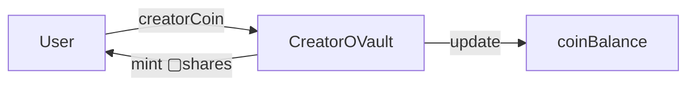
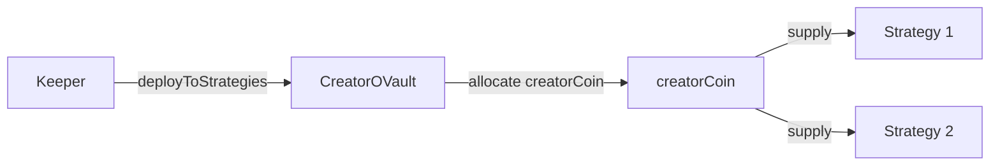
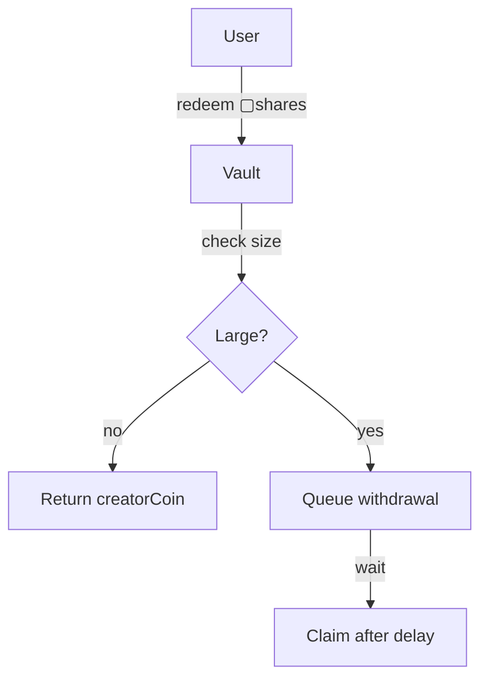

# CreatorOVault

ERC-4626 compliant tokenized vault for creator coins with multi-strategy yield generation.

---

## Source

| Contract | Path |
|----------|------|
| CreatorOVault | [`contracts/vault/CreatorOVault.sol`](https://github.com/wenakita/4626/blob/main/contracts/vault/CreatorOVault.sol) |

---

## Purpose

CreatorOVault is the core accounting and coordination contract for each creator's tokenized vault. It accepts deposits of the underlying creatorCoin, issues proportional vault shares (▢[creatorCoin]), and coordinates capital deployment to yield strategies.

The vault is the single source of truth for total assets, share pricing, and strategy allocations.

---

## Responsibilities

**What it does:**
- Accept creatorCoin deposits and mint ▢[creatorCoin] shares
- Burn shares and return creatorCoin on withdrawal
- Track total assets across idle balance and strategy deployments
- Coordinate strategy allocation based on weights
- Process profit/loss reports from strategies
- Enforce security invariants (deposit minimums, withdrawal delays)

**What it does NOT do:**
- Generate yield directly (strategies do this)
- Handle cross-chain transfers (ShareOFT does this)
- Collect or distribute fees (GaugeController does this)
- Store user positions (standard ERC-20 balance tracking)

---

## Key invariants and guarantees

1. **Share-to-asset ratio**: `totalAssets() / totalSupply()` always reflects accurate redemption value
2. **No inflation attacks**: `_decimalsOffset() = 3` creates 1000 virtual shares
3. **Minimum first deposit**: First deposit must be at least 5,000,000 tokens
4. **Flash loan protection**: 1 block minimum between deposit and withdrawal
5. **Price stability**: Maximum 10% price change per transaction
6. **Large withdrawal queue**: Withdrawals above threshold require queuing
7. **Strategy accounting**: `totalDebt == sum(strategyDebt[s] for s in strategies)`
8. **Asset conservation**: `totalAssets() == coinBalance + totalDebt`

---

## External interface (conceptual)

### User operations

**Deposits**: Users deposit creatorCoin and receive ▢[creatorCoin] shares. The share amount is calculated based on current `pricePerShare()`.

**Withdrawals**: Users can redeem shares for creatorCoin. Small withdrawals are instant; large withdrawals must be queued.

**Queue management**: Large withdrawals are queued for a delay period, then claimed. Users can cancel queued withdrawals.

### Strategy operations (keeper)

**Deployment**: Keeper calls `deployToStrategies()` to move idle creatorCoin into strategies based on weights.

**Reporting**: Keeper calls `report()` to process profit/loss from strategies. Profits are subject to gradual unlocking.

### Admin operations (management)

**Strategy management**: Add, remove, or update strategy weights.

**Parameter tuning**: Adjust withdrawal thresholds, delay blocks, minimum deposits.

---

## Core flows

### Deposit flow

### Strategy deployment flow

The vault allocates creatorCoin to strategies. Strategies only receive creatorCoin, never vault shares.

### Withdrawal flow

---

## Access control

| Role | Permissions |
|------|-------------|
| Owner | Full control, strategy management, emergency shutdown |
| Management | Strategy parameters, keeper assignment, thresholds |
| Keeper | Deploy to strategies, report profits, rebalance |
| Emergency Admin | Pause operations, emergency withdrawal |
| Users | Deposit, withdraw, queue withdrawals |

---

## Failure modes and edge cases

### Common reverts

| Error | Cause |
|-------|-------|
| `FirstDepositTooSmall` | First deposit below 5M minimum |
| `WithdrawTooSoon` | Withdrawal before delay period |
| `LargeWithdrawalMustBeQueued` | Large withdrawal not queued |
| `InflationAttackDetected` | Share calculation anomaly |
| `PriceChangeExceedsLimit` | Price moved more than 10% |

### Economic risks

- **Strategy losses**: If a strategy loses funds, all shareholders bear the loss proportionally
- **Illiquidity**: If strategies cannot return funds, withdrawals may be delayed
- **Price manipulation**: Large deposits/withdrawals can temporarily affect share price

### Operational pitfalls

- **Deployment timing**: Deploying to strategies during high volatility
- **Report ordering**: Incorrect profit/loss ordering can affect share pricing
- **Emergency mode**: Once activated, requires manual intervention to exit

---

## Integration notes

### For depositors

1. Approve the vault for creatorCoin spending
2. Call `deposit(assets, receiver)` or `mint(shares, receiver)`
3. Receive ▢[creatorCoin] shares to your address
4. Optionally wrap to ■[creatorCoin] via the wrapper

### For integrators

- Use `previewDeposit()` and `previewRedeem()` for accurate quotes
- Check `maxDeposit()` and `maxWithdraw()` for limits
- Monitor `pricePerShare()` for yield tracking

### Non-guarantees

- Share price can decrease if strategies incur losses
- Withdrawal timing depends on strategy liquidity
- Large withdrawals may face slippage from strategy exits

---

## Related contracts

- [CreatorOVaultWrapper](/contracts/core/creator-ovault-wrapper) - Wraps ▢ to ■ tokens
- [BaseCreatorStrategy](/contracts/strategies/base-creator-strategy) - Strategy interface
- [CreatorRegistry](/contracts/core/creator-registry) - Vault registration
- [CreatorGaugeController](/contracts/governance/gauge-controller) - Share burns
