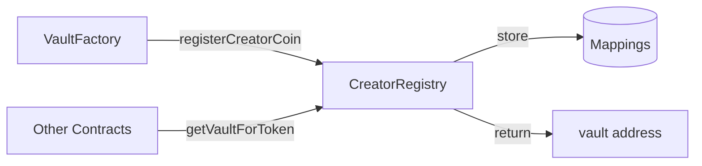
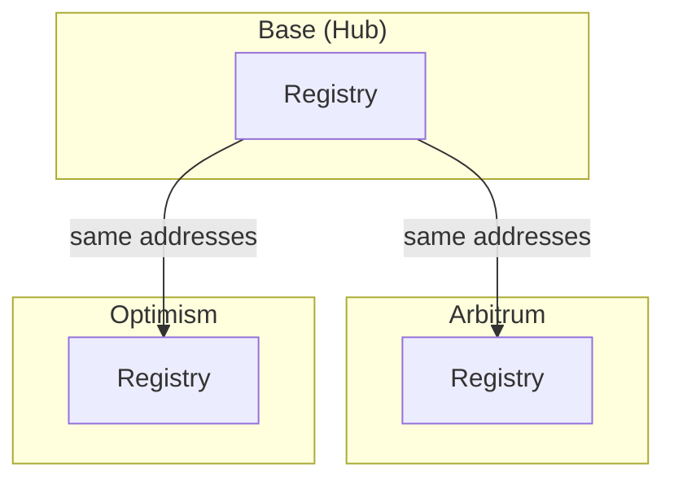

# CreatorRegistry

The canonical address registry for all creator vault deployments.
Other contracts query this registry to resolve addresses rather than storing them directly.

> **Summary**
> - Single source of truth for all creator vault addresses
> - Provides reverse lookups (vault → token, ShareOFT → token)
> - Manages LayerZero and cross-chain configuration

---

## Source

| Contract | Path |
|----------|------|
| CreatorRegistry | [`contracts/core/CreatorRegistry.sol`](https://github.com/wenakita/4626/blob/main/contracts/core/CreatorRegistry.sol) |

---

## Purpose

CreatorRegistry stores and resolves addresses for the entire creator vault ecosystem.
Every vault, wrapper, ShareOFT, oracle, and gauge controller registers here.

The registry is responsible for:
- Storing addresses for all creator coin deployments
- Providing forward and reverse address lookups
- Managing LayerZero endpoint configuration per chain
- Tracking supported chains and hub chain settings
- Authorizing factories to register new creator coins

The registry is not responsible for:
- Deploying contracts (factories handle this)
- Storing user balances or positions
- Executing cross-chain messages (OApps handle this)
- Managing vault operations or strategies

---

## Invariants

1. Each creator coin can only be registered once
2. `vaultToToken[vault]` always matches `creatorCoins[token].vault`
3. Only authorized factories can call `registerCreatorCoin()`
4. Hub chain ID (Base, 8453) is immutable after deployment
5. All registered addresses must be non-zero
6. A chain must be added before its endpoints can be configured

---

## Core Flows

### Registration

The following diagram shows how factories register new creator coins.
Registration creates both forward and reverse lookups.

*This diagram shows registration and lookup flows only.*

### Cross-Chain Resolution

Each chain has its own registry instance.
Addresses are synchronized via CREATE2 deterministic deployment.

*Cross-chain consistency depends on proper CREATE2 deployment.*

---

## Access Control

| Function | Access |
|----------|--------|
| `registerCreatorCoin` | Authorized factories only |
| `setFactoryAuthorization` | Owner |
| `addSupportedChain` | Owner |
| `setLayerZeroEndpoint` | Owner |
| `updateCreatorCoinStatus` | Owner |

The registry uses OpenZeppelin's `Ownable`. The owner is typically a protocol multisig.

---

## Failure Modes

### Common Reverts

| Error | Cause |
|-------|-------|
| `AlreadyRegistered` | Token already has a vault |
| `NotAuthorized` | Caller is not an authorized factory |
| `ZeroAddress` | Attempted to register zero address |
| `ChainNotSupported` | Chain ID not in supported list |

### Operational Pitfalls

- Forgetting to authorize a factory before deployment
- Adding endpoints before adding the chain itself
- CREATE2 salt mismatches across chains

---

## Integration Notes

### For Factories

1. Get authorized via `setFactoryAuthorization()`
2. Deploy all contracts (vault, wrapper, ShareOFT, oracle, gauge)
3. Call `registerCreatorCoin()` with all addresses
4. Verify registration via `getVaultForToken()`

### For Other Contracts

Query the registry instead of storing addresses:
- `getVaultForToken(token)` — Returns vault address
- `getShareOFTForToken(token)` — Returns ShareOFT address
- `getOracleForToken(token)` — Returns oracle address
- `getGaugeControllerForToken(token)` — Returns gauge controller

### Non-Guarantees

- The registry does not validate that registered addresses are correct implementations
- Cross-chain consistency depends on proper CREATE2 deployment

---

## Related Contracts

- [CreatorOVault](/contracts/core/creator-ovault) — Registered vault contract
- [CreatorShareOFT](/contracts/core/creator-share-oft) — Registered OFT contract
- [CreatorOracle](/contracts/services/creator-oracle) — Registered oracle contract

---

### Implementation Reference

This document describes design intent.
For exact behavior and edge cases, refer to the Solidity implementation.

[View on GitHub](https://github.com/wenakita/4626/blob/main/contracts/core/CreatorRegistry.sol)
