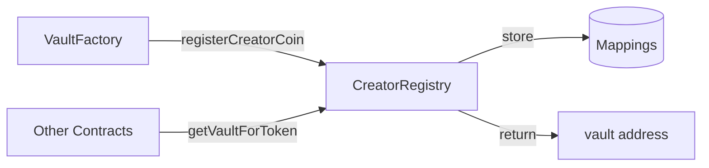
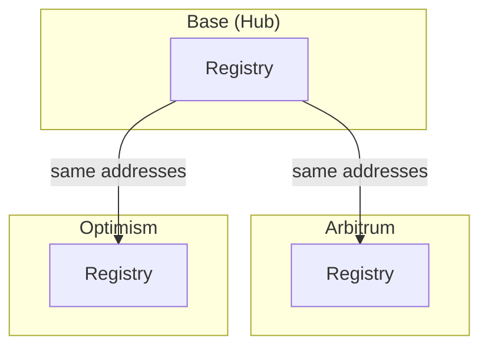

# CreatorRegistry

Global registry for CreatorVault deployments and ecosystem configuration.

---

## Source

| Contract | Path |
|----------|------|
| CreatorRegistry | [`contracts/core/CreatorRegistry.sol`](https://github.com/wenakita/4626/blob/main/contracts/core/CreatorRegistry.sol) |

---

## Purpose

CreatorRegistry is the single source of truth for all creator vault deployments. Every vault, wrapper, ShareOFT, oracle, and gauge controller registers here. Other contracts query the registry to resolve addresses rather than storing them directly.

The registry also manages cross-chain configuration, including LayerZero endpoints, chain IDs, and hub chain settings.

---

## Responsibilities

**What it does:**
- Stores addresses for all creator coin deployments (vault, wrapper, ShareOFT, oracle, gauge controller)
- Provides reverse lookups (e.g., vault → token, shareOFT → token)
- Manages LayerZero endpoint configuration per chain
- Tracks supported chains and hub chain settings
- Authorizes factories to register new creator coins

**What it does NOT do:**
- Deploy contracts (factories do this)
- Store user balances or positions
- Execute cross-chain messages (OApps do this)
- Manage vault operations or strategies

---

## Key invariants and guarantees

1. **One registration per token**: Each creator coin can only be registered once
2. **Reverse lookup consistency**: `vaultToToken[vault]` always matches `creatorCoins[token].vault`
3. **Factory authorization**: Only authorized factories can call `registerCreatorCoin()`
4. **Hub chain immutability**: Hub chain ID (Base, 8453) is set at deployment
5. **Address non-zero**: All registered addresses must be non-zero
6. **Chain support**: A chain must be added before its endpoints can be configured

---

## External interface (conceptual)

### Creator coin registration

Factories call `registerCreatorCoin()` to register a new creator coin ecosystem:

- Stores vault, wrapper, shareOFT, oracle, and gaugeController addresses
- Creates reverse lookups for each contract type
- Emits `CreatorCoinRegistered` event

### Address resolution

Other contracts query the registry to resolve addresses:

- `getVaultForToken(token)` - Returns the vault address
- `getShareOFTForToken(token)` - Returns the ShareOFT address
- `getOracleForToken(token)` - Returns the oracle address
- `getGaugeControllerForToken(token)` - Returns the gauge controller

### Reverse lookups

Contracts can also perform reverse lookups:

- `vaultToToken[vault]` - Get token from vault address
- `shareOFTToToken[shareOFT]` - Get token from ShareOFT address

### Chain configuration

Owner configures cross-chain settings:

- `addSupportedChain(chainId, config)` - Add a new chain
- `setLayerZeroEndpoint(chainId, endpoint)` - Set LZ endpoint
- `setChainIdToEid(chainId, eid)` - Map chain ID to LZ EID

---

## Core flows

### Registration flow



### Cross-chain resolution



Each chain has its own registry instance, but addresses are synchronized via CREATE2.

---

## Access control

| Function | Access |
|----------|--------|
| `registerCreatorCoin` | Authorized factories only |
| `setFactoryAuthorization` | Owner |
| `addSupportedChain` | Owner |
| `setLayerZeroEndpoint` | Owner |
| `updateCreatorCoinStatus` | Owner |

The registry uses OpenZeppelin's `Ownable` for access control. The owner is typically a protocol multisig.

---

## Failure modes and edge cases

### Common reverts

| Error | Cause |
|-------|-------|
| `AlreadyRegistered` | Token already has a vault |
| `NotAuthorized` | Caller is not an authorized factory |
| `ZeroAddress` | Attempted to register zero address |
| `ChainNotSupported` | Chain ID not in supported list |

### Operational pitfalls

- **Factory authorization**: Forgetting to authorize a factory before deployment
- **Chain ordering**: Adding endpoints before adding the chain itself
- **Address consistency**: Ensuring CREATE2 produces same addresses on all chains

---

## Integration notes

### For factories

```
1. Get authorized via setFactoryAuthorization()
2. Deploy all contracts (vault, wrapper, ShareOFT, oracle, gauge)
3. Call registerCreatorCoin() with all addresses
4. Verify registration via getVaultForToken()
```

### For other contracts

Query the registry instead of storing addresses:

```
address vault = registry.getVaultForToken(creatorCoin);
address shareOFT = registry.getShareOFTForToken(creatorCoin);
```

### Non-guarantees

- The registry does not validate that registered addresses are correct implementations
- Cross-chain consistency depends on proper CREATE2 deployment

---

## Related contracts

- [CreatorOVault](/contracts/core/creator-ovault) - Registered vault contract
- [CreatorShareOFT](/contracts/core/creator-share-oft) - Registered OFT contract
- [CreatorOracle](/contracts/services/creator-oracle) - Registered oracle contract
