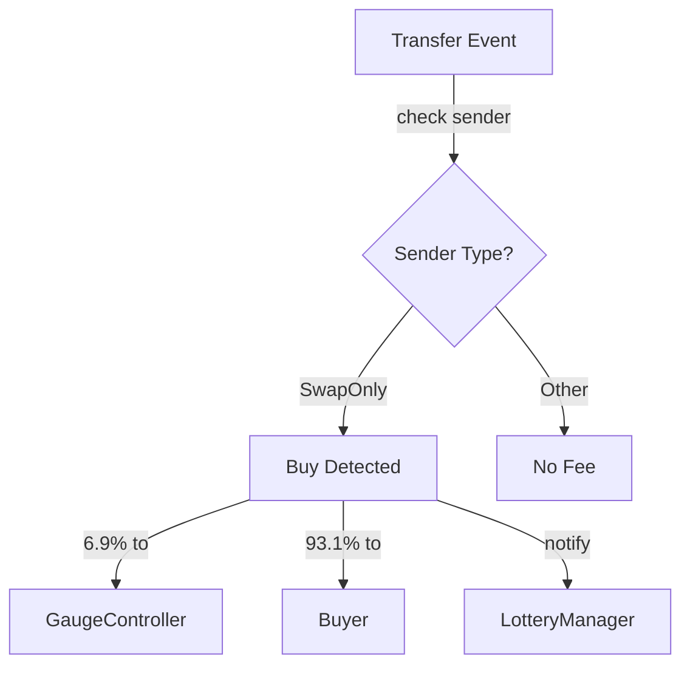

# CreatorShareOFT

The user-facing tradeable token.
Implements LayerZero OFT for cross-chain transfers with integrated buy fee and lottery entry.

> **Summary**
> - Wraps vault shares for DEX listing and bridging
> - Collects 6.9% fee on DEX purchases
> - Triggers lottery entries on qualifying trades

---

## Source

| Contract | Path |
|----------|------|
| CreatorShareOFT | [`contracts/services/messaging/CreatorShareOFT.sol`](https://github.com/wenakita/4626/blob/main/contracts/services/messaging/CreatorShareOFT.sol) |

---

## Purpose

CreatorShareOFT (■[creatorCoin]) is the token users interact with directly.
It wraps vault shares and adds protocol-level functionality.

The ShareOFT is responsible for:
- Serving as the tradeable asset on DEXs
- Bridging tokens to other chains via LayerZero
- Capturing 6.9% fee on DEX purchases
- Notifying the lottery of qualifying trades

The ShareOFT is not responsible for:
- Custody of the underlying creatorCoin (vault handles this)
- Fee distribution (GaugeController handles this)
- Lottery winner selection (LotteryManager handles this)

---

## Invariants

1. Buy fee maximum is 10% (configurable, default 6.9%)
2. Only the vault and authorized minters can mint tokens
3. Total supply remains consistent across all chains
4. Fee classification is deterministic based on address registration

---

## Core Flows

### Buy Fee Detection

The following diagram shows how the contract detects buy transactions and applies fees.
Transfers from swap addresses to normal addresses trigger the fee.

*This diagram shows fee detection only. Fee distribution is handled by GaugeController.*

### Address Classification

| Classification | Addresses | Behavior |
|----------------|-----------|----------|
| SwapOnly | DEX pools, routers | Outgoing transfers trigger fee |
| NoFees | Vault, controller | Exempt from fees |
| Unknown | User wallets | No fees (default) |

Buy = transfer from SwapOnly → normal address.
Sells and transfers incur no fee.

### Cross-Chain Transfer

As a LayerZero OFT, tokens can bridge to any chain with a peer ShareOFT:

1. Burn tokens on source chain
2. Send message via LayerZero
3. Mint equivalent tokens on destination chain

---

## Access Control

| Role | Permissions |
|------|-------------|
| Owner | Set address classifications, fee parameters |
| Minter | Mint and burn tokens |
| LayerZero | Receive cross-chain messages |

---

## Failure Modes

### Common Reverts

| Error | Cause |
|-------|-------|
| `NotAuthorized` | Non-minter attempting to mint |
| `InvalidClassification` | Invalid address type |
| `PeerNotSet` | Bridging to unconfigured chain |

### Operational Pitfalls

- DEX addresses must be registered as SwapOnly before trading begins
- Cross-chain peer addresses must be configured before bridging
- Fee percentage changes affect ongoing trades

---

## Integration Notes

### For DEX Integrators

- Register pool and router addresses as SwapOnly
- Fee is deducted from the transfer amount
- Buyer receives 93.1% of the transferred amount

### For Bridge Users

- Ensure peer ShareOFT is deployed on destination chain
- Bridge fees paid in native gas token
- Minting on destination requires LayerZero message confirmation

### Non-Guarantees

- Fee detection depends on correct address classification
- Bridge timing depends on LayerZero confirmation
- Lottery entry does not guarantee lottery win

---

## Related Contracts

- [CreatorOVaultWrapper](/contracts/core/creator-ovault-wrapper) — Minting on wrap
- [CreatorGaugeController](/contracts/governance/gauge-controller) — Fee recipient
- [CreatorLotteryManager](/contracts/services/lottery-manager) — Lottery entry

---

### Implementation Reference

This document describes design intent.
For exact behavior and edge cases, refer to the Solidity implementation.

[View on GitHub](https://github.com/wenakita/4626/blob/main/contracts/services/messaging/CreatorShareOFT.sol)
