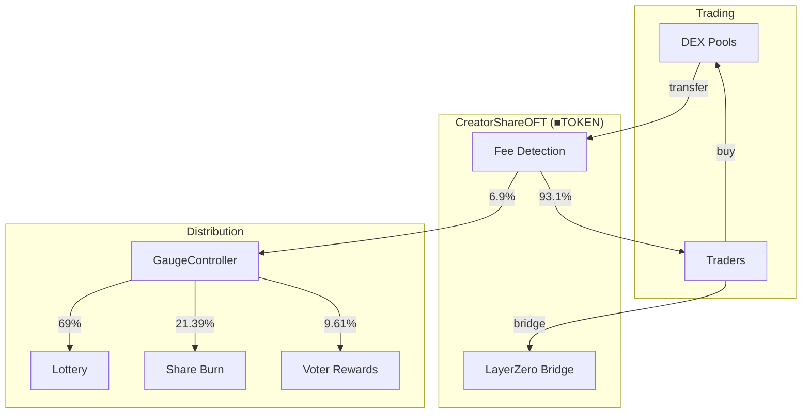

# CreatorShareOFT

LayerZero OFT (Omnichain Fungible Token) for cross-chain share transfers with integrated buy fee and lottery.

---

## Source

| Contract | Path |
|----------|------|
| CreatorShareOFT | [`contracts/services/messaging/CreatorShareOFT.sol`](https://github.com/wenakita/4626/blob/main/contracts/services/messaging/CreatorShareOFT.sol) |

---

## Purpose

CreatorShareOFT (■TOKEN) is the user-facing tradeable token. It serves three primary functions:

1. **Tradeable asset** - Listed on DEXs for price discovery
2. **Cross-chain transfers** - Bridges to other chains via LayerZero
3. **Fee collection** - Captures 6.9% on DEX purchases for the protocol

This is the token users interact with directly. It wraps vault shares and adds protocol-level functionality.

---

## System role

---

## Key behaviors

### Buy fee mechanism

The contract classifies addresses to detect buy transactions:

| Classification | Behavior |
|----------------|----------|
| SwapOnly | DEX pools/routers - outgoing transfers trigger fee |
| NoFees | Vault, controller - exempt from fees |
| Unknown | Normal addresses - no fees |

When a transfer moves tokens **from** a SwapOnly address **to** a normal address, it's classified as a buy and the 6.9% fee applies.

Sells (normal → SwapOnly) and transfers (normal → normal) incur no fee.

### Lottery integration

Buy transactions automatically enter the buyer into the lottery. The `LotteryManager` is notified with the buyer's address and transaction amount to calculate their probability weight.

### Cross-chain transfers

As a LayerZero OFT, the token can be bridged to any chain where a peer ShareOFT is deployed. The bridging process:

1. Burns tokens on the source chain
2. Sends message via LayerZero
3. Mints equivalent tokens on destination chain

---

## Invariants

| Invariant | Description |
|-----------|-------------|
| Buy fee cap | Maximum 10% (configurable, default 6.9%) |
| Minting authority | Only vault and authorized minters |
| Cross-chain supply | Total supply consistent across all chains |

---

## Access control

| Role | Permissions |
|------|-------------|
| Owner | Set address classifications, fee parameters |
| Minter | Mint and burn tokens |
| LayerZero | Receive cross-chain messages |

---

## Integration points

| Integrates with | Purpose |
|-----------------|---------|
| [Wrapper](./creator-ovault-wrapper) | Minting on wrap |
| [GaugeController](/contracts/governance/gauge-controller) | Fee recipient |
| [LotteryManager](/concepts/lottery) | Lottery entry |
| LayerZero | Cross-chain messaging |
| DEX pools | Trading venues |

---

## Configuration

DEX addresses must be registered as `SwapOnly` for fee detection to work:

| Address type | Use case |
|--------------|----------|
| SwapOnly | Uniswap pools, routers, aggregators |
| NoFees | Vault, wrapper, controller |
| Unknown | User wallets (default) |

---

## Implementation details

For function signatures and events, see the [source code](https://github.com/wenakita/4626/blob/main/contracts/services/messaging/CreatorShareOFT.sol).

Key implementation notes:
- Inherits from LayerZero's OFT standard
- Fee calculation happens in `_update()` override
- Cross-chain peer addresses must be configured before bridging

---

## Related

- [Token Model](/overview/token-model) - ■TOKEN explained
- [Fee Flow](/overview/fee-flow) - Fee distribution
- [OFT Integration](/integrations/oft) - LayerZero setup
