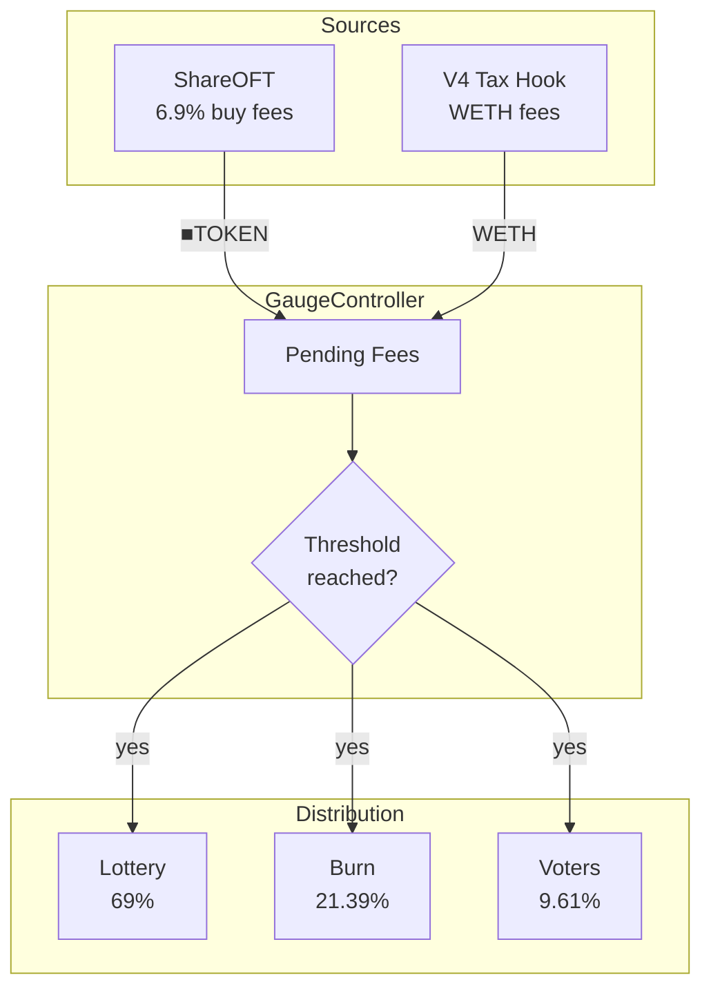

# CreatorGaugeController

The central fee routing contract for creator vaults.
Receives trading fees, accumulates until threshold, then distributes to lottery, burn, and voters.

> **Summary**
> - Receives fees from ShareOFT trades and V4 tax hooks
> - Distributes to lottery (69%), burn (21.39%), and voters (9.61%)
> - Accumulates until threshold before distributing

---

## Source

| Contract | Path |
|----------|------|
| CreatorGaugeController | [`contracts/governance/CreatorGaugeController.sol`](https://github.com/wenakita/4626/blob/main/contracts/governance/CreatorGaugeController.sol) |

---

## Purpose

CreatorGaugeController ensures predictable, transparent fee distribution.
All protocol revenue flows through this contract.

The controller is responsible for:
- Receiving ■TOKEN fees from ShareOFT trades
- Receiving WETH fees from V4 tax hooks
- Converting WETH to ■TOKEN via configured DEX
- Distributing accumulated fees when threshold is reached

The controller is not responsible for:
- Collecting fees (ShareOFT handles this)
- Lottery winner selection (LotteryManager handles this)
- Vote tracking (VaultGaugeVoting handles this)

---

## Invariants

1. Allocation percentages sum to exactly 100%
2. Distribution only triggers when threshold is met
3. Lifetime distribution stats match actual transfers
4. WETH conversion uses configured slippage protection

---

## Core Flows

### Fee Collection and Distribution

The following diagram shows how fees flow from sources through distribution.
Fees accumulate until the threshold is reached.

*This diagram shows fee routing only. Lottery and voter mechanics are handled by separate contracts.*

### Distribution Split

| Recipient | Allocation | Effect |
|-----------|------------|--------|
| Lottery | 69% | Funds jackpot for random prizes |
| Burn | 21.39% | Burns ▢TOKEN, increases price per share |
| Voters | 9.61% | Rewards for ve4626 voters |

### WETH Handling

V4 tax hooks pay fees in WETH. The controller:
1. Swaps WETH to creatorCoin via configured DEX
2. Deposits creatorCoin to vault for ▢TOKEN
3. Wraps to ■TOKEN
4. Distributes using the same split

---

## Access Control

| Role | Permissions |
|------|-------------|
| Owner | Set allocation percentages, thresholds |
| Management | Force distribution, update DEX router |
| Anyone | Trigger distribution (when threshold met) |

---

## Failure Modes

### Common Reverts

| Error | Cause |
|-------|-------|
| `ThresholdNotMet` | Distribution attempted below threshold |
| `CooldownActive` | Distribution attempted too soon |
| `InvalidAllocation` | Percentages don't sum to 100% |

### Operational Pitfalls

- WETH swap may fail if DEX liquidity is insufficient
- Large fee accumulations may cause slippage on conversion
- Manual `forceDistribute()` should be used sparingly

---

## Integration Notes

### Configuration

| Parameter | Default | Description |
|-----------|---------|-------------|
| Distribution threshold | 100 ■TOKEN | Minimum to trigger |
| Distribution interval | 1 hour | Cooldown between distributions |
| Burn share | 21.39% | Burned for PPS increase |
| Lottery share | 69% | Lottery jackpot funding |
| Voter share | 9.61% | Voter reward pool |

### For Keepers

- Monitor pending fees via `pendingFees()`
- Trigger distribution via `distribute()` when threshold met
- Use `forceDistribute()` only with management approval

### Non-Guarantees

- Distribution timing depends on threshold and cooldown
- WETH conversion rate is market-dependent
- Jackpot funding does not guarantee lottery payouts

---

## Related Contracts

- [CreatorShareOFT](/contracts/core/creator-share-oft) — Fee source
- [CreatorLotteryManager](/contracts/services/lottery-manager) — Jackpot recipient
- [VoterRewardsDistributor](/contracts/governance/voter-rewards-distributor) — Voter rewards
- [CreatorOVault](/contracts/core/creator-ovault) — Share burning

---

### Implementation Reference

This document describes design intent.
For exact behavior and edge cases, refer to the Solidity implementation.

[View on GitHub](https://github.com/wenakita/4626/blob/main/contracts/governance/CreatorGaugeController.sol)
