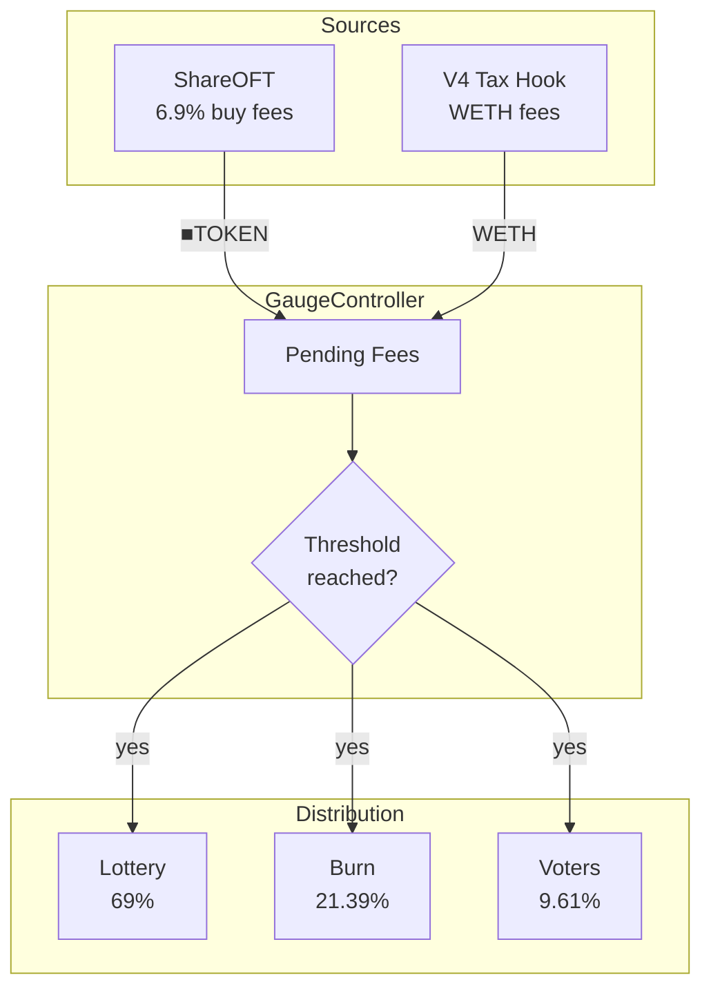

# CreatorGaugeController

Fee collection and distribution hub for creator vaults.

---

## Source

| Contract | Path |
|----------|------|
| CreatorGaugeController | [`contracts/governance/CreatorGaugeController.sol`](https://github.com/wenakita/4626/blob/main/contracts/governance/CreatorGaugeController.sol) |

---

## Purpose

CreatorGaugeController is the central fee routing contract. It receives trading fees from ShareOFT and WETH from V4 tax hooks, accumulates them until a threshold is reached, then distributes to lottery, burn, and voter allocations.

The controller ensures predictable, transparent fee distribution with configurable splits.

---

## System role

---

## Key behaviors

### Fee accumulation

Fees accumulate in the controller until two conditions are met:
1. Pending fees exceed the distribution threshold
2. Sufficient time has passed since last distribution

This batching reduces gas costs and ensures meaningful distribution amounts.

### Distribution split

| Recipient | Allocation | Effect |
|-----------|------------|--------|
| Lottery | 69% | Funds jackpot for random prizes |
| Burn | 21.39% | Burns ▢TOKEN, increases price per share |
| Voters | 9.61% | Rewards for ve4626 voters |

### WETH handling

V4 tax hooks pay fees in WETH. The controller:
1. Swaps WETH to TOKEN via configured DEX
2. Deposits TOKEN to vault for ▢TOKEN
3. Distributes ▢TOKEN using the same split

---

## Invariants

| Invariant | Description |
|-----------|-------------|
| Split totals 100% | All allocation BPS must sum to 10000 |
| Threshold gating | Distribution only when threshold met |
| Accounting accuracy | Lifetime stats match actual distributions |

---

## Configuration

| Parameter | Default | Description |
|-----------|---------|-------------|
| Distribution threshold | 100 ■TOKEN | Minimum to trigger distribution |
| Distribution interval | 1 hour | Cooldown between distributions |
| Burn share | 21.39% | Share burned for PPS increase |
| Lottery share | 69% | Share to lottery jackpot |
| Voter share | 9.61% | Share to voter rewards |

---

## Integration points

| Integrates with | Purpose |
|-----------------|---------|
| [ShareOFT](../core/creator-share-oft) | Receives ■TOKEN fees |
| V4 Tax Hook | Receives WETH fees |
| [LotteryManager](/concepts/lottery) | Funds jackpot |
| [VoterRewards](/contracts/governance/vault-gauge-voting) | Distributes voter rewards |
| [Vault](../core/creator-ovault) | Burns shares for PPS |

---

## Implementation details

For function signatures and events, see the [source code](https://github.com/wenakita/4626/blob/main/contracts/governance/CreatorGaugeController.sol).

Key implementation notes:
- Burn operation unwraps ■TOKEN to ▢TOKEN before burning
- WETH swap uses configured router (typically Uniswap)
- `forceDistribute()` allows management to bypass threshold

---

## Related

- [Fee Flow](/overview/fee-flow) - Distribution explained
- [Lottery](/concepts/lottery) - Jackpot mechanics
- [VaultGaugeVoting](./vault-gauge-voting) - Voter rewards
