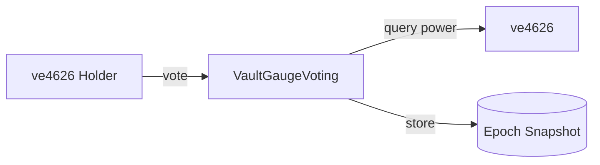
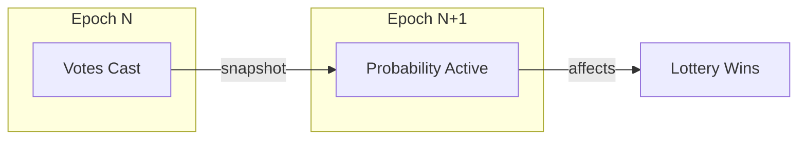

# VaultGaugeVoting

Epoch-based gauge voting.
ve4626 holders direct lottery probability to creator vaults through weighted votes.

> **Summary**
> - 7-day epochs starting Thursday 00:00 UTC
> - Votes snapshot at epoch end, apply to next epoch
> - Vaults with more votes give buyers higher lottery win rates

---

## Source

| Contract | Path |
|----------|------|
| VaultGaugeVoting | [`contracts/governance/VaultGaugeVoting.sol`](https://github.com/wenakita/4626/blob/main/contracts/governance/VaultGaugeVoting.sol) |

---

## Purpose

VaultGaugeVoting implements ve(3,3) style gauge voting.
Instead of directing emissions, ve4626 holders direct lottery probability to creator vaults.

The contract is responsible for:
- Accepting votes from ve4626 holders
- Snapshotting vote weights at epoch boundaries
- Calculating vault probability boosts
- Managing epoch timing (7-day cycles)

The contract is not responsible for:
- Calculating voting power (ve4626 handles this)
- Distributing rewards (VoterRewardsDistributor handles this)
- Running the lottery (LotteryManager handles this)
- Managing bribes (BribeDepot handles this)

---

## Invariants

1. User vote weights must sum to 10,000 basis points (100%)
2. Voting power comes exclusively from ve4626 balance
3. Votes snapshot at epoch end, apply to next epoch
4. Each user has one active vote allocation per epoch
5. Only whitelisted vaults can receive votes
6. Past epoch snapshots are immutable

---

## Core Flows

### Voting

The following diagram shows how votes are recorded and snapshotted.
Voting power is queried from ve4626 at vote time.

*This diagram shows vote recording only. Probability effects apply next epoch.*

### Epoch Timing

*Votes cast in epoch N affect lottery probability in epoch N+1.*

---

## Access Control

| Function | Access |
|----------|--------|
| `vote` | Any ve4626 holder |
| `resetVotes` | Voter only (their own votes) |
| `checkpoint` | Public |
| `whitelistVault` | Owner |
| `setEpochStartTime` | Owner (once) |

---

## Failure Modes

### Common Reverts

| Error | Cause |
|-------|-------|
| `InvalidWeights` | Weights don't sum to 10000 |
| `NoVotingPower` | Caller has no ve4626 balance |
| `VaultNotWhitelisted` | Voting for non-whitelisted vault |
| `ArrayLengthMismatch` | Vaults and weights arrays differ |

### Economic Risks

- Whales can dominate probability direction
- Small voters may find bribes more profitable
- Late votes count the same as early votes

---

## Integration Notes

### For Voters

1. Lock tokens in ve4626 to get voting power
2. Call `vote(vaults[], weights[])` with allocation
3. Votes apply next epoch
4. Claim rewards after epoch ends

### For Frontends

- Query `currentEpoch()` and calculate time remaining
- Show `getVaultWeight / getTotalWeight` as percentage
- Display user allocation via `getUserVotes()`

### Non-Guarantees

- Probability boost does not guarantee lottery wins
- Vote power changes during epoch apply next epoch
- Bribes are handled by separate contract

---

## Related Contracts

- [ve4626](/contracts/governance/ve4626) — Voting power source
- [VoterRewardsDistributor](/contracts/governance/voter-rewards-distributor) — Epoch rewards
- [CreatorLotteryManager](/contracts/services/lottery-manager) — Probability consumer

---

### Implementation Reference

This document describes design intent.
For exact behavior and edge cases, refer to the Solidity implementation.

[View on GitHub](https://github.com/wenakita/4626/blob/main/contracts/governance/VaultGaugeVoting.sol)
