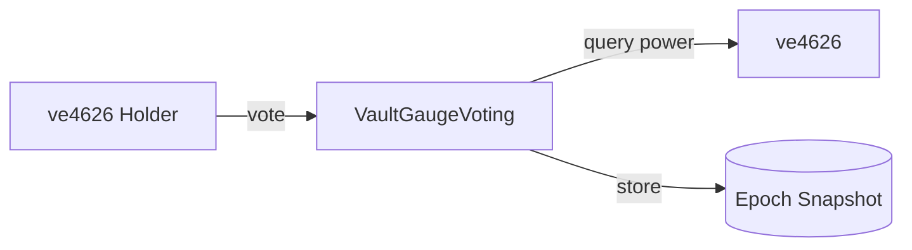
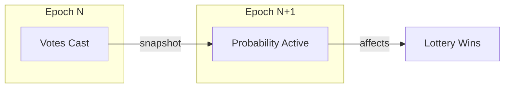

# VaultGaugeVoting

Epoch-based gauge voting where ve4626 holders direct lottery probability to creator vaults.

---

## Source

| Contract | Path |
|----------|------|
| VaultGaugeVoting | [`contracts/governance/VaultGaugeVoting.sol`](https://github.com/wenakita/4626/blob/main/contracts/governance/VaultGaugeVoting.sol) |

---

## Purpose

VaultGaugeVoting implements ve(3,3) style gauge voting. Instead of directing emissions to pools (like Curve), ve4626 holders direct lottery probability to creator vaults. Vaults with more votes give their buyers higher lottery win rates.

This creates an incentive market where protocols can bribe ve4626 holders to vote for their vault.

---

## Responsibilities

**What it does:**
- Accept votes from ve4626 holders (weighted across multiple vaults)
- Snapshot vote weights at epoch boundaries
- Calculate vault probability boosts based on vote share
- Track historical vote data for reward distribution
- Manage epoch timing (7-day cycles starting Thursday 00:00 UTC)

**What it does NOT do:**
- Calculate voting power (ve4626 does this)
- Distribute rewards (VoterRewardsDistributor does this)
- Run the lottery (LotteryManager does this)
- Manage bribes (BribeDepot does this)

---

## Key invariants and guarantees

1. **Weight normalization**: User vote weights must sum to 10,000 basis points (100%)
2. **Power source**: Voting power comes exclusively from ve4626 balance
3. **Epoch boundaries**: Votes snapshot at epoch end, apply to next epoch
4. **Single vote set**: Each user has one active vote allocation per epoch
5. **Whitelist requirement**: Only whitelisted vaults can receive votes
6. **No retroactive changes**: Past epoch snapshots are immutable

---

## External interface (conceptual)

### Voting

Users allocate their voting power across vaults using basis points (0-10000):
- `vote(vaults[], weights[])` - Set vote allocation
- `resetVotes()` - Clear current votes

Votes apply to the current epoch and affect probability in the next epoch.

### Query functions

- `getVaultWeight(vault, epoch)` - Total votes for a vault in an epoch
- `getTotalWeight(epoch)` - Sum of all votes in an epoch
- `getUserVotes(user, epoch)` - User's vote allocation
- `getVaultProbabilityBoostPPM(vault)` - Current probability boost (PPM)

### Epoch management

- `currentEpoch()` - Current epoch number
- `epochStartTime(epoch)` - Timestamp when epoch started
- `checkpoint()` - Finalize epoch transition (automatic)

---

## Core flows

### Voting flow

### Probability effect flow

---

## Access control

| Function | Access |
|----------|--------|
| `vote` | Any ve4626 holder |
| `resetVotes` | Voter only (their own votes) |
| `checkpoint` | Public |
| `whitelistVault` | Owner |
| `setEpochStartTime` | Owner (once) |

---

## Failure modes and edge cases

### Common reverts

| Error | Cause |
|-------|-------|
| `InvalidWeights` | Weights don't sum to 10000 |
| `NoVotingPower` | Caller has no ve4626 balance |
| `VaultNotWhitelisted` | Voting for non-whitelisted vault |
| `ArrayLengthMismatch` | Vaults and weights arrays differ |

### Economic considerations

- **Vote concentration**: Whales can dominate probability direction
- **Bribe efficiency**: Small voters may find bribes more profitable than probability
- **Epoch timing**: Late votes count the same as early votes

### Operational notes

- Votes cast in final hours of epoch still count
- Checkpoint is called automatically on first interaction after epoch end
- Historical data remains queryable indefinitely

---

## Integration notes

### For voters

1. Lock tokens in ve4626 to get voting power
2. Research vaults and potential bribes
3. Call `vote(vaults[], weights[])` with your allocation
4. Votes apply next epoch, rewards claimable after epoch ends

### For frontends

- Query `currentEpoch()` and calculate time remaining
- Show `getVaultWeight / getTotalWeight` as percentage
- Display user's current allocation via `getUserVotes()`

### Non-guarantees

- Probability boost does not guarantee lottery wins
- Vote power changes during epoch are not reflected until next epoch
- Bribes are handled separately from this contract

---

## Related contracts

- [ve4626](/contracts/governance/ve4626) - Voting power source
- [VoterRewardsDistributor](/contracts/governance/voter-rewards-distributor) - Epoch rewards
- [CreatorLotteryManager](/contracts/services/lottery-manager) - Probability consumer
- [BribeDepot](https://github.com/wenakita/4626/blob/main/contracts/governance/bribes/BribeDepot.sol) - Vote incentives
