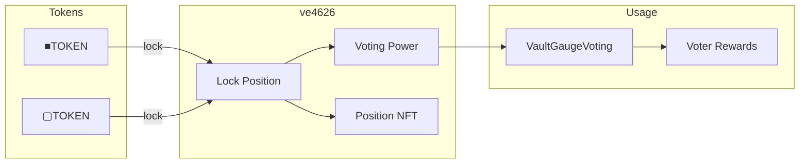

# ve4626

Vote-escrowed token contract.
Users lock tokens for time-weighted voting power that decays linearly to zero at unlock.

> **Summary**
> - Lock ■TOKEN or ▢TOKEN for 7 days to 4 years
> - Voting power decays linearly over lock duration
> - Each position is an ERC-721 NFT

---

## Source

| Contract | Path |
|----------|------|
| ve4626 | [`contracts/governance/ve4626.sol`](https://github.com/wenakita/4626/blob/main/contracts/governance/ve4626.sol) |

---

## Purpose

ve4626 implements vote-escrow mechanics at the heart of protocol governance.
Longer locks yield more voting power, aligning long-term incentives.

The contract is responsible for:
- Accepting token locks with configurable duration
- Calculating time-weighted voting power
- Managing position NFTs
- Supporting delegation of voting power

The contract is not responsible for:
- Processing votes (VaultGaugeVoting handles this)
- Distributing rewards (VoterRewardsDistributor handles this)
- Lottery mechanics (LotteryManager handles this)

---

## Invariants

1. Lock duration: minimum 7 days, maximum 4 years
2. Voting power = `amount × (duration / maxDuration)` at lock time
3. Power decays linearly to zero at unlock time
4. Only position owner can manage the position
5. Power cannot be negative

---

## Core Flows

### Locking Mechanics

The following diagram shows how tokens flow into ve4626 and generate voting power.
Position NFTs are minted for each lock.

*This diagram shows ve4626 interactions only. Vote counting happens in VaultGaugeVoting.*

### Voting Power Calculation

| Lock Duration | Voting Power Multiplier |
|---------------|------------------------|
| 7 days | ~0.5% of amount |
| 1 year | 25% of amount |
| 2 years | 50% of amount |
| 4 years | 100% of amount |

Power decays linearly from lock time to unlock time.

### Position Management

Lock positions support:
- **Increase** — Add tokens without changing duration
- **Extend** — Lengthen duration without adding tokens
- **Withdraw** — Claim tokens after lock expires
- **Early exit** — Exit before expiry with penalty

---

## Access Control

| Role | Permissions |
|------|-------------|
| Position Owner | Increase, extend, withdraw, delegate |
| Delegatee | Vote on behalf of delegator |
| Anyone | Query voting power |

---

## Failure Modes

### Common Reverts

| Error | Cause |
|-------|-------|
| `LockTooShort` | Duration below 7-day minimum |
| `LockTooLong` | Duration exceeds 4-year maximum |
| `NotOwner` | Non-owner attempting position management |
| `LockNotExpired` | Withdrawal attempted before unlock |

### Economic Risks

- Early exit incurs penalty proportional to remaining lock time
- Voting power decays even if unused
- Position NFTs on secondary markets may have little remaining power

---

## Integration Notes

### Position NFT

Each lock is an ERC-721 NFT containing:
- Token type (■TOKEN or ▢TOKEN)
- Locked amount
- Lock start time
- Lock end time

The NFT can be transferred, enabling secondary markets.

### Delegation

Users can delegate voting power to another address:
- Delegatee votes on their behalf in VaultGaugeVoting
- Self-delegation required before voting (default)
- Delegation can be changed at any time

### For Integrators

- Query voting power via `getVotingPower(address)`
- Check lock status via `getLockInfo(tokenId)`
- Historical power available via checkpoint system

### Non-Guarantees

- Voting power does not guarantee reward share
- Delegation does not transfer position ownership
- Secondary market prices may not reflect remaining power

---

## Related Contracts

- [VaultGaugeVoting](/contracts/governance/vault-gauge-voting) — Cast votes with ve power
- [VoterRewardsDistributor](/contracts/governance/voter-rewards-distributor) — Epoch rewards
- [Governance](/governance) — User-facing voting guide

---

### Implementation Reference

This document describes design intent.
For exact behavior and edge cases, refer to the Solidity implementation.

[View on GitHub](https://github.com/wenakita/4626/blob/main/contracts/governance/ve4626.sol)
