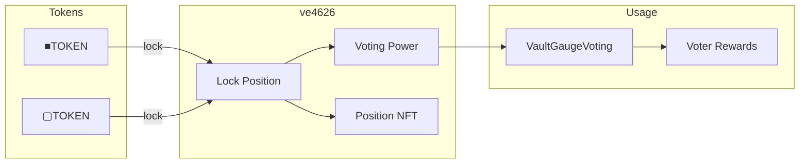

# ve4626

Vote-escrowed token contract where users lock ■TOKEN or ▢TOKEN for time-weighted voting power.

---

## Source

| Contract | Path |
|----------|------|
| ve4626 | [`contracts/governance/ve4626.sol`](https://github.com/wenakita/4626/blob/main/contracts/governance/ve4626.sol) |

---

## Purpose

ve4626 implements the vote-escrow mechanism at the heart of the protocol's governance. Users lock tokens for a duration (7 days to 4 years) and receive voting power that decays linearly over time. This aligns long-term incentives: the longer you lock, the more influence you have.

Each lock position is represented as an NFT, making positions transferable and composable.

---

## System role



---

## Key behaviors

### Locking

Users lock tokens for a chosen duration. Longer locks yield more voting power:

| Lock duration | Voting power multiplier |
|---------------|------------------------|
| 7 days | ~0.5% of amount |
| 1 year | 25% of amount |
| 2 years | 50% of amount |
| 4 years | 100% of amount |

### Voting power decay

Voting power starts at `amount × (duration / maxDuration)` and decays linearly to zero at unlock time. This creates urgency to participate actively rather than passively holding.

```
Voting Power
    │
    ■ 1000 (4yr lock)
    │ ■
    │   ■
    │     ■
    │       ■ 500 (2yr remaining)
    │         ■
    │           ■
    │             ■ 0
    └─────────────────→ Time
```

### Position management

Lock positions can be:
- **Increased** - Add more tokens without changing duration
- **Extended** - Lengthen duration without adding tokens
- **Withdrawn** - Claim tokens after lock expires
- **Early exited** - Exit before expiry with penalty

---

## Invariants

| Invariant | Description |
|-----------|-------------|
| Lock duration bounds | 7 days minimum, 4 years maximum |
| Decay linearity | Power decreases smoothly to zero |
| NFT ownership | Only position owner can manage |
| No negative power | Power cannot go below zero |

---

## Position NFT

Each lock is an ERC-721 NFT containing:
- Token type (■TOKEN or ▢TOKEN)
- Locked amount
- Lock start time
- Lock end time

The NFT can be transferred, enabling secondary markets for locked positions.

---

## Delegation

Users can delegate their voting power to another address. The delegatee can then vote on their behalf in VaultGaugeVoting.

By default, users must self-delegate before voting.

---

## Integration points

| Integrates with | Purpose |
|-----------------|---------|
| [VaultGaugeVoting](./vault-gauge-voting) | Cast votes with ve power |
| [VoterRewardsDistributor](./gauge-controller) | Earn epoch rewards |
| Governance proposals | Vote on protocol changes |

---

## Implementation details

For function signatures and events, see the [source code](https://github.com/wenakita/4626/blob/main/contracts/governance/ve4626.sol).

Key implementation notes:
- Uses checkpoint system for historical voting power queries
- Implements ERC-721 for position representation
- Supports both ■TOKEN and ▢TOKEN as lock assets
- Early exit penalty is proportional to remaining lock time

---

## Related

- [VaultGaugeVoting](./vault-gauge-voting) - Cast votes with ve power
- [Governance](/governance) - User-facing voting guide
- [Token Model](/overview/token-model) - ▢TOKEN and ■TOKEN explained
