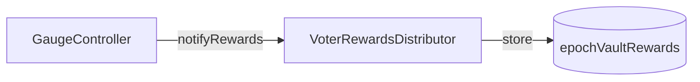
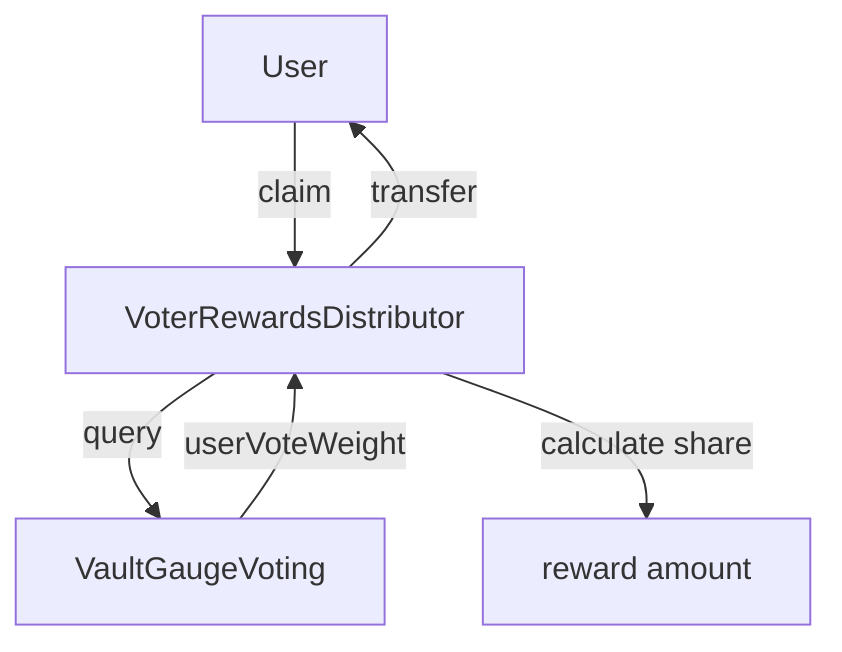

# VoterRewardsDistributor

Distributes the voter fee slice (9.61%) to ve4626 holders based on epoch votes.
Pro-rata rewards for active governance participation.

> **Summary**
> - Receives 9.61% of fees from GaugeController
> - Tracks rewards per (epoch, vault) pair
> - Users claim pro-rata share after epoch ends

---

## Source

| Contract | Path |
|----------|------|
| VoterRewardsDistributor | [`contracts/governance/VoterRewardsDistributor.sol`](https://github.com/wenakita/4626/blob/main/contracts/governance/VoterRewardsDistributor.sol) |

---

## Purpose

VoterRewardsDistributor implements ve(3,3) reward mechanics.
Voters who directed ve4626 power to vaults receive their share of fees.

The contract is responsible for:
- Receiving vault share tokens from GaugeController
- Tracking rewards per (epoch, vault) pair
- Calculating pro-rata claims based on vote weight
- Sweeping unclaimed rewards from zero-vote epochs

The contract is not responsible for:
- Collecting fees (GaugeController handles this)
- Managing voting power (ve4626 handles this)
- Tracking votes (VaultGaugeVoting handles this)

---

## Invariants

1. Users can only claim once per (epoch, vault) pair
2. Claim amount = `epochRewards × userVoteWeight / totalVaultWeight`
3. Rewards can only be claimed after epoch ends
4. Each vault pays in the same token type
5. Zero-vote epochs swept after 4-epoch grace period
6. Vote weight snapshotted at epoch end

---

## Core Flows

### Reward Notification

The following diagram shows how GaugeController notifies this contract of rewards.
Rewards are stored by (epoch, vault) pair.

*This diagram shows notification only. Claims happen after epoch ends.*

### Claim Process

*Pro-rata calculation uses historical vote snapshots.*

---

## Access Control

| Function | Access |
|----------|--------|
| `notifyRewards` | GaugeController |
| `claim` | Any user with votes |
| `sweepZeroVoteEpoch` | Owner only |
| `setProtocolTreasury` | Owner only |

---

## Failure Modes

### Common Reverts

| Error | Cause |
|-------|-------|
| `EpochNotEnded` | Claiming during active epoch |
| `AlreadyClaimed` | User already claimed this (epoch, vault) |
| `ZeroVoteWeight` | User had no votes for this vault |
| `SweepNotAllowedYet` | Grace period not elapsed |
| `NotZeroVoteEpoch` | Sweeping epoch with votes |

### Economic Considerations

- Late votes still count for full rewards
- Voting for unpopular vaults may yield higher per-vote rewards
- Rewards remain claimable indefinitely (no expiry)

---

## Integration Notes

### For Voters

1. Lock tokens in ve4626
2. Vote for vaults via VaultGaugeVoting
3. Wait for epoch to end
4. Call `claim(epoch, vault)` for each vault voted for

### For Frontends

- Query `epochVaultRewards(epoch, vault)` for total rewards
- Use VaultGaugeVoting to get user's vote weight
- Calculate estimated claim amount client-side

### Non-Guarantees

- Reward amounts depend on fee volume during epoch
- Low-activity epochs may have minimal rewards
- Zero-vote epochs may be swept after grace period

---

## Related Contracts

- [VaultGaugeVoting](/contracts/governance/vault-gauge-voting) — Vote weight source
- [CreatorGaugeController](/contracts/governance/gauge-controller) — Reward source
- [ve4626](/contracts/governance/ve4626) — Voting power source

---

### Implementation Reference

This document describes design intent.
For exact behavior and edge cases, refer to the Solidity implementation.

[View on GitHub](https://github.com/wenakita/4626/blob/main/contracts/governance/VoterRewardsDistributor.sol)
