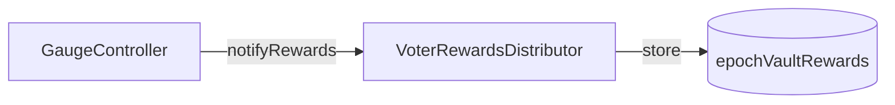
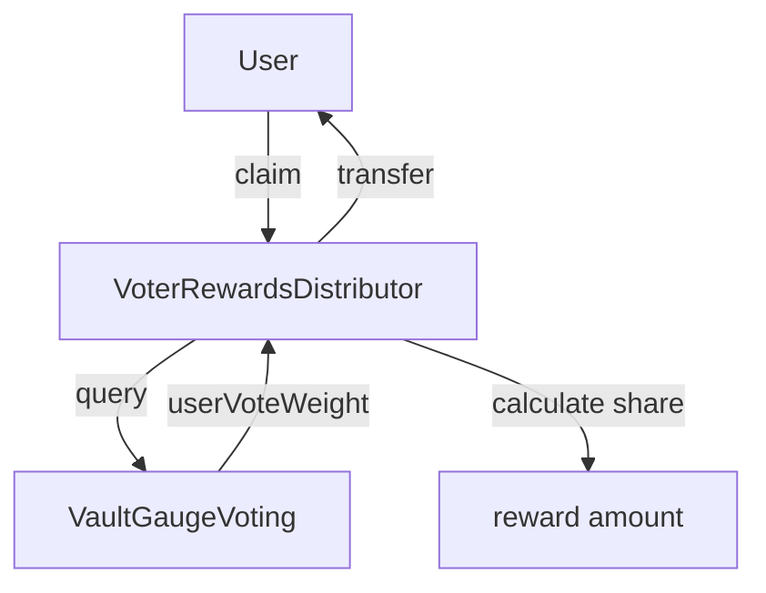

# VoterRewardsDistributor

Distributes the voter fee slice to ve4626 holders based on their epoch votes.

---

## Source

| Contract | Path |
|----------|------|
| VoterRewardsDistributor | [`contracts/governance/VoterRewardsDistributor.sol`](https://github.com/wenakita/4626/blob/main/contracts/governance/VoterRewardsDistributor.sol) |

---

## Purpose

VoterRewardsDistributor implements ve(3,3) reward mechanics. When GaugeController distributes fees, 9.61% goes to this contract. Voters who directed their ve4626 voting power to vaults during an epoch can claim their pro-rata share of rewards after the epoch ends.

This creates an incentive for ve4626 holders to actively participate in governance rather than passively holding.

---

## Responsibilities

**What it does:**
- Receive vault share tokens from GaugeController (9.61% of fees)
- Track rewards per (epoch, vault) pair
- Calculate user claims based on their vote weight relative to total vault weight
- Distribute rewards when users claim
- Sweep unclaimed rewards from zero-vote epochs to treasury

**What it does NOT do:**
- Collect fees (GaugeController does this)
- Manage voting power (ve4626 does this)
- Track votes (VaultGaugeVoting does this)
- Convert between token types

---

## Key invariants and guarantees

1. **One claim per epoch**: Users can only claim once per (epoch, vault) pair
2. **Pro-rata distribution**: Claim amount = `epochRewards × userVoteWeight / totalVaultWeight`
3. **Epoch finality**: Rewards can only be claimed after the epoch ends
4. **Reward token consistency**: Each vault always pays in the same token type
5. **Sweep grace period**: Zero-vote epochs can only be swept after grace period (4 epochs)
6. **No double counting**: User vote weight is snapshotted at epoch end

---

## External interface (conceptual)

### Reward notification (GaugeController)

When GaugeController distributes fees, it calls `notifyRewards(epoch, vault, token, amount)` to record the reward allocation for that epoch.

### User claims

Users call `claim(epoch, vault)` to receive their share of rewards. The contract:
1. Checks the epoch has ended
2. Looks up user's vote weight for that vault in that epoch
3. Calculates pro-rata share
4. Transfers vault shares to user

### Treasury sweep

Owner can sweep rewards from epochs where no one voted for a vault. This prevents funds from being permanently locked.

---

## Core flows

### Reward distribution flow

### Claim flow

---

## Access control

| Function | Access |
|----------|--------|
| `notifyRewards` | GaugeController (implicit via transfer) |
| `claim` | Any user with votes |
| `sweepZeroVoteEpoch` | Owner only |
| `setProtocolTreasury` | Owner only |

---

## Failure modes and edge cases

### Common reverts

| Error | Cause |
|-------|-------|
| `EpochNotEnded` | Attempting to claim during active epoch |
| `AlreadyClaimed` | User already claimed this (epoch, vault) |
| `ZeroVoteWeight` | User had no votes for this vault |
| `SweepNotAllowedYet` | Grace period not elapsed |
| `NotZeroVoteEpoch` | Attempting to sweep epoch with votes |

### Economic considerations

- **Vote timing**: Votes cast late in an epoch still count for full rewards
- **Vault selection**: Voting for unpopular vaults may yield higher per-vote rewards
- **Unclaimed rewards**: Rewards remain claimable indefinitely (no expiry)

---

## Integration notes

### For voters

1. Lock tokens in ve4626
2. Vote for vaults via VaultGaugeVoting
3. Wait for epoch to end
4. Call `claim(epoch, vault)` for each vault you voted for

### For frontends

- Query `epochVaultRewards(epoch, vault)` to show total rewards
- Use VaultGaugeVoting to get user's vote weight
- Calculate estimated claim amount client-side

### Non-guarantees

- Reward amounts depend on fee volume during the epoch
- Low-activity epochs may have minimal rewards
- Zero-vote epochs may be swept after grace period

---

## Related contracts

- [VaultGaugeVoting](/contracts/governance/vault-gauge-voting) - Vote weight source
- [CreatorGaugeController](/contracts/governance/gauge-controller) - Reward source
- [ve4626](/contracts/governance/ve4626) - Voting power source
