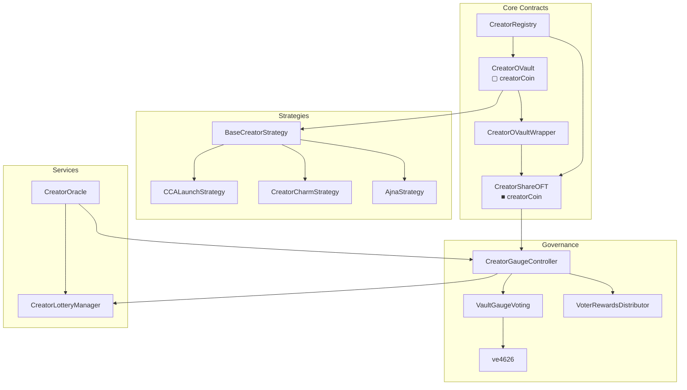

# Smart contracts

Deep-dive documentation for 4626 protocol smart contracts.

---

## Contract map

---

## Contract categories

### Core

The foundational contracts that implement vault mechanics and token representation.

| Contract | Purpose | Documentation |
|----------|---------|---------------|
| CreatorRegistry | Global registry for all creator vaults | [Deep dive](/contracts/core/creator-registry) |
| CreatorOVault | ERC-4626 vault, issues ▢[creatorCoin] | [Deep dive](/contracts/core/creator-ovault) |
| CreatorOVaultWrapper | Normalizes ▢ to ■ tokens | [Deep dive](/contracts/core/creator-ovault-wrapper) |
| CreatorShareOFT | LayerZero OFT with buy fee | [Deep dive](/contracts/core/creator-share-oft) |

### Governance

Vote-escrow and fee distribution contracts implementing ve(3,3) mechanics.

| Contract | Purpose | Documentation |
|----------|---------|---------------|
| CreatorGaugeController | Fee collection and distribution | [Deep dive](/contracts/governance/gauge-controller) |
| VaultGaugeVoting | Epoch-based gauge voting | [Deep dive](/contracts/governance/vault-gauge-voting) |
| ve4626 | Vote-escrow lock positions | [Deep dive](/contracts/governance/ve4626) |
| VoterRewardsDistributor | Voter fee share distribution | [Deep dive](/contracts/governance/voter-rewards-distributor) |

### Strategies

Yield strategies that deploy creatorCoin to external protocols.

| Contract | Purpose | Documentation |
|----------|---------|---------------|
| BaseCreatorStrategy | Abstract base for all strategies | [Deep dive](/contracts/strategies/base-creator-strategy) |
| CCALaunchStrategy | Continuous Clearing Auction | [Deep dive](/contracts/strategies/cca-launch) |
| CreatorCharmStrategy | Uniswap V3 via Charm Alpha | [Deep dive](/contracts/strategies/charm-strategy) |
| AjnaStrategy | Ajna lending protocol | [Deep dive](/contracts/strategies/ajna-strategy) |

### Services

Cross-cutting services shared across all creator vaults.

| Contract | Purpose | Documentation |
|----------|---------|---------------|
| CreatorLotteryManager | Shared lottery service | [Deep dive](/contracts/services/lottery-manager) |
| CreatorOracle | Cross-chain price oracle | [Deep dive](/contracts/services/creator-oracle) |

---

## Supporting contracts

These contracts provide infrastructure but do not require deep-dive documentation.

| Contract | Purpose | Source |
|----------|---------|--------|
| CreatorOVaultFactory | Deploys new vaults | [GitHub](https://github.com/wenakita/4626/blob/main/contracts/factories/CreatorOVaultFactory.sol) |
| BribeDepot | Holds vote incentives | [GitHub](https://github.com/wenakita/4626/blob/main/contracts/governance/bribes/BribeDepot.sol) |
| ve4626BoostManager | Calculates ve boosts | [GitHub](https://github.com/wenakita/4626/blob/main/contracts/governance/ve4626BoostManager.sol) |
| ChainlinkVRFIntegrator | VRF integration | [GitHub](https://github.com/wenakita/4626/blob/main/contracts/services/lottery/vrf/ChainlinkVRFIntegratorV2_5.sol) |

---

## Key invariants

These invariants apply across all contracts:

1. **Asset flow**: Yield strategies only receive the underlying creatorCoin. Never ▢[creatorCoin] or ■[creatorCoin].
2. **Token notation**: ▢ represents ERC-4626 vault shares, ■ represents wrapped OFT shares.
3. **Registry authority**: CreatorRegistry is the source of truth for all vault addresses.
4. **Hub chain**: Base (chain ID 8453) is the authoritative hub for cross-chain operations.

---

## API reference

Auto-generated API documentation from NatSpec comments is available in the [API Reference](/api/contracts).
