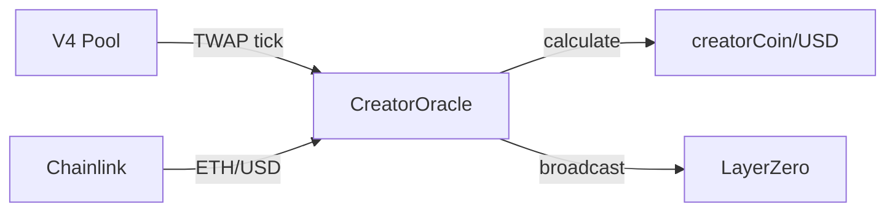
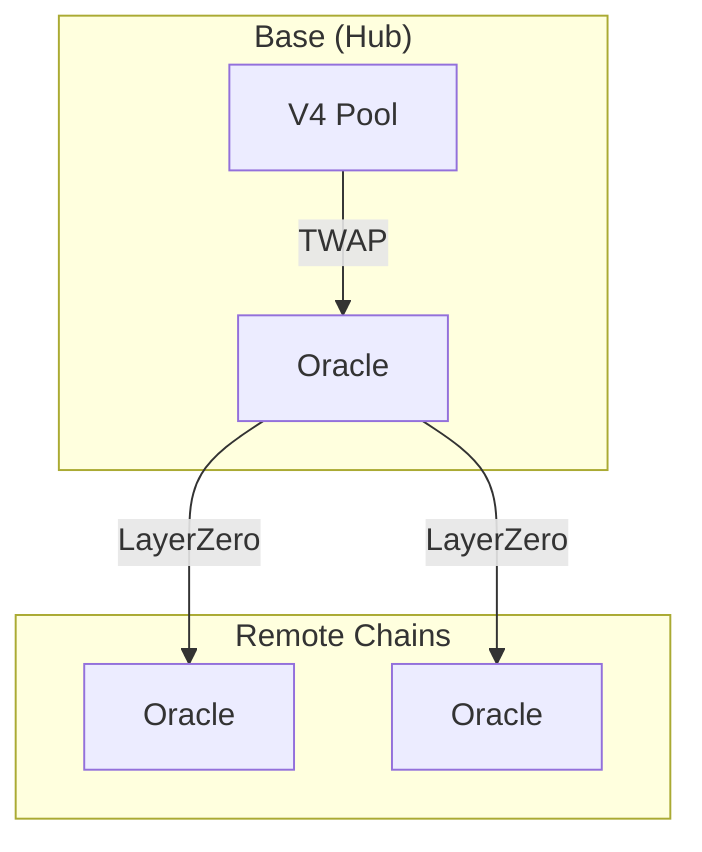

# CreatorOracle

Cross-chain price oracle for creator coins with manipulation resistance.

---

## Source

| Contract | Path |
|----------|------|
| CreatorOracle | [`contracts/services/oracles/CreatorOracle.sol`](https://github.com/wenakita/4626/blob/main/contracts/services/oracles/CreatorOracle.sol) |

---

## Purpose

CreatorOracle provides reliable USD pricing for creator coins across all chains. The oracle reads from Uniswap V4 TWAP on Base (the hub chain), combines with Chainlink ETH/USD, and broadcasts the resulting price to all remote chains via LayerZero.

This architecture ensures consistent pricing everywhere without requiring liquidity on every chain.

---

## Responsibilities

**What it does:**
- Read TWAP from Uniswap V4 pool (■[creatorCoin]/ETH)
- Fetch ETH/USD from Chainlink price feed
- Calculate and store ■[creatorCoin]/USD price
- Broadcast price updates to remote chains via LayerZero
- Apply tick capping to resist manipulation

**What it does NOT do:**
- Provide real-time spot prices (uses TWAP)
- Create or manage liquidity pools
- Execute trades or swaps
- Store historical price series

---

## Key invariants and guarantees

1. **Hub authority**: Base chain is the authoritative price source
2. **TWAP smoothing**: 30-minute default TWAP window
3. **Tick capping**: Maximum tick movement per observation
4. **Staleness check**: Prices older than 2 hours are considered stale
5. **Chainlink dependency**: ETH/USD comes from trusted Chainlink feed
6. **Cross-chain consistency**: All chains receive the same price

---

## External interface (conceptual)

### Price reading

Contracts query the oracle for current price:
- `getCreatorPriceUSD()` - Returns price in 1e18 format
- `getCreatorPriceETH()` - Returns price in ETH terms
- `isPriceStale()` - Check if price needs refresh

### Price updates (Hub only)

On Base, the oracle:
1. Reads V4 pool tick via TWAP
2. Fetches ETH/USD from Chainlink
3. Calculates USD price
4. Broadcasts to remote chains

### Cross-chain reception

Remote chains receive price updates via LayerZero and store them for local use.

---

## Core flows

### Price calculation flow (Base)



### Cross-chain propagation



---

## Access control

| Function | Access |
|----------|--------|
| `updatePrice` | Public (Base only) |
| `broadcastPrice` | Public (Base only, pays gas) |
| `_lzReceive` | LayerZero endpoint |
| `setChainlinkFeed` | Owner |
| `setTwapDuration` | Owner |

---

## Failure modes and edge cases

### Common reverts

| Error | Cause |
|-------|-------|
| `PriceStale` | Last update older than MAX_STALENESS |
| `InvalidChainlinkPrice` | Chainlink returned zero or negative |
| `PoolNotInitialized` | V4 pool has no liquidity |
| `NotHubChain` | Broadcast attempted on remote chain |

### Manipulation resistance

**Tick capping**: Limits maximum price movement per observation, preventing flash loan attacks.

**TWAP**: 30-minute window smooths out short-term manipulation.

**Auto-tuning**: Tick cap adjusts based on observation frequency.

### Economic considerations

- Low liquidity pools may have wider TWAP variance
- Chainlink feed staleness affects all prices
- Cross-chain message costs paid by broadcaster

---

## Integration notes

### For contracts

```
uint256 priceUSD = oracle.getCreatorPriceUSD();
require(!oracle.isPriceStale(), "Price stale");
```

### For keepers

- Monitor price staleness on Base
- Call `broadcastPrice()` when needed
- Ensure sufficient ETH for LayerZero fees

### Non-guarantees

- TWAP lags spot price by design
- Remote chain prices may be slightly delayed
- Extreme volatility may exceed tick caps

---

## Related contracts

- [CreatorLotteryManager](/contracts/services/lottery-manager) - Price consumer
- [CreatorGaugeController](/contracts/governance/gauge-controller) - Swap slippage
- [CreatorRegistry](/contracts/core/creator-registry) - Oracle registration
