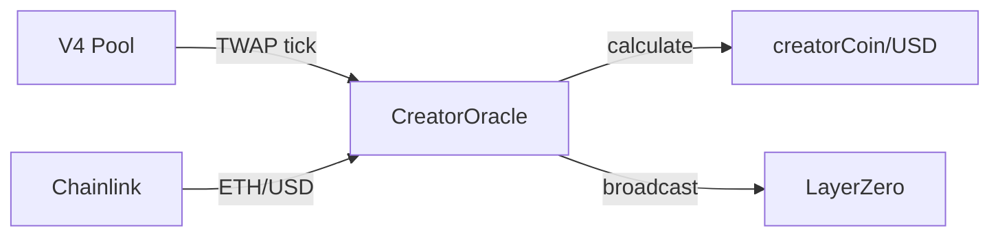
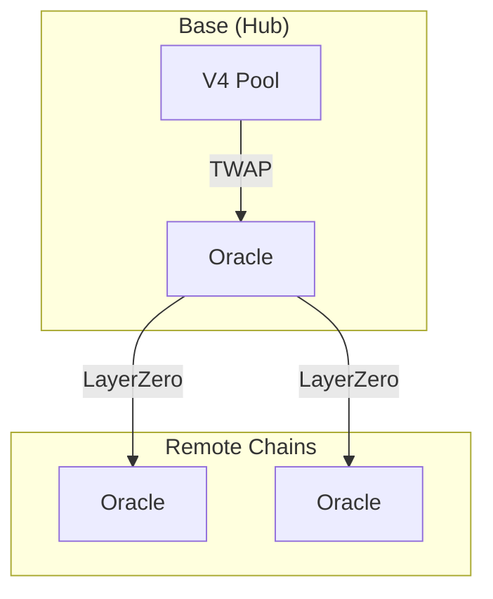

# CreatorOracle

Cross-chain price oracle for creator coins.
Reads TWAP on Base, broadcasts to all chains via LayerZero.

> **Summary**
> - Hub authority: Base chain is the price source
> - TWAP smoothing: 30-minute window resists manipulation
> - Cross-chain: All chains receive consistent pricing

---

## Source

| Contract | Path |
|----------|------|
| CreatorOracle | [`contracts/services/oracles/CreatorOracle.sol`](https://github.com/wenakita/4626/blob/main/contracts/services/oracles/CreatorOracle.sol) |

---

## Purpose

CreatorOracle provides reliable USD pricing without requiring liquidity on every chain.
The oracle reads from Uniswap V4 TWAP on Base, combines with Chainlink ETH/USD, and broadcasts to remote chains.

The oracle is responsible for:
- Reading TWAP from Uniswap V4 pool (■[creatorCoin]/ETH)
- Fetching ETH/USD from Chainlink price feed
- Calculating and storing ■[creatorCoin]/USD price
- Broadcasting updates to remote chains via LayerZero
- Applying tick capping to resist manipulation

The oracle is not responsible for:
- Providing real-time spot prices (uses TWAP)
- Creating or managing liquidity pools
- Executing trades or swaps
- Storing historical price series

---

## Invariants

1. Base chain is the authoritative price source
2. 30-minute default TWAP window
3. Maximum tick movement per observation (tick capping)
4. Prices older than 2 hours are stale
5. ETH/USD comes from trusted Chainlink feed
6. All chains receive the same price

---

## Core Flows

### Price Calculation (Base)

The following diagram shows how the oracle calculates USD price from on-chain sources.
TWAP and Chainlink combine for manipulation resistance.

*This diagram shows Base chain flow only. Remote chains receive via LayerZero.*

### Cross-Chain Propagation

*Remote chains store and serve the broadcast price.*

---

## Access Control

| Function | Access |
|----------|--------|
| `updatePrice` | Public (Base only) |
| `broadcastPrice` | Public (Base only, pays gas) |
| `_lzReceive` | LayerZero endpoint |
| `setChainlinkFeed` | Owner |
| `setTwapDuration` | Owner |

---

## Failure Modes

### Common Reverts

| Error | Cause |
|-------|-------|
| `PriceStale` | Last update older than MAX_STALENESS |
| `InvalidChainlinkPrice` | Chainlink returned zero or negative |
| `PoolNotInitialized` | V4 pool has no liquidity |
| `NotHubChain` | Broadcast attempted on remote chain |

### Manipulation Resistance

- **Tick capping**: Limits maximum price movement per observation
- **TWAP**: 30-minute window smooths short-term manipulation
- **Auto-tuning**: Tick cap adjusts based on observation frequency

### Economic Considerations

- Low liquidity pools may have wider TWAP variance
- Chainlink staleness affects all prices
- Cross-chain message costs paid by broadcaster

---

## Integration Notes

### For Contracts

Query price and check staleness:
- `getCreatorPriceUSD()` — Returns price in 1e18 format
- `getCreatorPriceETH()` — Returns price in ETH terms
- `isPriceStale()` — Check if refresh needed

### For Keepers

- Monitor price staleness on Base
- Call `broadcastPrice()` when needed
- Ensure sufficient ETH for LayerZero fees

### Non-Guarantees

- TWAP lags spot price by design
- Remote chain prices may be slightly delayed
- Extreme volatility may exceed tick caps

---

## Related Contracts

- [CreatorLotteryManager](/contracts/services/lottery-manager) — Price consumer
- [CreatorGaugeController](/contracts/governance/gauge-controller) — Swap slippage
- [CreatorRegistry](/contracts/core/creator-registry) — Oracle registration

---

### Implementation Reference

This document describes design intent.
For exact behavior and edge cases, refer to the Solidity implementation.

[View on GitHub](https://github.com/wenakita/4626/blob/main/contracts/services/oracles/CreatorOracle.sol)
