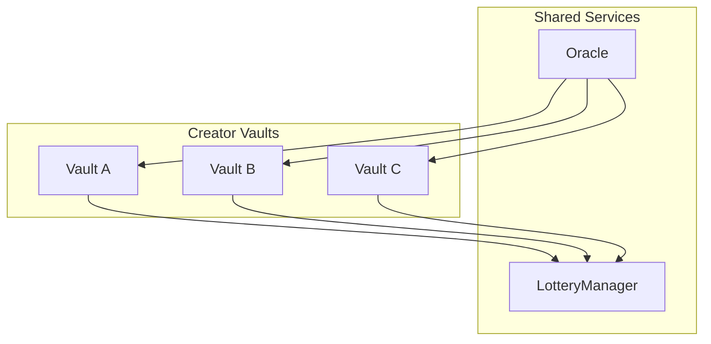

# Service contracts

Cross-cutting services shared across all creator vaults.

---

## Overview

Service contracts provide functionality that spans multiple creator vaults rather than being specific to a single vault deployment.

| Contract | Purpose |
|----------|---------|
| [CreatorLotteryManager](/contracts/services/lottery-manager) | Shared lottery with multi-token prizes |
| [CreatorOracle](/contracts/services/creator-oracle) | Cross-chain price oracle |

---

## Shared service pattern

Unlike core contracts (one per creator), service contracts are deployed once per chain and serve all creator vaults:

---

## Related

- [CreatorRegistry](/contracts/core/creator-registry) - Service address resolution
- [Governance](/contracts/governance) - Fee distribution to services
