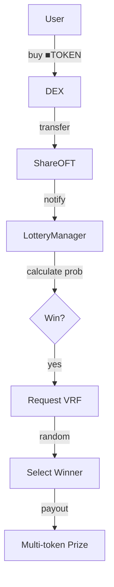
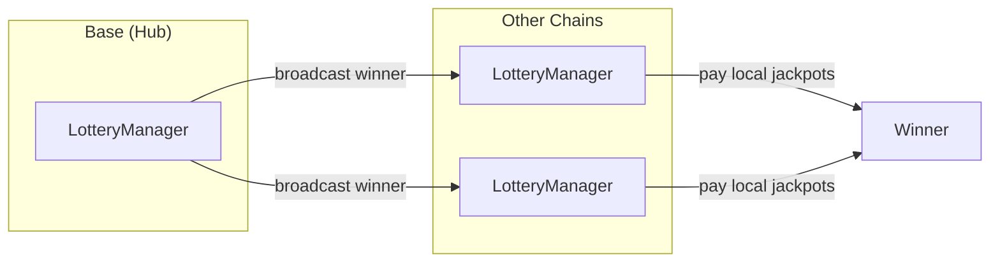

# CreatorLotteryManager

Shared lottery service for all creator coins.
Deployed once per chain, processes entries from all ShareOFT trades.

> **Summary**
> - Processes lottery entries from ShareOFT buy transactions
> - Winners receive prizes from all active vaults
> - Uses Chainlink VRF for verifiable randomness

---

## Source

| Contract | Path |
|----------|------|
| CreatorLotteryManager | [`contracts/services/lottery/CreatorLotteryManager.sol`](https://github.com/wenakita/4626/blob/main/contracts/services/lottery/CreatorLotteryManager.sol) |

---

## Purpose

CreatorLotteryManager serves all creator coins from a single deployment.
When users buy ■[creatorCoin] on a DEX, they automatically enter the lottery.

The contract is responsible for:
- Processing entries from ShareOFT buy transactions
- Calculating win probability based on trade size and boosts
- Requesting verifiable randomness via Chainlink VRF
- Distributing prizes from all active vault jackpots
- Broadcasting winners cross-chain via LayerZero

The contract is not responsible for:
- Collecting fees (GaugeController handles this)
- Managing jackpot reserves (GaugeController handles this)
- Tracking voting power (ve4626 handles this)

---

## Invariants

1. All winners determined by Chainlink VRF
2. Winners receive from all active vaults
3. Base probability capped at configurable maximum
4. ve4626 boosts apply equally to all participants
5. Same winner announced on all chains
6. Base chain is authoritative for winner selection

---

## Core Flows

### Entry and Selection

The following diagram shows how trades become lottery entries and how winners are selected.
VRF ensures fair, verifiable randomness.

*This diagram shows entry and selection only. Jackpot funding is handled by GaugeController.*

### Cross-Chain Winner Announcement

*Each chain pays from its local jackpot reserves.*

### Probability Calculation

Base probability scales with trade size:
- $1 trade: Base probability
- $1000+ trade: Maximum probability

Additional boosts from:
- ve4626 lock duration and amount
- Vault gauge votes (probability direction)

---

## Access Control

| Function | Access |
|----------|--------|
| `processEntry` | ShareOFT contracts |
| `fulfillRandomWords` | VRF Coordinator |
| `_lzReceive` | LayerZero endpoint |
| `setParameters` | Owner |
| `pause` / `unpause` | Owner |

---

## Failure Modes

### Common Reverts

| Error | Cause |
|-------|-------|
| `NotShareOFT` | Caller not a registered ShareOFT |
| `InsufficientJackpot` | Jackpot below minimum payout |
| `VRFPending` | Previous VRF request not fulfilled |
| `Paused` | Lottery is paused |

### VRF Considerations

- VRF requests cost LINK tokens
- Callback gas must be sufficient for distribution
- Failed callbacks may require manual intervention

### Economic Risks

- Large wins reduce jackpot for subsequent winners
- Few trades means fewer lottery entries
- Cross-chain messages have propagation delays

---

## Integration Notes

### For ShareOFT

ShareOFT automatically notifies lottery on buy detection.
No additional integration needed.

### For Frontends

- Query `getJackpotReserve(vault)` via GaugeController
- Query `calculateProbability(user, amount)` for odds
- Listen for `WinnerSelected` events

### Non-Guarantees

- Win probability is probabilistic, not guaranteed
- Prize amounts depend on jackpot state at win time
- Cross-chain delivery times vary

---

## Related Contracts

- [CreatorShareOFT](/contracts/core/creator-share-oft) — Entry source
- [CreatorGaugeController](/contracts/governance/gauge-controller) — Jackpot funding
- [CreatorOracle](/contracts/services/creator-oracle) — USD price conversion
- [ve4626](/contracts/governance/ve4626) — Probability boosts

---

### Implementation Reference

This document describes design intent.
For exact behavior and edge cases, refer to the Solidity implementation.

[View on GitHub](https://github.com/wenakita/4626/blob/main/contracts/services/lottery/CreatorLotteryManager.sol)
