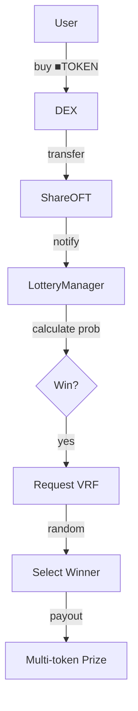
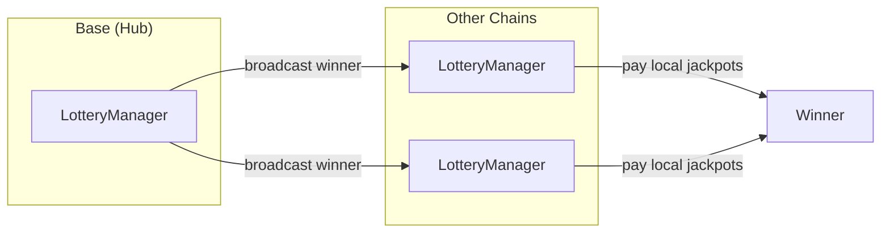

# CreatorLotteryManager

Shared lottery service for all creator coins with cross-chain prize distribution.

> **Summary**
> - Shared service deployed once per chain, serves all creator vaults
> - Processes lottery entries from ShareOFT buy transactions
> - Winners receive prizes from all active vaults (diversified portfolio)
> - Uses Chainlink VRF for verifiable randomness

---

## Source

| Contract | Path |
|----------|------|
| CreatorLotteryManager | [`contracts/services/lottery/CreatorLotteryManager.sol`](https://github.com/wenakita/4626/blob/main/contracts/services/lottery/CreatorLotteryManager.sol) |

---

## Purpose

CreatorLotteryManager is a shared service deployed once per chain that serves all creator coins. When users buy any ■[creatorCoin] on a DEX, they automatically enter the lottery. Winners receive a diversified prize from all active creator vaults.

This shared architecture means every creator benefits from the combined trading activity of the entire ecosystem.

---

## Responsibilities

**What it does:**
- Process lottery entries from ShareOFT buy transactions
- Calculate win probability based on trade size and ve4626 boosts
- Request verifiable randomness via Chainlink VRF
- Distribute prizes from all active creator vault jackpots
- Broadcast winners cross-chain via LayerZero

**What it does NOT do:**
- Collect fees (GaugeController does this)
- Manage jackpot reserves (GaugeController does this)
- Track voting power (ve4626 does this)
- Store user positions

---

## Key invariants and guarantees

1. **Fair randomness**: All winners determined by Chainlink VRF
2. **Multi-token prizes**: Winners receive from all active vaults
3. **Probability bounds**: Base probability capped at configurable maximum
4. **Boost fairness**: ve4626 boosts apply equally to all participants
5. **Cross-chain consistency**: Same winner announced on all chains
6. **Hub authority**: Base chain is authoritative for winner selection

---

## External interface (conceptual)

### Lottery entry

When ShareOFT detects a buy, it notifies the lottery manager with:
- Buyer address
- Trade amount (in USD via oracle)
- Source token (which ■[creatorCoin])

The lottery calculates probability and may trigger VRF.

### Probability calculation

Base probability scales with trade size:
- $1 trade: Base probability
- $1000+ trade: Maximum probability

Additional boosts from:
- ve4626 lock duration and amount
- Vault gauge votes (probability direction)

### Prize distribution

Winners receive shares from all active vaults:
- 69% of each vault's jackpot reserve
- Distributed as vault shares (redeemable for creatorCoin)
- Cross-chain winner notification via LayerZero

---

## Core flows

### Entry and selection flow

*Every qualifying trade automatically enters the lottery. VRF ensures fair randomness.*

### Cross-chain winner flow

*Winners are announced on all chains. Each chain pays from its local jackpot reserves.*

---

## Access control

| Function | Access |
|----------|--------|
| `processEntry` | ShareOFT contracts |
| `fulfillRandomWords` | VRF Coordinator |
| `_lzReceive` | LayerZero endpoint |
| `setParameters` | Owner |
| `pause` / `unpause` | Owner |

---

## Failure modes and edge cases

### Common reverts

| Error | Cause |
|-------|-------|
| `NotShareOFT` | Caller not a registered ShareOFT |
| `InsufficientJackpot` | Jackpot below minimum payout |
| `VRFPending` | Previous VRF request not fulfilled |
| `Paused` | Lottery is paused |

### Economic considerations

- **Jackpot depletion**: Large wins reduce jackpot for subsequent winners
- **Low activity**: Few trades means fewer lottery entries
- **Cross-chain delays**: LayerZero messages have propagation time

### VRF considerations

- VRF requests cost LINK tokens
- Callback gas must be sufficient for prize distribution
- Failed VRF callbacks may require manual intervention

---

## Integration notes

### For ShareOFT

ShareOFT automatically notifies lottery on buy detection. No additional integration needed.

### For frontends

- Query `getJackpotReserve(vault)` via GaugeController
- Query `calculateProbability(user, amount)` for estimated odds
- Listen for `WinnerSelected` events

### Non-guarantees

- Win probability is probabilistic, not guaranteed
- Prize amounts depend on jackpot state at win time
- Cross-chain delivery times vary

---

## Related contracts

- [CreatorShareOFT](/contracts/core/creator-share-oft) - Entry source
- [CreatorGaugeController](/contracts/governance/gauge-controller) - Jackpot funding
- [CreatorOracle](/contracts/services/creator-oracle) - USD price conversion
- [ve4626](/contracts/governance/ve4626) - Probability boosts
