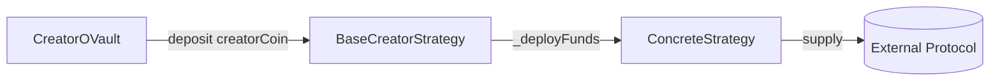
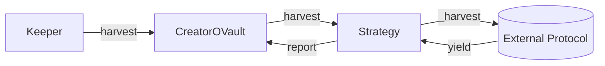

# BaseCreatorStrategy

Abstract base contract for all CreatorOVault yield strategies.

---

## Source

| Contract | Path |
|----------|------|
| BaseCreatorStrategy | [`contracts/vault/strategies/BaseCreatorStrategy.sol`](https://github.com/wenakita/4626/blob/main/contracts/vault/strategies/BaseCreatorStrategy.sol) |

---

## Purpose

BaseCreatorStrategy provides the common interface and safety patterns for all yield strategies. Concrete strategies (Ajna, Charm, etc.) inherit from this base and implement the protocol-specific logic.

This abstraction allows the vault to interact with any strategy through a unified interface while each strategy handles its own yield generation mechanics.

---

## Responsibilities

**What it does:**
- Define the `IStrategy` interface implementation
- Manage strategy lifecycle (active, inactive, emergency)
- Track accounting (deposited, withdrawn, harvested)
- Enforce vault-only access for sensitive operations
- Provide common safety patterns (reentrancy, emergency mode)

**What it does NOT do:**
- Generate yield (concrete strategies do this)
- Interact with external protocols directly (concrete strategies do this)
- Make allocation decisions (vault does this)
- Handle multiple tokens (single-token pattern)

---

## Key invariants and guarantees

1. **Single token pattern**: Each strategy manages exactly one token (creatorCoin)
2. **Vault-only deposits**: Only the registered vault can deposit/withdraw
3. **Asset type**: Strategies only receive creatorCoin, never ▢ or ■ tokens
4. **Emergency mode**: Once enabled, blocks new deposits until disabled
5. **Accounting accuracy**: `totalDeposited - totalWithdrawn + totalHarvested` reflects lifecycle
6. **Non-zero vault**: Vault address must be set before activation

---

## External interface (conceptual)

### Required overrides

Concrete strategies must implement:

- `_deployFunds(amount)` - Deploy creatorCoin to yield source
- `_freeFunds(amount)` - Withdraw from yield source
- `_totalDeployed()` - Get current value in yield source
- `_harvest()` - Collect and reinvest yields

### Vault operations

The vault calls these functions to manage capital:

- `deposit(amount)` - Receive creatorCoin from vault
- `withdraw(amount)` - Return creatorCoin to vault
- `harvest()` - Trigger yield collection
- `emergencyWithdraw()` - Exit all positions immediately

### View functions

- `isActive()` - Whether strategy accepts deposits
- `asset()` - The token this strategy manages (creatorCoin)
- `getTotalAssets()` - Total value managed by strategy

---

## Core flows

### Deposit flow

### Harvest flow

---

## Access control

| Function | Access |
|----------|--------|
| `deposit` | Vault only |
| `withdraw` | Vault only |
| `emergencyWithdraw` | Vault only |
| `harvest` | Vault only |
| `setVault` | Owner (once) |
| `activate` / `deactivate` | Owner |
| `enableEmergencyMode` | Owner |

---

## Failure modes and edge cases

### Common reverts

| Error | Cause |
|-------|-------|
| `NotVault` | Caller is not the registered vault |
| `NotActive` | Strategy is deactivated |
| `EmergencyMode` | Strategy is in emergency mode |
| `ZeroAmount` | Attempted zero deposit/withdraw |
| `ZeroAddress` | Attempted to set zero vault address |

### External protocol risks

- **Liquidity**: External protocol may not have sufficient liquidity
- **Smart contract risk**: External protocol vulnerabilities
- **Oracle risk**: Price manipulation in external protocols
- **Slippage**: Large operations may incur slippage

---

## Integration notes

### For strategy developers

To create a new strategy:

1. Inherit from `BaseCreatorStrategy`
2. Implement `_deployFunds(uint256 amount)`
3. Implement `_freeFunds(uint256 amount)`
4. Implement `_totalDeployed() returns (uint256)`
5. Implement `_harvest() returns (uint256)`
6. Add protocol-specific initialization

### Non-guarantees

- Strategies cannot guarantee positive returns
- External protocol changes may affect strategy behavior
- Harvest timing affects yield capture

---

## Related contracts

- [CreatorOVault](/contracts/core/creator-ovault) - Parent vault
- [CCALaunchStrategy](/contracts/strategies/cca-launch) - Launch strategy
- [AjnaStrategy](/contracts/strategies/ajna-strategy) - Ajna implementation
- [CreatorCharmStrategy](/contracts/strategies/charm-strategy) - Charm implementation
