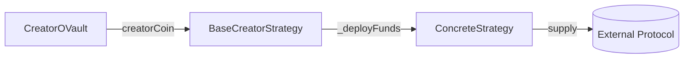
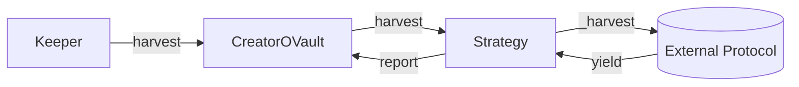

# BaseCreatorStrategy

Abstract base contract for all yield strategies.
Defines the common interface for vault-strategy interaction.

> **Summary**
> - Strategies only receive creatorCoin, never vault shares
> - Single-token pattern: one strategy manages one token
> - Concrete strategies implement protocol-specific logic

---

## Source

| Contract | Path |
|----------|------|
| BaseCreatorStrategy | [`contracts/vault/strategies/BaseCreatorStrategy.sol`](https://github.com/wenakita/4626/blob/main/contracts/vault/strategies/BaseCreatorStrategy.sol) |

---

## Purpose

BaseCreatorStrategy provides the unified interface and safety patterns for all yield strategies.
Concrete strategies (Ajna, Charm, etc.) inherit from this base.

The base strategy is responsible for:
- Defining the `IStrategy` interface implementation
- Managing strategy lifecycle (active, inactive, emergency)
- Tracking accounting (deposited, withdrawn, harvested)
- Enforcing vault-only access for sensitive operations

The base strategy is not responsible for:
- Generating yield (concrete strategies handle this)
- Interacting with external protocols (concrete strategies handle this)
- Making allocation decisions (vault handles this)

---

## Invariants

1. Each strategy manages exactly one token (creatorCoin)
2. Only the registered vault can deposit/withdraw
3. Strategies only receive creatorCoin, never ▢ or ■ tokens
4. Emergency mode blocks new deposits until disabled
5. Vault address must be set before activation

---

## Core Flows

### Deposit

The following diagram shows how creatorCoin flows from vault through the strategy to external protocols.
Vault shares never enter this flow.

*This diagram shows deposit only. Withdrawal reverses this flow.*

### Harvest

*Harvested yield is reported back to the vault for accounting.*

---

## Access Control

| Function | Access |
|----------|--------|
| `deposit` | Vault only |
| `withdraw` | Vault only |
| `emergencyWithdraw` | Vault only |
| `harvest` | Vault only |
| `setVault` | Owner (once) |
| `activate` / `deactivate` | Owner |
| `enableEmergencyMode` | Owner |

---

## Failure Modes

### Common Reverts

| Error | Cause |
|-------|-------|
| `NotVault` | Caller is not the registered vault |
| `NotActive` | Strategy is deactivated |
| `EmergencyMode` | Strategy is in emergency mode |
| `ZeroAmount` | Attempted zero deposit/withdraw |
| `ZeroAddress` | Attempted to set zero vault address |

### External Protocol Risks

- External protocol may lack sufficient liquidity
- Smart contract vulnerabilities in external protocols
- Price manipulation in external protocols
- Slippage on large operations

---

## Integration Notes

### For Strategy Developers

To create a new strategy:
1. Inherit from `BaseCreatorStrategy`
2. Implement `_deployFunds(uint256 amount)`
3. Implement `_freeFunds(uint256 amount)`
4. Implement `_totalDeployed() returns (uint256)`
5. Implement `_harvest() returns (uint256)`

### Non-Guarantees

- Strategies cannot guarantee positive returns
- External protocol changes may affect behavior
- Harvest timing affects yield capture

---

## Related Contracts

- [CreatorOVault](/contracts/core/creator-ovault) — Parent vault
- [CCALaunchStrategy](/contracts/strategies/cca-launch) — Launch strategy

---

### Implementation Reference

This document describes design intent.
For exact behavior and edge cases, refer to the Solidity implementation.

[View on GitHub](https://github.com/wenakita/4626/blob/main/contracts/vault/strategies/BaseCreatorStrategy.sol)
