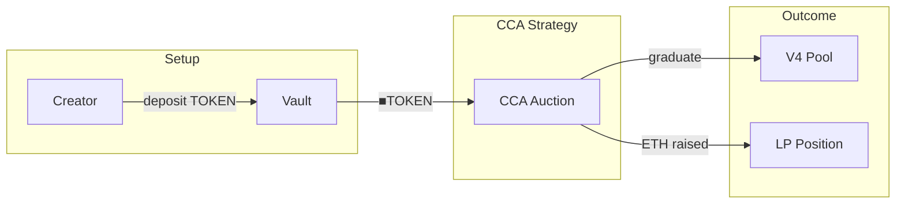
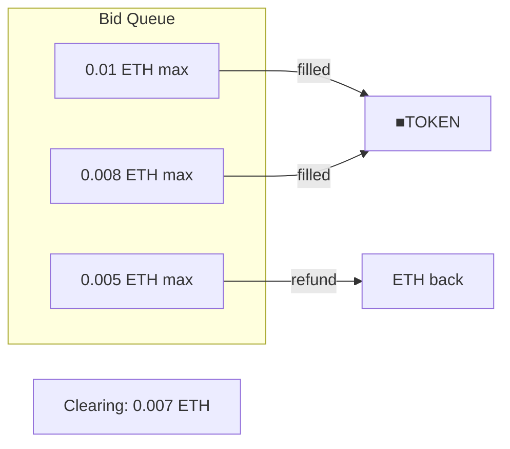

# CCA Launch Strategy

Fair launch strategy using Uniswap's Continuous Clearing Auction mechanism.

---

## Source

| Contract | Path |
|----------|------|
| CCALaunchStrategy | [`contracts/vault/strategies/CCALaunchStrategy.sol`](https://github.com/wenakita/4626/blob/main/contracts/vault/strategies/CCALaunchStrategy.sol) |

---

## Purpose

CCALaunchStrategy enables fair token launches by auctioning ■TOKEN via Uniswap's CCA. The mechanism eliminates common launch problems:

| Problem | CCA solution |
|---------|--------------|
| Sniping | All bidders get same clearing price |
| MEV/sandwich | No timing advantage to exploit |
| Information asymmetry | Price discovery is gradual |
| Whale dominance | Early bids naturally get better prices |

This is a launch-only strategy: it runs once to bootstrap liquidity, then the vault transitions to yield strategies.

---

## System role

---

## Key behaviors

### Auction lifecycle

1. **Setup**: Creator deposits TOKEN, receives ▢TOKEN, wraps to ■TOKEN, transfers to strategy
2. **Auction creation**: Strategy creates CCA auction via Uniswap factory
3. **Bidding period**: Users bid ETH for ■TOKEN with max prices
4. **Clearing**: All bids above clearing price get filled at clearing price
5. **Graduation**: Auction ends, V4 pool created with raised liquidity
6. **Post-launch**: Tax hook configured, trading begins

### Clearing price mechanism

The clearing price is where cumulative demand meets supply. All filled bidders pay this price, regardless of their max bid.

### V4 graduation

After the auction ends, the strategy:
1. Creates a Uniswap V4 pool
2. Adds raised ETH + unsold ■TOKEN as liquidity
3. Configures the 6.9% tax hook
4. Updates the oracle with initial price

---

## Invariants

| Invariant | Description |
|-----------|-------------|
| Single clearing price | All filled bids pay same price |
| No partial fills | Bids either fill completely or refund |
| Tax hook required | V4 pool must have tax configured |
| Factory validation | Only uses official Uniswap CCA factory |

---

## Configuration

| Parameter | Default | Description |
|-----------|---------|-------------|
| Pool fee tier | 0.3% | V4 pool swap fee |
| Tax rate | 6.9% | Buy fee on V4 pool |
| Duration | 7 days | Auction length |
| Min price | Configurable | Floor price per token |
| Max price | Configurable | Ceiling price per token |

---

## Integration points

| Integrates with | Purpose |
|-----------------|---------|
| Uniswap CCA Factory | Creates auctions |
| Uniswap V4 | Post-graduation trading |
| Tax Hook | Fee collection |
| [GaugeController](/contracts/governance/gauge-controller) | Fee recipient |

---

## Implementation details

For function signatures and events, see the [source code](https://github.com/wenakita/4626/blob/main/contracts/vault/strategies/CCALaunchStrategy.sol).

Key implementation notes:
- Uses official Uniswap CCA factory at `0xcca1101...`
- Strategy holds ■TOKEN during auction
- Keeper triggers checkpoints to update clearing price
- Post-graduation sweep functions recover funds

---

## Related

- [Auction Concepts](/concepts/auction) - How CCA works
- [Token Model](/overview/token-model) - Why ■TOKEN is auctioned
- [Fee Flow](/overview/fee-flow) - Post-launch fee distribution
