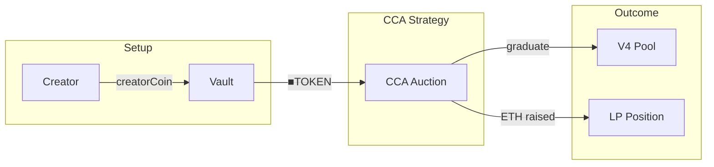
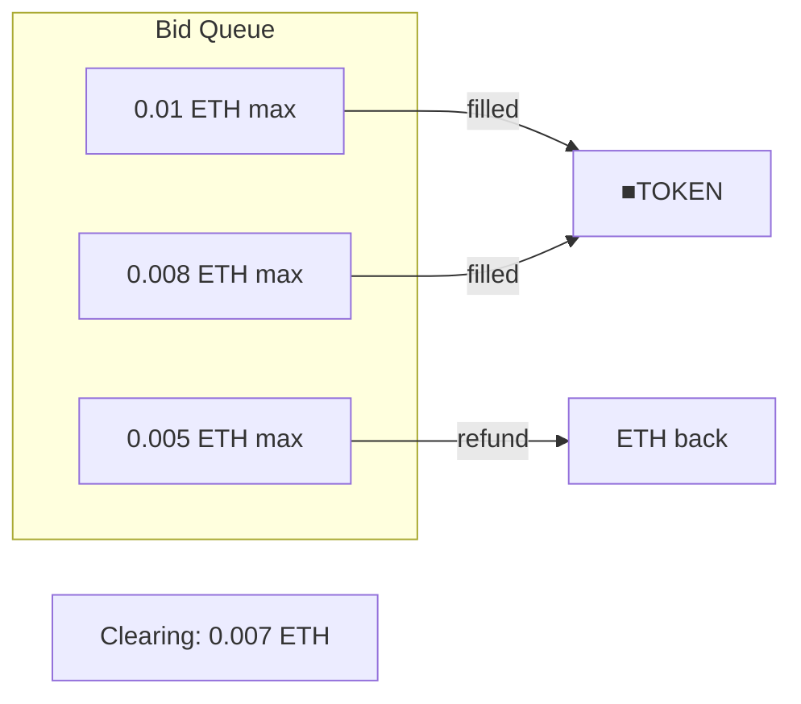

# CCA Launch Strategy

Fair launch strategy using Uniswap's Continuous Clearing Auction.
Eliminates sniping, MEV, and information asymmetry.

> **Summary**
> - Single clearing price for all bidders
> - Graduates to V4 pool with raised liquidity
> - Launch-only: runs once, then vault uses yield strategies

---

## Source

| Contract | Path |
|----------|------|
| CCALaunchStrategy | [`contracts/vault/strategies/CCALaunchStrategy.sol`](https://github.com/wenakita/4626/blob/main/contracts/vault/strategies/CCALaunchStrategy.sol) |

---

## Purpose

CCALaunchStrategy enables fair token launches by auctioning ■[creatorCoin] via Uniswap's CCA.

| Problem | CCA Solution |
|---------|--------------|
| Sniping | All bidders get same clearing price |
| MEV/sandwich | No timing advantage to exploit |
| Information asymmetry | Price discovery is gradual |
| Whale dominance | Early bids naturally get better prices |

The strategy is responsible for:
- Creating the CCA auction via Uniswap factory
- Managing the auction lifecycle
- Graduating to V4 pool after auction ends
- Configuring the 6.9% tax hook

The strategy is not responsible for:
- Ongoing yield generation (yield strategies handle this)
- Fee distribution (GaugeController handles this)
- Trading after graduation (V4 pool handles this)

---

## Invariants

1. All filled bids pay the same clearing price
2. Bids either fill completely or refund (no partial fills)
3. V4 pool must have tax hook configured
4. Only official Uniswap CCA factory is used

---

## Core Flows

### Auction Lifecycle

The following diagram shows the complete launch flow.
creatorCoin enters the strategy, ■[creatorCoin] is auctioned, V4 pool graduates.

*This diagram shows launch flow only. Post-launch trading uses V4 directly.*

### Clearing Price Mechanism

*Bids above clearing price fill. Bids below refund.*

### Auction Steps

1. **Setup**: Creator deposits creatorCoin, wraps to ■[creatorCoin]
2. **Auction**: Strategy creates CCA via Uniswap factory
3. **Bidding**: Users bid ETH with max prices
4. **Clearing**: All bids above clearing price fill at clearing price
5. **Graduation**: V4 pool created with raised liquidity
6. **Post-launch**: Tax hook configured, trading begins

---

## Access Control

| Function | Access |
|----------|--------|
| `createAuction` | Owner |
| `checkpoint` | Public |
| `graduate` | Public (after auction ends) |
| `sweepFunds` | Owner |

---

## Failure Modes

### Common Reverts

| Error | Cause |
|-------|-------|
| `AuctionNotEnded` | Graduation attempted before end |
| `AlreadyGraduated` | Second graduation attempt |
| `InsufficientBids` | Not enough ETH raised |

### Economic Risks

- Low demand may result in unfavorable clearing price
- High demand may leave many bids unfilled
- Tax hook misconfiguration affects post-launch trading

---

## Integration Notes

### Configuration

| Parameter | Default | Description |
|-----------|---------|-------------|
| Pool fee tier | 0.3% | V4 pool swap fee |
| Tax rate | 6.9% | Buy fee on V4 pool |
| Duration | 7 days | Auction length |
| Min price | Configurable | Floor price per token |
| Max price | Configurable | Ceiling price per token |

### For Launchers

- Deposit sufficient creatorCoin before auction start
- Configure min/max prices based on valuation
- Monitor clearing price during auction
- Verify tax hook after graduation

### Non-Guarantees

- Clearing price depends on market demand
- Unsold tokens return to strategy/vault
- Post-graduation price may differ from clearing price

---

## Related Contracts

- [BaseCreatorStrategy](/contracts/strategies/base-creator-strategy) — Base class
- [Auction Concepts](/concepts/auction) — How CCA works
- [CreatorGaugeController](/contracts/governance/gauge-controller) — Fee recipient

---

### Implementation Reference

This document describes design intent.
For exact behavior and edge cases, refer to the Solidity implementation.

[View on GitHub](https://github.com/wenakita/4626/blob/main/contracts/vault/strategies/CCALaunchStrategy.sol)
