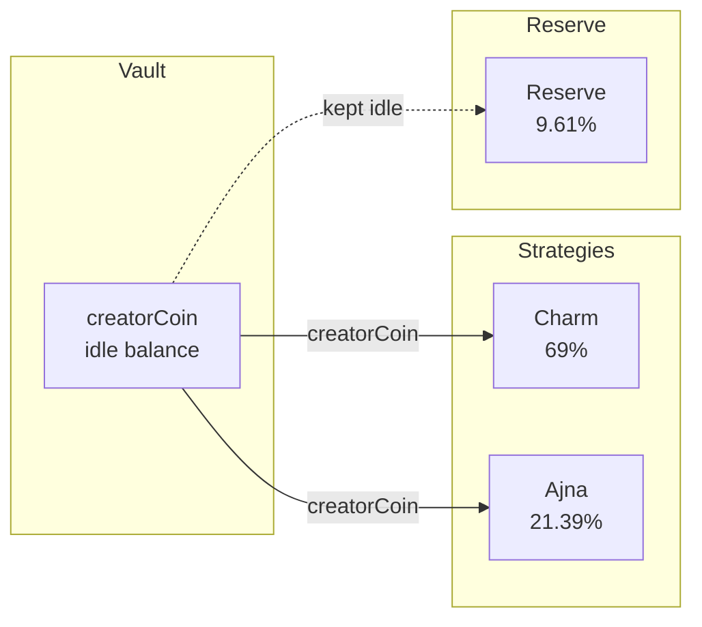

# Strategy contracts

Strategies deploy vault capital to generate yield or facilitate token launches.

> **Invariant:** Yield strategies operate exclusively on the underlying creatorCoin.
> Vault shares (▢[creatorCoin]) and wrapped OFT shares (■[creatorCoin]) are never deposited into yield strategies.

See [Architecture](/overview/architecture) for the canonical asset flow diagram.

---

## Strategy types

### Launch strategies

The CCA strategy is a special case that auctions ■TOKEN for price discovery:

| Strategy | Asset | Purpose |
|----------|-------|---------|
| [CCA Launch](./cca-launch) | ■TOKEN | Continuous Clearing Auction |

### Yield strategies

All yield strategies operate on the underlying creatorCoin:

| Strategy | Asset | Purpose |
|----------|-------|---------|
| Charm | creatorCoin | Uniswap V3 LP via Charm Alpha |
| Ajna | creatorCoin | Lending to Ajna pools |
| V4 Full Range | creatorCoin | Uniswap V4 full range LP |
| V4 Concentrated | creatorCoin | Uniswap V4 targeted ranges |
| V4 Limit Order | creatorCoin | Uniswap V4 limit orders |

---

## Strategy interface

All strategies implement `IStrategy`. See [source code](https://github.com/wenakita/4626/blob/main/contracts/interfaces/IStrategy.sol) for the full interface.

Key functions:
- `asset()` - Returns the underlying asset (always creatorCoin for yield strategies)
- `deposit(amount)` - Receives creatorCoin from vault
- `withdraw(amount)` - Returns creatorCoin to vault
- `harvest()` - Reports yield back to vault

---

## Allocation

The vault allocates creatorCoin to strategies based on weights (basis points):

Keeper calls `deployToStrategies()` to move idle creatorCoin into strategies based on weights.

---

## Related

- [Architecture](/overview/architecture) - System design
- [Vault](/concepts/vault) - Strategy management
