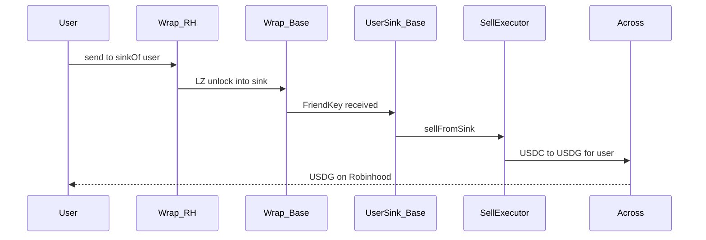

# FriendKey Cross-Chain Acquisition

**Status:** Design (Phase 1) — deployments live; see [Deployment status](./friendkey-cross-chain-acquisition-status.md)  
**Collection:** AlfaClub FriendKey  
**Seed scope:** FriendKey token id **1659** (`AKITA FriendKey #1659`)

## Summary

Robinhood users can buy AlfaClub FriendKey **#1659** with **USDG** in a **single signature**, without changing FriendKey’s mint authority or bonding-curve ownership. The reverse seamless path returns USDG to Robinhood with one wrap send to a per-user Base sink.

Settlement remains on **Base** against the existing FriendKey curve. The buyer receives a **1:1 LayerZero-bridged representation** on Robinhood. The underlying ERC-1155 never leaves Base custody except into a purpose-built lockbox that backs the wrap.

| | |
|--|--|
| **Outcome** | One-signature buy from Robinhood → keys on Robinhood; one-signature seamless sell → USDG |
| **Settlement** | Existing Base `buyShares` / `sellShares` path (USDC) |
| **Payment rail** | Across (USDG ↔ USDC) |
| **Delivery rail** | LayerZero omnichain ERC-1155 wrap |
| **AlfaClub change required** | None to FriendKey contracts |
| **New surface** | Base buy/sell executors + multi-id omnichain wrap (+ per-user sell sinks) |
| **Live pins** | [Deployment status](./friendkey-cross-chain-acquisition-status.md) |

## Why this matters

Robinhood Chain brings a large retail distribution surface and native **USDG**. FriendKey liquidity and price discovery already live on Base. Bridging those two without a custom mint path preserves AlfaClub’s economics while making keys reachable where users already hold stablecoin.

The wrap is one **AlfaClub FriendKey** collection (multi-id capable; seed allowlist `1659`). Robinhood is the first spoke and the USDG payment lane; additional non-Base chains can be peered later for hold/redeem without a new wrap contract.

## User experience

### Buy

1. User chooses quantity and confirms once on Robinhood (USDG).
2. Across delivers USDC on Base to the purchase handler, with the buy intent attached.
3. The handler purchases keys on the FriendKey bonding curve and immediately wraps them for the user’s Robinhood address.
4. The user receives a representation ERC-1155 on Robinhood after LayerZero delivery.

### Redeem vs seamless sell

Both start with one Robinhood `wrap.send`. They differ by destination:

| Path | Destination on Base | Result |
|------|---------------------|--------|
| **Redeem** | User’s wallet | Unlock underlying FriendKey (hold keys on Base) |
| **Seamless sell** | User’s predicted sell sink | Curve sell + Across → USDG on Robinhood |

Seamless sell requires a one-time permissionless sink deploy on Base (`deploySink(user)`); it is not part of every sell signature.

Across fills and LayerZero delivery complete asynchronously after the user’s Robinhood transaction. On Base, buy+wrap in the destination handler and sink receive → sell revert together on failure.

## Architecture (high level)

### Contracts

| Component | Where | Role |
|-----------|-------|------|
| Purchase handler (BuyExecutor) | Base | Receives Across fills; buys allowlisted FriendKey ids; starts the wrap |
| SellExecutor + SellSinkFactory | Base | Seamless sell via per-user CREATE2 sink; Across USDC→USDG |
| Omnichain wrap | Base + Robinhood (same address on both) | Escrows real keys on Base; mints/burns spoke representations |

### Wrap model

One deployment pattern, one address on every peered chain:

- **Base** — Lockbox for the real FriendKey (`0xAF0B…FA9F`). Holds underlying inventory when supply is represented elsewhere. Users on Base continue to hold the native FriendKey; they do not need a second Base-side token.
- **Robinhood (and future spokes)** — Representation ERC-1155 at that same address. Minted when keys arrive; burned when returned to Base for unlock or sell.

No separate “adapter” product surface: the Base instance *is* the lockbox; each spoke instance *is* what users hold on that chain. USDG buy/sell adapters are Robinhood-specific payment lanes.

### Why Across for payment and LayerZero for keys

| Concern | Choice | Rationale |
|---------|--------|-----------|
| USDG ↔ USDC + destination execution | **Across** | Maps Robinhood USDG to Base USDC (and back) and can invoke a destination handler after fill |
| FriendKey inventory movement | **LayerZero wrap** | We control peers and parity; suitable for a locked ERC-1155 representation |
| Paying the curve with LayerZero USDG | **Not used** | No Base USDG deployment today; Robinhood USDG OFT is not peered to Base |

Other aggregators (e.g. Relay, LI.FI) may appear later as **wallet UX shells**. They are not Phase 1 onchain dependencies.

## Trust and security

- **No FriendKey admin rights required.** Uses the public purchase and sell paths on Base; we do not request mint, upgrade, or curve-parameter control.
- **Allowlisted asset scope.** Underlying collection is immutable on the wrap; token ids must be allowlisted before buy/sell/wrap.
- **USDC-only settlement on Base.** The buy handler accepts Base USDC from the Across SpokePool only—not arbitrary callers or tokens.
- **Atomic buy + wrap.** If wrap initiation fails after purchase intent, the whole destination execution reverts (no silent half-fills in our handler).
- **Seamless sell via sink.** Unlock into the user’s CREATE2 sink triggers sell + Across in the receive path; no separate Base approval for the seamless flow.
- **1:1 inventory.** Spoke supply is backed by escrowed FriendKey on Base; burns unlock.

Live SpokePool, executor, and wrap addresses are pinned in the [deployment status](./friendkey-cross-chain-acquisition-status.md).

## Reference addresses

| Item | Base | Robinhood |
|------|------|-----------|
| FriendKey ERC-1155 | `0xAF0Bf8593dC6CA973DF2132731B0F9B5F974FA9F` | — |
| Bonding token (USDC) | `0x833589fCD6eDb6E08f4c7C32D4f71b54bdA02913` | — |
| USDG | — | `0x5fc5360D0400a0Fd4f2af552ADD042D716F1d168` |
| LayerZero EndpointV2 | `0x1a44076050125825900e736c501f859c50fE728c` | `0x6F475642a6e85809B1c36Fa62763669b1b48DD5B` |
| Omnichain wrap / executors / SpokePool | See [deployment status](./friendkey-cross-chain-acquisition-status.md) | Same wrap address on Robinhood |

## Metadata and NFT rendering

The Robinhood (and future spoke) wrap is a standard ERC-1155 representation with OpenSea-compatible IPFS metadata:

- Collection: **AlfaClub FriendKey** via `contractURI`
- Seed token: **AKITA FriendKey #1659** via `uri(1659)`

Details and explorer links: [deployment status](./friendkey-cross-chain-acquisition-status.md#metadata-and-nft-rendering).

## Boundaries

**In scope:** Robinhood → Base buy of allowlisted FriendKey ids (seed `#1659`) with USDG; wrap delivery back to Robinhood; redeem path via the wrap; seamless sell to USDG via per-user sink; IPFS metadata on the wrap.

**Out of scope for this surface:** secondary-market (e.g. Sudoswap) routing; alternate stablecoins; alternate payment bridges as onchain dependencies; deposit / wallet UX packaging; claiming live payment adapters on chains other than Robinhood.

## Coordination ask

We do **not** need AlfaClub contract changes. Helpful alignment:

1. Confirmation that public `buyShares` / `sellShares` for id `1659` remain the intended purchase and sell surfaces.
2. Awareness that holders outside Base see a **bridged representation** (same id semantics, different contract address per spoke) backed 1:1 by Base escrow.
3. Awareness that seamless sell routes through the wrap → per-user Base sink, not a second mint authority.
4. Optional: preferred public naming / room framing for additional ids as they are allowlisted.
