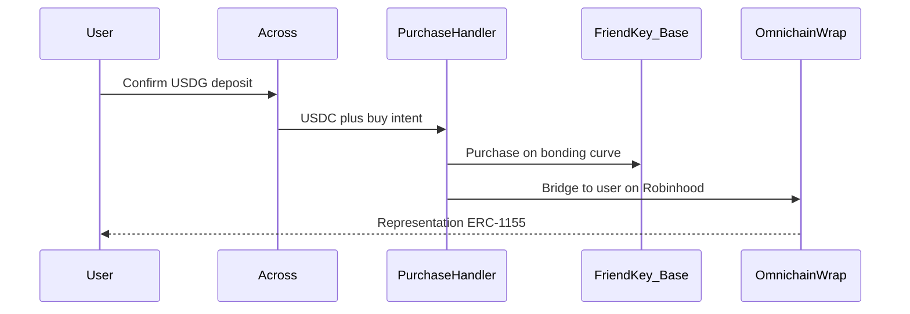

# FriendKey Cross-Chain Acquisition

**Status:** Design proposal (Phase 1)  
**Scope:** FriendKey token id **1659** only

## Summary

We propose a path for Robinhood users to buy AlfaClub FriendKey **#1659** with **USDG** in a **single signature**, without changing FriendKey’s mint authority or bonding-curve ownership.

Settlement remains on **Base** against the existing FriendKey curve. The buyer receives a **1:1 LayerZero-bridged representation** on Robinhood. The underlying ERC-1155 never leaves Base custody except into a purpose-built lockbox that backs the wrap.

| | |
|--|--|
| **Outcome** | One-signature buy from Robinhood → keys on Robinhood |
| **Settlement** | Existing Base `buyShares` path (USDC) |
| **Payment rail** | Across (USDG → USDC) |
| **Delivery rail** | LayerZero omnichain ERC-1155 wrap |
| **AlfaClub change required** | None to FriendKey contracts for Phase 1 |
| **New surface** | Two contracts (Base buyer + omnichain wrap) |

## Why this matters

Robinhood Chain brings a large retail distribution surface and native **USDG**. FriendKey liquidity and price discovery already live on Base. Bridging those two without a custom mint path preserves AlfaClub’s economics while making keys reachable where users already hold stablecoin.

Phase 1 is intentionally narrow: one token id, one direction (buy + deliver), one payment rail—so the trust story stays simple.

## User experience

1. User chooses quantity and confirms once on Robinhood (USDG).
2. Across delivers USDC on Base to a dedicated purchase handler, with the buy intent attached.
3. The handler purchases keys on the FriendKey bonding curve and immediately wraps them for the user’s Robinhood address.
4. The user receives a representation ERC-1155 on Robinhood, redeemable 1:1 for the underlying FriendKey on Base via the same wrap.

## Architecture (high level)

### Two contracts

| Component | Where | Role |
|-----------|-------|------|
| Purchase handler | Base | Receives Across fills; buys FriendKey #1659; starts the wrap |
| Omnichain wrap | Base + Robinhood (same address on both) | Escrows real keys on Base; mints/burns the Robinhood representation |

### Wrap model

One deployment pattern, one address on every chain:

- **Base** — Lockbox for the real FriendKey (`0xAF0B…FA9F`, id `1659`). Holds underlying inventory when supply is represented elsewhere. Users on Base continue to hold the native FriendKey; they do not need a second Base-side token.
- **Robinhood** — Representation ERC-1155 at that same address. Minted when keys arrive; burned when returned to Base for unlock.

No separate “adapter” product surface: the Base instance *is* the lockbox; the Robinhood instance *is* what users hold.

### Why Across for payment and LayerZero for keys

| Concern | Choice | Rationale |
|---------|--------|-----------|
| USDG → USDC + destination execution | **Across** | Already maps Robinhood USDG to Base USDC and can invoke a destination handler after fill |
| FriendKey inventory movement | **LayerZero wrap** | We control peers and parity; suitable for a locked ERC-1155 representation |
| Paying the curve with LayerZero USDG | **Not used** | No Base USDG deployment today; Robinhood USDG OFT is not peered to Base |

Other aggregators (e.g. Relay, LI.FI) may appear later as **wallet UX shells**. They are not Phase 1 onchain dependencies.

## Trust and security

- **No FriendKey admin rights required.** Phase 1 uses the public purchase path on Base; we do not request mint, upgrade, or curve-parameter control.
- **Fixed asset scope.** Underlying collection and token id `1659` are hardcoded in the purchase path.
- **USDC-only settlement on Base.** The handler accepts Base USDC from the Across SpokePool only—not arbitrary callers or tokens.
- **Atomic buy + wrap.** If wrap initiation fails after purchase intent, the whole destination execution reverts (no silent half-fills in our handler).
- **No in-handler DEX.** No permissionless “anyone can trigger a buy” entry in Phase 1.
- **1:1 inventory.** Robinhood supply is backed by escrowed FriendKey on Base; burns unlock.

Operational details (fee prefund, CREATE2 deployer, SpokePool address pins) are finalized at integration and need not be decided in this brief.

## Reference addresses

| Item | Base | Robinhood |
|------|------|-----------|
| FriendKey ERC-1155 | `0xAF0Bf8593dC6CA973DF2132731B0F9B5F974FA9F` | — |
| Bonding token (USDC) | `0x833589fCD6eDb6E08f4c7C32D4f71b54bdA02913` | — |
| USDG | — | `0x5fc5360D0400a0Fd4f2af552ADD042D716F1d168` |
| LayerZero EndpointV2 | `0x1a44076050125825900e736c501f859c50fE728c` | `0x6F475642a6e85809B1c36Fa62763669b1b48DD5B` |

Purchase-handler and wrap addresses will be published once CREATE2 deployments are fixed. Across SpokePool addresses will be pinned at integration against Across’s current chain config.

## Phase 1 boundaries

**In scope:** Robinhood → Base buy of FriendKey #1659 with USDG; wrap delivery back to Robinhood; redeem path via the wrap.

**Out of scope for Phase 1:** additional token ids; sell-from-Robinhood productization; secondary-market (e.g. Sudoswap) routing; alternate stablecoins; alternate payment bridges as onchain dependencies.

## Coordination ask

For Phase 1 we do **not** need AlfaClub contract changes. Helpful alignment:

1. Confirmation that public `buyShares` for id `1659` remains the intended purchase surface.
2. Awareness that Robinhood holders will see a **bridged representation** (same id semantics, different contract address on Robinhood) backed 1:1 by Base escrow.
3. Optional: preferred public naming / room framing for #1659 in user-facing copy (we can match your language).
